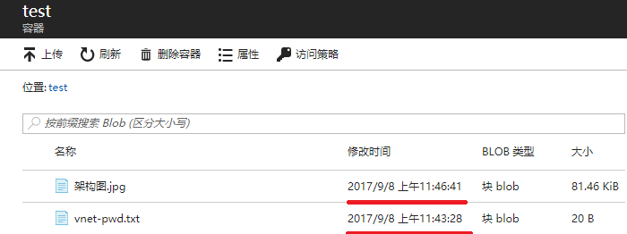
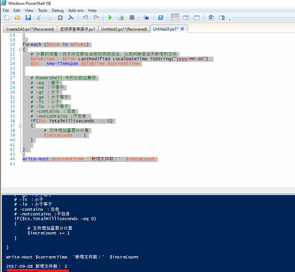

## 通过 PowerShell 统计存储每日文件新增数量

## 问题描述

如何查看 blob 中某个 container 每日的数据增加量。

## 实现思路

目前并没有直接的工具能完成此项业务需求。建议考虑程序代码或 PowerShell 脚本实现，实现逻辑即按照时间（当天）统计文件总数，即是当天的增长量

PowerShell 脚本：

```PowerShell
# 登录账户
Login-AzureRmAccount -EnvironmentName AzureChinaCloud
Set-AzureRmContext -SubscriptionId "e0fbea86-6cf2-4b2d-81e2-9c59f4f96bcb"

$StorageName1="存储账户"
$StorageKey1="存储账户秘钥"
$ContainerName1="容器名称" 

$StorageCtx1 = New-AzureStorageContext -StorageAccountName $StorageName1 -StorageAccountKey $StorageKey1 -Environment AzureChinaCloud 
$blobs = Get-AzureStorageBlob -Container $ContainerName1 -Context $StorageCtx1

# 增长数
$increCount = 0
# 获取当前日期，PowerShell日期函数参考：http://www.oschina.net/code/snippet_222150_18220 
$currentTime=Get-Date -Format 'yyyy-MM-dd'

foreach ($blob in $blobs)
{
   # 计算时间差：将文件日期与当前时间做减法，从而判断是当天新增的文件
   $blobTime = $blob.LastModified.LocalDateTime.ToString("yyyy-MM-dd") 
   $ts = New-Timespan $blobTime $currentTime

   # PowerShell 中的比较运算符
   # -eq ：等于
   # -ne ：不等于
   # -gt ：大于
   # -ge ：大于等于
   # -lt ：小于
   # -le ：小于等于
   # -contains ：包含
   # -notcontains :不包含 
   if($ts.TotalMilliseconds -eq 0)
   {
        # 文件增加量累计计算
        $increCount += 1
   }
} 

Write-Host $currentTime  '新增文件数：'  $increCount
```

## 使用测试

1. 将附件脚本，拷贝到 PowerShell 命令行或 ISE，先使用订阅账户登录订阅。
2. 修改存储账户、秘钥及容器名称。
3. 运行即可，当前脚本只用来统计今天新增文件数量，测试如下：

    - 门户容器：
    
        

    - 运行测试：
 
        