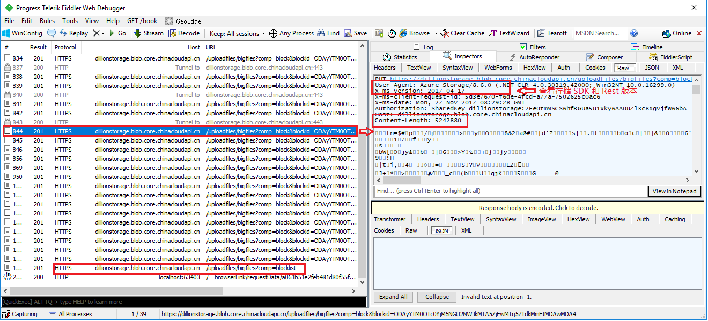
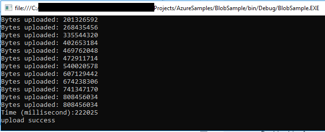

# 上传大文件到 Azure 存储块 Blob 

## 相关概念

Azure 存储提供三种类型的 Blob：块 Blob、页 Blob 和追加 Blob。其中，块 Blob 特别适用于存储短的文本或二进制文件，例如文档和媒体文件。

块 Blob 由块组成，每个块可以是不同的大小，最大为 100MB (对于 2016-05-31 之前 REST 版本的请求为 4MB )，块 Blob 最多可以包含 50,000 块。因此，块 Blob 的最大大小约为 4.75 TB (100MB X 50,000 块)。对于 2016-05-31 之前的 REST 版本，块 Blob 的最大大小约为 195 GB（4MB X 50,000 块），更多详细信息，请参阅[块 Blob、追加 Blob 以及页 Blob 介绍](https://docs.microsoft.com/rest/api/storageservices/understanding-block-blobs--append-blobs--and-page-blobs)。

在上传文件到 Azure Blob 存储时，Azure 支持两种方式，**整体上传**和**分块上传**。

* 整块上传：当上传到块 Blob 的文件小于等于 [SingleBlobUploadThresholdInBytes](https://docs.microsoft.com/dotnet/api/microsoft.windowsazure.storage.blob.blobrequestoptions.singleblobuploadthresholdinbytes?view=azure-dotnet) 属性（客户端可以通过设置该属性设置单个 Blob 上传的最大值，范围介于 1MB 和 256MB 之间）的值时，则可以采用整体上传的方式，调用 PutBlob 完整的上传 Blob ，更多详细信息，请参考 [PutBlob](https://docs.microsoft.com/rest/api/storageservices/put-blob) 。

* 分块上传：当上传的块 Blob 的文件大于 SingleBlobUploadThresholdInBytes 属性的值时，存储客户端会根据 [StreamWriteSizeInBytes](https://docs.microsoft.com/dotnet/api/microsoft.windowsazure.storage.blob.cloudblockblob.streamwritesizeinbytes?view=azure-dotnet) (客户端可以通过设置该属性设置单个分块 Blob 的大小，范围介于 16KB 和 100MB 之间) 的值将文件分解成块, 采用分块上传的方式上传文件，更多详细信息，请参考 [PubBlobList](https://docs.microsoft.com/rest/api/storageservices/put-block-list) 。

例如：设置 SingleBlobUploadThresholdInBytes 为：10MB , StreamWriteSizeInBytes 为：5MB。当上传文件小于等于 10MB 时，可以用一个 PutBlob 将文件整体上传；当文件大于 10MB 时，客户端会将文件按照 StreamWriteSizeInBytes 属性设置的值，将文件切块， 然后使用 PutBlobList 上传。

本文主要使用以下两种方式上传大文件到 Blob 存储。

* [使用 .NET Storage SDK 上传文件](#netsdk)

* [使用 Microsoft Azure Storage Data Movement Library 上传文件](#datamovement)

## <a id="netsdk"></a>使用 .NET Storage SDK 上传文件

### 前提条件

需要在项目中引用两个包：[适用于 .NET 的 Azure 存储客户端库](https://www.nuget.org/packages/WindowsAzure.Storage/)和[适用于 .NET 的 Azure Configuration Manager 库](https://www.nuget.org/packages/Microsoft.WindowsAzure.ConfigurationManager/)，也可以通过 NuGet 搜索 "**WindowsAzure.Storage**" 和 "**WindowsAzure.ConfigurationManager**" 安装。

以下示例使用的是 WindowsAzure.Storage 8.6.0 版本，采用分块方式上传本地文件，文件大小为 117MB 。

### 示例代码

```C#
TimeSpan backOffPeriod = TimeSpan.FromSeconds(2);
int retryCount = 1;
//设置请求选项
BlobRequestOptions requestoptions = new BlobRequestOptions()
{
    SingleBlobUploadThresholdInBytes = 1024 * 1024 * 10, //10MB
    ParallelOperationThreadCount = 12,
    RetryPolicy = new ExponentialRetry(backOffPeriod, retryCount),
};

CloudStorageAccount account = CloudStorageAccount.Parse(CloudConfigurationManager.GetSetting("StorageConnectionString"));
CloudBlobClient blobclient = account.CreateCloudBlobClient();
//设置客户端默认请求选项
blobclient.DefaultRequestOptions = requestoptions;
CloudBlobContainer blobcontainer = blobclient.GetContainerReference("uploadfiles");
blobcontainer.CreateIfNotExists();
//文件路径，文件大小 117MB
string sourcePath = @"D:\bigfiles.zip";
CloudBlockBlob blockblob = blobcontainer.GetBlockBlobReference("bigfiles");
//设置单个块 Blob 的大小（分块方式）
blockblob.StreamWriteSizeInBytes = 1024 * 1024 * 5;
try
{
    Console.WriteLine("uploading");
    //使用 Stopwatch 查看上传时间
    var timer = System.Diagnostics.Stopwatch.StartNew();
    using (var filestream = System.IO.File.OpenRead(sourcePath))
    {
        blockblob.UploadFromStream(filestream);
    }
    timer.Stop();

    Console.WriteLine(timer.ElapsedMilliseconds);

    Console.WriteLine("Upload Successful, Time:" + timer.ElapsedMilliseconds);
}
catch (Exception e)
{
    Console.WriteLine(e.Message);
}
```

> [!IMPORTANT]
> 在 WindowsAzure.Storage 8.0.0 版本( Rest 2016-05-31 版本)及以上版本中，单个块 BlockBlob 最大为 100MB，在之前的版本中，单个块 Blob 最大不超过 4MB 。如果设块 Blob 的大小超出范围，代码运行当中会报 ArgumentOutOfRangeException 异常。有关存储 SDK 版本和 Rest 版本对应的详细信息，请参考 [Azure 存储版本更新日志](https://github.com/Azure/azure-storage-net/blob/master/changelog.txt)

### 示例结果



通过 Fiddler 查看 Rest 请求，我们可以看到，因为文件大于 10MB， 上传时会将文件根据 StreamWriteSizeInBytes 的值将文件分块，每块大小为 5MB，然后每个 request 上传一个 BlockBlob , 每个 BlockBlob 都有 blobid ,最后使用一个 PutBlobList 提交请求。

## <a id="datamovement"></a>使用 Microsoft Azure Storage Data Movement 类库上传文件

[Microsoft Azure Storage Data Movement](https://github.com/Azure/azure-storage-net-data-movement) 主要用于高性能上传，下载和复制 Azure 存储 Blob 和文件。 这个库是基于 [AzCopy](https://docs.azure.cn/storage/common/storage-use-azcopy?toc=%2fstorage%2fblobs%2ftoc.json) 为核心的数据移动框架。

### 前提条件

.NET Framework 4.5 或者以上版本，Netstandard2.0 。

通过 Nuget 搜索 "Microsoft.Azure.Storage.DataMovement" 安装该类库。

以下示例使用的是 Microsoft.Azure.Storage.DataMovement 0.6.5 版本，采用分块方式上传本地文件，本地文件大小 771MB 。

### 示例代码

```C#
CloudStorageAccount account = CloudStorageAccount.Parse(CloudConfigurationManager.GetSetting("StorageConnectionString"));
CloudBlobClient blobclient = account.CreateCloudBlobClient();
CloudBlobContainer blobcontainer = blobclient.GetContainerReference("uploaddocuments");
blobcontainer.CreateIfNotExists();

// 获取文件路径
string sourcePath = @"D:\Documents.zip";
CloudBlockBlob docBlob = blobcontainer.GetBlockBlobReference("documents");
docBlob.DeleteIfExists();

// 设置并发操作的数量
TransferManager.Configurations.ParallelOperations = 64;
// 设置单块 blob 的大小，它必须在 4MB 到 100MB 之间，并且是 4MB 的倍数，默认情况下是 4MB
TransferManager.Configurations.BlockSize = 64 * 1024 * 1024;
// 设置传输上下文并跟踪上传进度
var context = new SingleTransferContext();
UploadOptions uploadOptions = new UploadOptions
{
    DestinationAccessCondition = AccessCondition.GenerateIfExistsCondition()
};
context.ProgressHandler = new Progress<TransferStatus>(progress =>
{
    //显示上传进度
    Console.WriteLine("Bytes uploaded: {0}", progress.BytesTransferred);
});
// 使用 Stopwatch 查看上传所需时间
var timer = System.Diagnostics.Stopwatch.StartNew();
// 上传 Blob
TransferManager.UploadAsync(sourcePath, docBlob, uploadOptions, context, CancellationToken.None).Wait();
timer.Stop();
Console.WriteLine("Time (millisecond):" + timer.ElapsedMilliseconds);
Console.WriteLine("upload success");
```

### 示例结果

