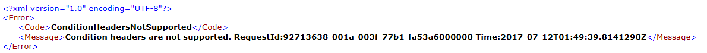
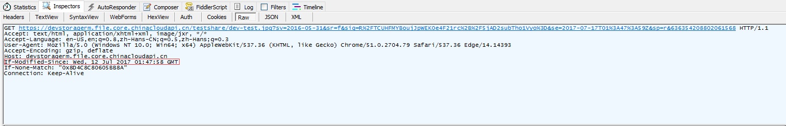

# IE 或 Edge 浏览器通过 SAS 访问 File 文件只能访问一次

## 问题描述

通过代码为 File Storage 文件设置 SAS 读取访问权限，在 IE 或 Edge 浏览器中访问 File 的 SAS URL，只能在第一次发送请求时返回响应（换言之第一次访问正常），再次发送请求则报告“Condition headers are not supported”的错误。



而通过 Chrome 浏览器则可以一直正常访问该文件。

## 问题分析

在分析该问题之前，我们准备了一份样例代码，用于为 File 文件生成 SAS URL，如下：

```
string storageAccount = "<存储账户名称>";
string storageKey = "<存储账户秘钥>";
string fileShareName = "<文件共享名称>";
string fileName = "<文件名称>";

CloudStorageAccount account = new CloudStorageAccount(
    storageCred, 
    blobUri, 
    queueUri,
    tableUri, 
    fileUri);
CloudFileClient fileclient = account.CreateCloudFileClient()
CloudFileShare share = fileclient.GetShareReference(fileShareName);
CloudFile file= share.GetFileReference(fileName);
SharedAccessFilePolicy sasFile = new SharedAccessFilePolicy();
sasFile.SharedAccessExpiryTime = DateTime.Now.AddDays(5);
sasFile.Permissions = SharedAccessFilePermissions.Read;
string sasToken = file.GetSharedAccessSignature(sasFile);

Uri uriFile = new Uri(file.StorageUri.PrimaryUri.ToString() + sasToken);
```

通过上述代码，我们可以得到测试使用的 SAS URL，同时我们还需要 Fiddler 抓包工具。

## 抓包分析

分别测试 IE (本次验证在 Edge 下测试)、Chrome 浏览器下请求情况，同时抓包。

- Edge：

    1. 第一次请求，可以正常访问文件。查看请求头部信息如下：
        
        

    2. 第二次请求，无法正常访问文件，重现到报错问题。查看请求头部信息如下，请求中添加了 “**If-Modified-Since**”:

        

- Chrome:

    1. 第一次及后续多次请求，我们发现都可以正常访问文件。请求头部信息如下，均未包含 “**If-Modified-Since**”：

        

### 关于 HTTP 的请求头标签 If-Modified-Since

If-Modified-Since 是标准的 HTTP 请求头标签，在发送 HTTP 请求时，把浏览器端缓存页面的最后修改时间一起发到服务器去，服务器会把这个时间与服务器上实际文件的最后修改时间进行比较。

在第一次发起请求时请求头中没有 If-Modified-Since 标签。而第二次以及之后请求，IE（Edge）浏览器的行为会添加该请求头，而 Chrome 浏览器则不会添加该请求头。

### 多了 If-Modified-Since 标签头为什么导致文件无法访问

由于 File Service 不支持 If-Modified-Since 类型的请求头从而导致使用 IE 或 Edge 浏览器在第二次以及之后的访问报错。但是由于 Blob Service 支持 If-Modified-Since，因此同样的方法访问 Blob Service 没有问题，详细内容请参考如下链接：[为 Blob 服务操作指定标签头](https://docs.microsoft.com/en-us/rest/api/storageservices/specifying-conditional-headers-for-blob-service-operations)


## 方案建议

- 第一种方案：

    Blob Service 支持 If-Modified-Since，可以使用 Blob 替换 File 存储文件。

- 第二种方案：

    在 URL 后添加一个变量值，取消缓存，重新 Get 请求，示例：

    `https://devstoragerm.file.core.chinacloudapi.cn/testshare/dev-test.jpg?sv=2016-05-31&sr=f&sig=pEQZXdJi4bRzQk0ygap9YQ2vgUKJEXGHER1Y3pNrYAM%3D&se=2017-07-17T03%3A23%3A10Z&sp=r&636354265907741557`

    每次请求时，需要更新 `636354265907741557` 值，代码的实现：

    ```
    string tick = $"&{ DateTimeOffset.UtcNow.Ticks}";
    Uri uriFile = new Uri(file.StorageUri.PrimaryUri.ToString() + sasToken + tick);
    ```

    但是这种方案存在较大的局限性。