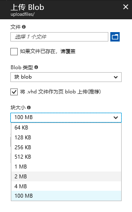
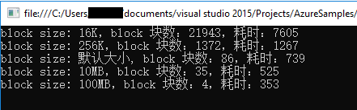
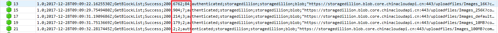

# 如何解决 Block Blob 读取速度慢的问题

## 问题描述

使用 Azure Block Blob 存储事件日志文件，在读取文件时速度慢。

## 问题分析

Block Blob 由块组成。每个块可以是不同的大小，最大为 100MB (对于 2016-05-31 之前 REST 版本的请求为 4MB )，Block Blob 最多可以包含 50,000 块。在上传 Blob 时，我们可以设置单个 Block Blob 块的大小，但是如果每个块的大小设置的太小，就会产生大量的 Block Blob 块，在读取时由于需要进行大量的块映射，就会影响 Block Blob 的读取效率。

## 示例分析

本文采用以下示例来展示在 Block 块大小不同的情况下，读取 Block Blob 时的效率。

例如：在本地文件（342MB）上传时，分别设置单个 Block 块为 16KB、256KB、默认大小（本文使用的 SDK 版本为 WindowsAzure.Storage 8.6.0, 默认上传时单个 BlocK 块为 4MB ）、10MB、100MB，分解成块，然后上传到 Block Blob。读取 Block Blob 时，通过代码或者检查日志方式检查响应时间。

### 文件上传方式：

通过 Azure 门户上传，在存储账户中选择要上传的容器，点击“ **上传** ”，在上传 Blob 面板中从本地选取文件，点击 “ **高级** ”，设置单个块大小。



也可以通过存储 SDK 采用分块方式上传文件，具体实现请参阅[使用 .Net SDK 上传大文件到 Block Blob](https://docs.azure.cn/articles/azure-operations-guide/storage/aog-storage-blob-howto-upload-big-file-to-storage)。

.Net 读取 Block Blob 代码如下(本文使用的 SDK 版本为 WindowsAzure.Storage 8.6.0):

```C#
CloudStorageAccount account = CloudStorageAccount.Parse(CloudConfigurationManager.GetSetting("StorageConnectionString"));
CloudBlobClient blobclient = account.CreateCloudBlobClient();
//容器名称：uploadfiles
CloudBlobContainer blobcontainer = blobclient.GetContainerReference("uploadfiles");
blobcontainer.CreateIfNotExists();

var timer1 = System.Diagnostics.Stopwatch.StartNew();
//blob名称：Images_16K
CloudBlockBlob blob_16k = blobcontainer.GetBlockBlobReference("Images_16K");
blob_16k.FetchAttributes();
var item1 = blob_16k.DownloadBlockList();
timer1.Stop();
Console.WriteLine("block size: 16K，block 块数：" + item1.Count() + "，耗时：" + timer1.ElapsedMilliseconds);
```

代码执行结果如下（时间为毫秒）：



> [!Note]
> 使用以上代码获取的时间是执行请求操作的总时间，包含网络延迟的时间。

通过 [Azure 门户](https://portal.azure.cn/) [启用存储监视](https://docs.azure.cn/storage/common/storage-monitor-storage-account)，可以在存储日志中获取存储执行请求操作的执行时间（不包括网络延迟时间）。

截取部分日志信息如下，在 Http 状态码之后的两个数字为执行请求操作的总时间，第一个包括读取传入请求的时间并将响应发送给请求者，第二个不包括网络延迟：



有关存储日志格式的详细信息，请参阅[这篇文章](https://docs.microsoft.com/rest/api/storageservices/SStorage-Analytics-Log-Format?redirectedfrom=MSDN)

### 示例总结

通过测试输出结果以及存储日志，我们可以看出，对于同一文件，如果单个 Block 块的的尺寸越小，分解后的块数越多，读取时花费的时间也就越长。

## 方案建议

1. 在使用 Block Blob 存储日志文件时，为了避免为很小的日志文件创建一个单独的 Block 块，建议可以将日志记录在本地文件中，然后定期读取文件上传到 Blob 中。

2. 在设置每个 Block 块的的尺寸时，网速的好坏也会影响读取的性能，如果网速好的话，建议可以设置较大的值（最大值不超过 100MB），如果网速不好的话，可以减小这个值。