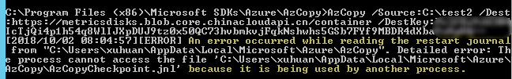

# 如何在 Windows 上运行多个 Azcopy 进程

## 问题描述

同时在 Window 上运行两个以上 Azcopy 进程时，其中一个会报错并被强制退出，报错信息显示如下：



## 问题分析

在未指定 Azcopy 日志文件路径情况下，日志默认保存位置为：`%SystemDrive%\Users\%username%\AppData\Local\Microsoft\Azure\AzCopy`。

由于 Azcopy 不支持将单个日志文件夹用于多个 Azcopy 进程，若需要同时运行多个 Azcopy 则需要自定义创建不同的日志文件。

## 解决方法

通过选项 `/Z` 指定不同的日志文件路径，即可同时运行多个 Azcopy 进程，示例代码如下：

```azcopy
AzCopy /Source:C:\test1 /Dest:https://metricsdisks.blob.core.chinacloudapi.cn/container/myfile1 /DestKey:Mykey /Z:C:\log1\

AzCopy /Source:C:\test2 /Dest:https://metricsdisks.blob.core.chinacloudapi.cn/container/myfile2 /DestKey:Mykey /Z:C:\log2\
```

> [!NOTE]
> 即使可以同时运行多个 Azcopy 进程，但拷贝速度仍同时受限于磁盘性能限制以及虚拟机性能限制。

## 更多参考

- [关于 Windows 上运行 Azcopy 传输数据简介](https://docs.azure.cn/zh-cn/storage/common/storage-use-azcopy?toc=%2farticles%2fazure-operations-guide%2ftoc.json)
- [在 Linux 上运行多个 Azcopy 进程](https://docs.azure.cn/zh-cn/storage/common/storage-use-azcopy-linux#running-multiple-azcopy-processes)