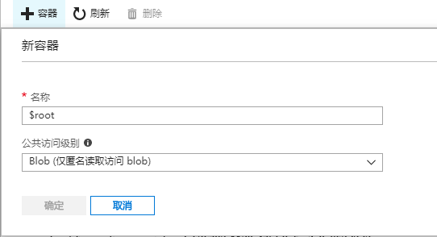

# 如何设置 Azure Storage 支持 Flash 跨域

Flash 和网站跨域资源访问的实现方式是不一样的，网站跨域资源访问都是使用 Http 协议定义的 CROS 的规范来实现的，而 Azure Storage 是支持 Http 协议的 CORS 规范的。但 Adobe 为 Flash 单独设计了跨域访问设置的方式，所以使用 Flash 跨域访问 Storage 资源时，是比较特殊的。

## 网站跨域资源访问设置

请参考官方设置文档：[如何设置 Azure Storage 支持 CORS](https://docs.microsoft.com/zh-cn/rest/api/storageservices/cross-origin-resource-sharing--cors--support-for-the-azure-storage-services)。

## Flash 跨域资源访问设置

Adobe 单独实现了跨域访问的权限配置方法。具体可参考 Adobe 关于此方面的文档：[跨域配置](https://www.adobe.com/devnet-docs/acrobatetk/tools/AppSec/xdomain.html)。

Adobe 定义了 crossdomain.xml 文件，使用它来配置客户端访问跨域资源的权限。 
目前 Adobe 规定必须将该文件置于服务器访问的根目录下。例如，我们想要使用 Flash 跨域访问存储的资源，例如：`http://test.blob.core.chinacloudapi.cn/aa/test.pg`，Flash 客户端需要先访问 `http://test.blob.core.chinacloudapi.cn/crossdomain.xml` 该地址去获取跨域配置文件。

为了支持 Flash 跨域，我们需要向存储根目录下存放 crossdomain.xml 文件，默认情况下，存储下的文件必须被放置到容器内，所以访问地址都会带有容器名称。为了支持这一特性，Azure Storage 添加了一些系统容器。例如 $root，该容器就是用来存放需要使用根目录访问的文件资源。我们可以在 Azure 门户中直接添加 $root 容器，如下图：

添加后，我们就可以将配置好的 crossdomain.xml 文件上传至此容器内，为了保证容器内文件可以被公网直接访问，可以将此容器设置为公共访问权限，之后我们就可以直接使用 `http://test.blob.core.chinacloudapi.cn/crossdomain.xml` 访问根目录资源。