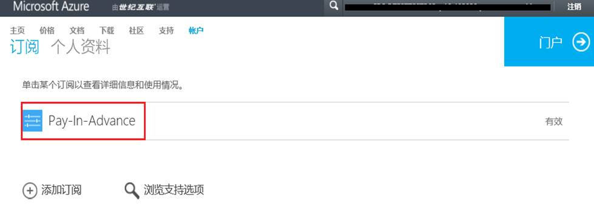
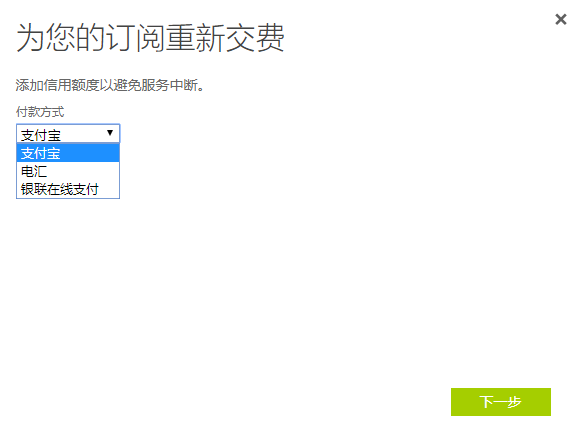

# 如何为订阅充值？（及常见问题）

## 如何充值

1. 用您 Azure 的账号登录 [Billing 门户](https://account.windowsazure.cn/Subscriptions)。

2. 点击订阅名称展开订阅：

    

3. 点击右侧绿色按钮“**重新缴费**”（1 元试用选择“立即升级”）：

    

4. 选择支付方式：

    

5. 选择金额后，跳转到相应支付平台进行支付。

    
    

## 支付方式

### 1 元试用订阅

激活 1 元试用订阅时支持支付宝和银联在线付款两种线上付款方式。且充值订单失效前不能更换支付方式。

1 元试用订阅升级为标准预付费订阅时，支持支付宝、银联在线付款和电汇三种线上付款方式，且充值订单失效前不能更换支付方式。

### 在线预付费订阅

**新购买**：在线预付费订阅首次充值时，支持支付宝、银联在线付款和电汇三种线上付款方式，且充值订单失效前不能更换支付方式。

**已购买的订阅充值**：在线预付费订阅续费时，支持支付宝、银联在线付款和电汇三种线上付款方式，且可以随时修改支付方式。

## 支付订单有效期

支付宝订单有效期为 3 天，如果支付过程中遇到问题没有及时完成支付，3 天内都可以点击订阅名称下显示的黄条（如下图）完成支付。支付宝订单无法手动取消，需等待 3 天之后系统自动取消。

银联订单一般一个小时内失效，订单失效之后，黄条提示会变为“**重新对您的订购支付失败。请单击此处重试。**”，此时如果要更改支付方式，需按照以上充值的步骤重新操作。

电汇订单有效期为 7 个工作日，超过 7 个工作日未完成付款，电汇订单会被后台取消。如需取消电汇订单，需要联售后服务热线 400-089-0365。

电汇操作步骤和汇款信息，请参考 [Azure 电汇说明](https://www.azure.cn/pricing/billing/azure-wire-transfer-overview)。

## 常见问题

1. 页面显示乱码 或 无法跳转到支付页面 。

    支付时遇到页面显示乱码，及无法跳转到支付宝或银联等问题，一般是由于浏览器或设备兼容性不佳，多见于浏览器版本过低或配置过低的设备，可更换隐私模式、更换浏览器或更换电脑重试。

    有时由于因为网络原因，如使用公司局域网，会出现更换多台设备仍无法正常显示或跳转的问题，建议更换网络环境。

    尝试以上方法之后问题仍然存存在，请联系世纪互联客户服务中心， 电话：400-089-0365。

    Azure 支持的浏览器参考：[支持的浏览器和设备](https://docs.azure.cn/zh-cn/azure-preview-portal-supported-browsers-devices)

2. 扣款成功，但是 Azure 账户余额没有变化。

    1. 1 元试用订阅支付 1 元激活订阅时，成功扣款但提示“**未收到您的汇款**”，几个小时后扣款金额退回支付账户，重新操作此问题已依旧存在，原因如下：

        根据试用活动的使用规定，每位新客户仅限一次优惠机会，多次申请 1 元试用会出现以上问题。

    2. 在线预付费订阅续费时，扣款成功之后查看账户余额没有变化：

        * 从您点击“**重新缴费**”开始充值起，需要在 15 分钟内完成充值，如果您整个充值过程超过了 15 分钟，系统后端实际已经将此次充值标记为失败，此时即使扣款成功系统也会自动进行退款，扣款的金额会自动退回到您的付款账户，支付宝一般当天或次日退回，银联退款则需要几天时间，如有问题，请联系世纪互联客户服务中心， 电话：400-089-0365.

        * 部分客户在充值时会遇到系统延迟，一般延迟时间不超过 3 个小时，请耐心登录系统数据同步，如超过 3 个小时，账户余额仍未同步，请联系世纪互联客户服务中心， 电话：400-089-0365.