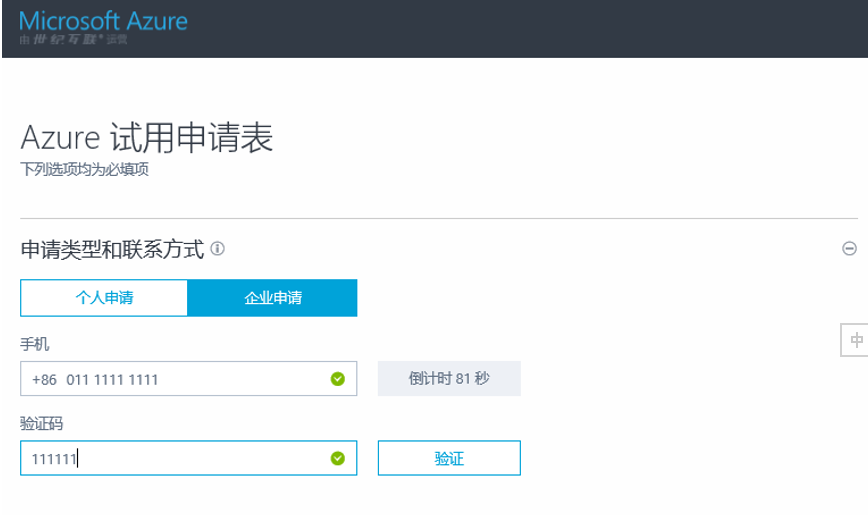
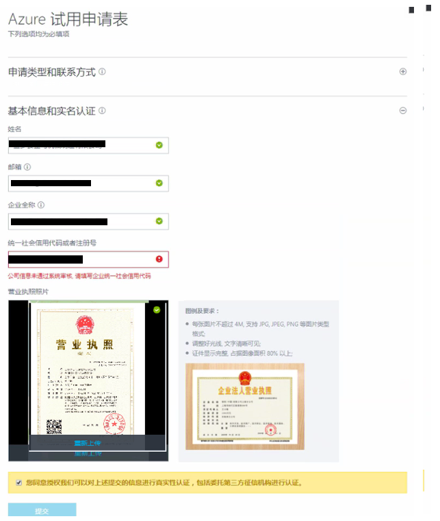

## 订阅管理 - 重命名

## 如何更改订阅名称

### 方法一

1. 登陆到 [Azure 账户管理门户](https://account.windowsazure.cn)
2. 点击要**更改名称的订阅**

    

3. 点击右侧页面 **编辑订阅详细信息**

    

4. 更改订阅名称后点击 **对勾**

    

### 方法二

1. 登陆到 [Azure 门户](https://portal.azure.cn)
2. 依次点击 “**订阅**” > 选中**要更改名称的订阅** > “**概述**” > “**重命名**”

    

3. 更改 **订阅名称** 后，点击 “**保存**” 按钮。

    

## 相关文档

- [订阅管理 - 创建](aog-subscription-management-create.md)
- [订阅管理 - 取消](aog-subscription-management-cancel.md)
- [订阅管理 - 迁移](aog-subscription-management-migrate.md)