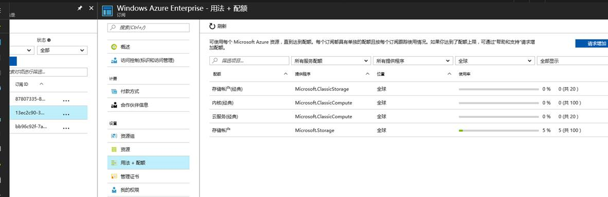
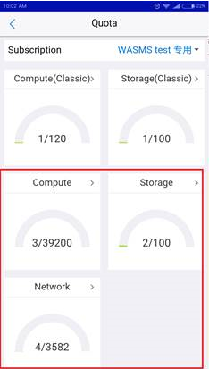
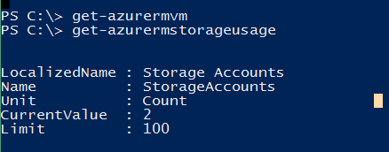
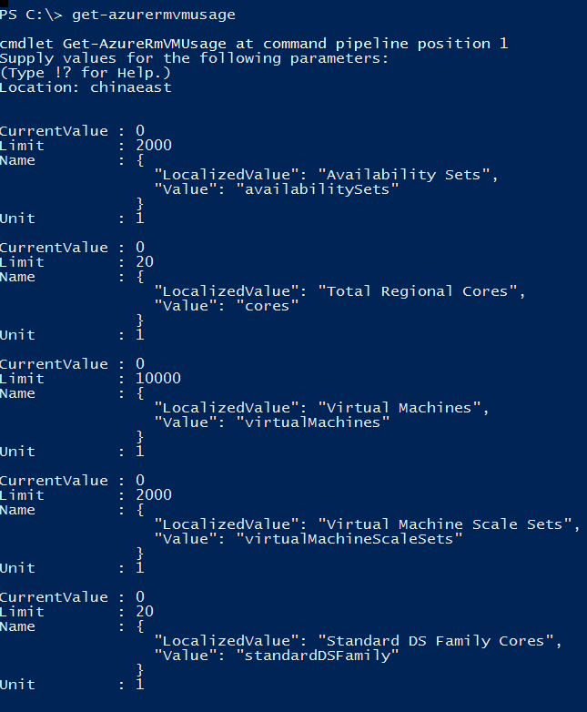

# 关于 Azure 配额资源如何申请的流程

1. 配额类型：Core, IP, Host Services, Storage, HDInsight

    > [!NOTE]
    > 如果您所申请的配额资源类型此文档中没有列出，您可以拨打 Azure 世纪互联客户服务热线：+86 400 0890 365 / +86 010-84563652，或通过网页在线提交服务请求获取支持：[Azure 支持](https://www.azure.cn/support/contact/)。

2. 配额申请适用情况：所用订阅当前配额不足，需要尽快申请

    > [!TIPS]
    > 如果您的配额需求较大，时间较急，我们建议您提前至少三个工作日申请。

3. 申请方式：您可以拨打 Azure 世纪互联客户服务热线：+86 400 0890 365 / +86 010-84563652，或通过网页在线提交服务请求获取支持：[Azure 支持](https://www.azure.cn/support/contact/)。

4. 增加配额后，如何查看当前配额以及使用情况：

    - 可以在资源管理门户查看配额情况：

        在 **订阅** - **用法 + 配额** 下，可以看到经典门户以及资源管理门户的配额和使用情况。
        在第四个选项框中选择 “**全部显示**”，会列出来所有的配额情况，您可以在筛选框中输入您要查看的配额名称，即可查看相应的结果。

        

    - 通过下载下载 [Azure 云助手 APP](https://www.azure.cn/azure-cloud-assistant/)，在 APP 中登录您的账号之后，可按照以下截图查看：

        
        

    - 如何通过 PowerShell 查看 ARM 配额情况：

        1. 查看 PowerShell 的版本, 命令：
            
            `get-module -listavailable | where-object {$_.name -like "*azure*" }`
            
            

        2. 将 ARM 环境加入到 PowerShell 中来, 命令：
            
            `$chinarmenv =get-azurermenvironment -name azurechinacloud`
            `login-azurermaccount -environment $chinarmenv`

            

        3. 查看某服务的 配额：
            1. 存储账户：`get-azurermstorageusage`

                

            2. 核数：`get-azurermvmusage -location "china east"`

                

5. 有关 Azure 订阅和服务限制、配额和约束的详情，请参考链接有详细说明：[限制和 Azure Resource Manager](https://docs.azure.cn/zh-cn/azure-subscription-service-limits#limits-and-the-azure-resource-manager)。

6. 每种配额申请需准备的信息模板：

    | 资源  | 模板(EN) | 模板(ZH) |
    | ---- | -------- | -------- |
    | storage account | 1) Org ID: 2) Sub ID: 3)Deployment model (ARM/Classic):4)Region: 5)Number of storage accounts(additional): 6)Planned storage usage in TBs: 7)Is there a service limit [Storage limits](https://azure.microsoft.com/en-us/documentation/articles/azure-subscription-service-limits/#storage-limits) other than the account per subscription limit you are managing to?  If so, which limit?: 8)If the goal is to get additional IOPS, how much IOPS is planned per account and with how much storage (Example: 20 TB per account and 10 K peak IOPS): | 1) Org ID: 2) Sub ID: 3) 部署模式 (资源管理器/经典): 4) 区域: 5) 存储账号数量(额外): 6) 已计划的存储用量(TBs): 7) 是否有服务限制，参考：[存储服务限制](https://azure.microsoft.com/en-us/documentation/articles/azure-subscription-service-limits/#storage-limits) 而非您所管理的账号的订阅限制？如果有，是怎样的限制？: 8) 如果是为了获得额外的 IOPS，每个账号需要多少 IOPS 和多少存储？（举例: 每个账号 20TB 和 10K 峰值 IOPS）: |
    | Cores | 1) Org ID: 2) Subscription GUID: 3) Deployment Model(ARM/Classic): 4) What VM size, additional amount, and region for each one. e.g.: A1:50 (China East) D3:60 (China East) So, the total amount should be 110. 5) Planned Storage Usage in TBs | 1) Org ID: 2) Subscription ID: 3)部署模式：（ARM/经典）: 4)对每项做出说明：VM 大小，额外增加的数量和所在区域？ 举例如下: A1:50 核(China East) D3:60 核(China East) 所以总数是 110 核。 5)已计划的存储用量(TBs):  |
    | HD Insight | 1) ORG ID: 2) SUB ID: 3) Offer type: 4) Request region: 5) Requested new quota: additional amount 6) Nodes VM type: input VM types 7) OS Type: input the system type 8) Flexibility: yes or no  | 1) ORG ID: 2) SUB ID: 3) 供应类型: 4) 申请区域: 5) 申请的新的配额: 额外数量 6) VM 类型节点: 请填写 VM 类型 7) OS 类型: 请填写系统类型 8) 可调剂: 是或否  |
    | IP increase: | 1) Customer Name (including Chinese name): 2) Customer Type: 3) ORG ID: 4) Requested SUB ID: 5)Deployment Model (ARM/Classic): 6) Requested type : 7) Requested quantity (total after increase) vs. Current quantity: 8) Where would you be deploying (China North or China East):  | 1) 客户名字(包括中文名): 2) 客户类型: 3) ORG ID: 4) 申请的 SUB ID: 5) 部署模式 (资源管理器/经典): 6) 申请类型: 7) 申请数量(total after increase) vs. 现有数量: 8) 部署位置 (中国北部或者中国东部):  |