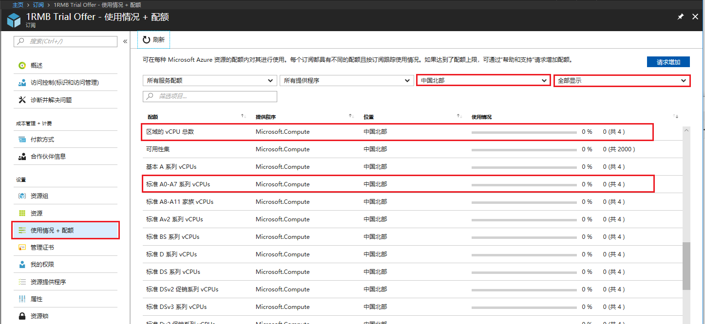
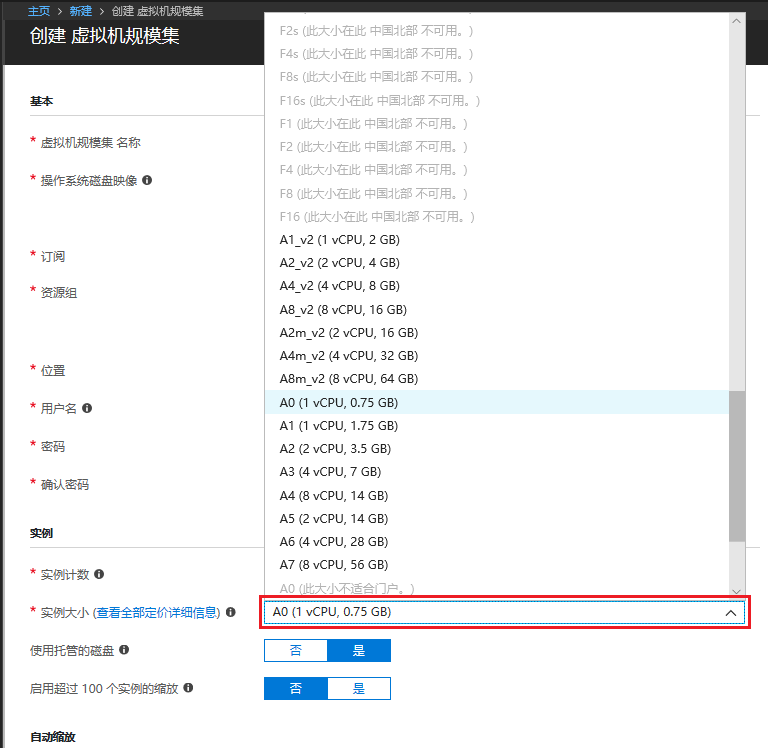

# 如何解决虚拟机规模集预配失败的问题

## 问题描述

用户使用一元试用订阅，在中国北部区域内，使用 Windows Server 2016 Datacenter 创建虚拟机规模集(包含 2 个 Standard_A0 虚拟机)时，遇到 OSProvisioningTimedOut 预配失败错误，详细错误信息如下：


尝试使用 PowerShell 在中国北部创建同样规模的虚拟机规模集时，同样遇到预配失败错误，详细信息如下：

```powershell
New-AzureRmVmss : Long running operation failed with status 'Failed'. Additional Info:'OS Provisioning for VM
'myvmss_4' did not finish in the allotted time. The VM may still finish provisioning successfully. Please check
provisioning state later.'
ErrorCode: OSProvisioningTimedOut
ErrorMessage: OS Provisioning for VM 'myvmss_4' did not finish in the allotted time. The VM may still finish
provisioning successfully. Please check provisioning state later.
```


## 问题分析

发生虚拟机分配失败主要有以下原因：当分配请求固定到某个群集时，由于可用的资源池较小，很可能找不到可用的资源。 此外，如果分配请求固定到某个群集，但该群集不支持你所请求的资源类型，那么，即使该群集有可用的资源，请求仍会失败。

本文主要通过以下步骤来排除虚拟机规模集预配失败的问题：

1. [检查订阅是否有足够的资源](#checkquota)。
2. [检查所在区域是否支持所请求的资源类型](#checksize)。
3. [检查虚拟机的大小是否满足操作系统的需求](#checkos)。

## 具体操作

本文使用的订阅为一元试用订阅， 虚拟机规模集配置信息如下：

* 操作系统磁盘映像：Windows Server 2016 Datacenter
* 规模集实例计数：2
* 规模集实例大小：Standard_A0 (1 vCPU，0.75 GB 内存)

### <a id="checkquota"></a>检查订阅是否有足够的资源

1. 登录到 [Azure 门户](https://portal.azure.cn) 。
2. 在左侧导航窗格中，依次点击 “所有服务“ 、”订阅“，选中当前使用的订阅，在订阅页左侧导航窗中点击 ”使用情况 + 配额“，在筛选条件中选择所在区域以及 ”全部显示“ ，查看区域内 vCPU 总数以及所用虚拟机的 vCPUs 配额。

    

    从截图中可以看出，一元试用账户中， 中国北部可用的区域 vCPU 总数和标准 A0-A7 系列 vCPU 的配额都为 4 vCPU 。可以创建包含两台 Standard_A0 (1 vCPU，0.75 GB 内存) 虚拟机实例的虚拟机规模集。

    若区域内没有足够的 vCPU ，可以在配额内调整虚拟机规模集实例个数和大小，或者注册为[标准预付费订阅](https://www.azure.cn/zh-cn/offers/ms-mc-arz-33p/) 获取更多的配额。

### <a id="checksize"></a>检查所在区域是否支持请求的资源类型。

使用 PowerShell、CLI 以及模板等方式创建虚拟机规模集时，可以通过 Azure 门户查看虚拟机规模集实例大小是否在所选区域内可用。具体步骤如下：

1. 登录到 [Azure 门户](https://portal.azure.cn) 。
2. 在左侧导航窗格中，依次点击 “创建资源“ 、”Virtual machine scale set“， 点击实例大小后边的选项，查看当前实例大小是否在所在区域内可用。

    

    

### <a id="checkos"></a>检查虚拟机规模集实例的大小是否满足操作系统的需求。

根据虚拟机规模集使用的操作系统磁盘映像检查系统最低要求，查看虚拟机大小是否满足操作系统的需求。

通过检查 [Windows server 2016 系统要求](https://docs.microsoft.com/zh-cn/windows-server/get-started/system-requirements#ram) 可以看出 Windows server 2016 对内存的最低要求为 512 MB (对于带桌面体验的服务器安装选项为 2 GB)，而 Azure Standard_A0 大小的虚拟机内存为 0.75 GB ，不满足 Windows server 2016 系统对于带桌面体验的服务器 2GB 内存的需求，因此会报预配失败的错误。

可以尝试使用 Windows Server 2012 创建虚拟机规模集，或者调整虚拟机规模机实例的大小，例如使用 Standard_A1_V2 虚拟机 ( 1 vCPU，2GB 内存)。

> [!Note]
> 调整虚拟机规模机实例大小时，请参阅 [虚拟机类型和大小](https://docs.azure.cn/virtual-machines/windows/sizes-general) 并检查虚拟机的 vCPU 以及内存，确保在订阅中有足够的 vCPU 配额并满足操作系统的要求。

## 参考链接

[Azure 虚拟机类型和大小](https://docs.azure.cn/virtual-machines/windows/sizes-general)