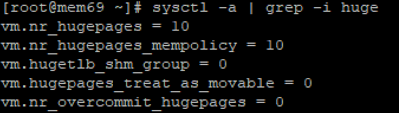
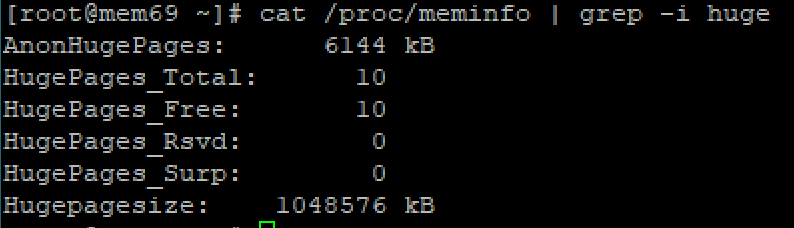
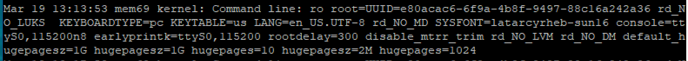
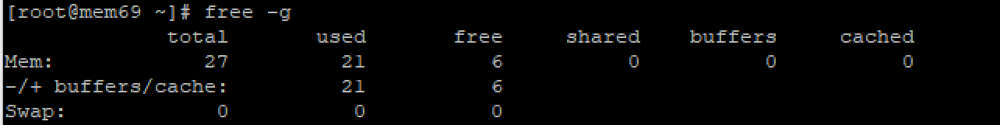
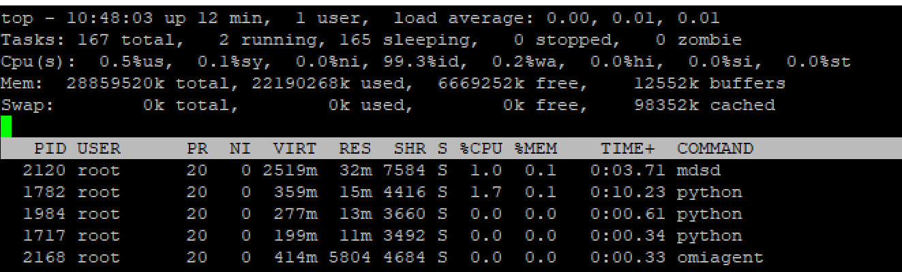
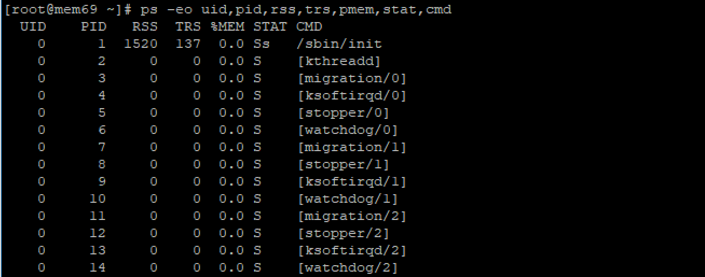

# Linux 系统如何进行大页面配置

在 Linux 中，物理内存是以页为单位来管理的。页的大小为 4096 字节。 1MB 的内存能划分为 256 页； 1GB 则等同于 256000 页。 CPU 中有一个内置的内存管理单元，用于存储这些页的列表，每页都有一个对应的入口。在这种情况下，内存管理单元的大小决定了服务器能使用的最大内存大小。

如果为服务器分配的内存远大于现有内存管理单元能管理的量，则会造成内存的浪费。 CentOS 6 中为解决这个问题，使用了大页面的方式。简单来说，大页面即大小为 2MB 或者 1GB 的页。 2MB 的页适用于管理 GB 级单位的内存； 1GB 的页适用于 TB 级单位的内存。

手动去管理大页面较麻烦，往往需要更改代码。为了便于系统管理员和开发人员使用， CentOS 引入了 transparent huge pages （后续简称 THP ）的概念。 THP 是一个抽象层，其自动化了创建，管理和使用大页面的大多数步骤。

## 大页面的配置

大页面配置需要连续的内存空间，因此在开机时就分配是最可靠的方式。配置大页面的参数有：

- **hugepages** ：在内核中定义了开机启动时就分配的永久大页面的数量。默认为 0，即不分配。只有当系统有足够的连续可用页时，分配才会成功。由该参数保留的页不能用于其他用途。
- **hugepagesz**： 在内核中定义了开机启动时分配的大页面的大小。可选值为 2MB 和 1GB 。默认是 2MB 。
- **default_hugepagesz**：在内核中定义了开机启动时分配的大页面的默认大小。

要调整页的尺寸，必须将配置以参数格式写入到启动命令中。如要为系统配置 10 个 1GB 的大页面，则启动命令中要包含： `default_hugepagesz=1G hugepagesz=1G hugepages=10`。配置 1GB 的大页面，CPU 特性需要支持 `pdpe1gb` ，系统内核也需要支持。

查看与大页面的相关的配置：

1. 命令 `sysctl -a  | grep -I huge` 输出：

    

2. 命令 `cat /proc/meminfo` 输出：

    

3. 若配置了不同大小的大页面，可以通过 `/var/log/message` 中的启动参数进行查看：

    

## 大页面对内存使用的影响

配置大页面后，系统在开机启动时会首选尝试在内存中找到并预留连续的大小为 `hugepages * hugepagesz` 的内存空间。如果内存空间不满足，则启动会报错 `Kernel Panic, Out of Memory` 等错误。 
使用大页面后，能减少系统管理和访问页的时间；内核中的 `swap` 守护进程也不会管理大页面占用的这部分空间。合理设置大页面能减少内存操作的负担，减少访问页表造成性能瓶颈的可能性，从而提升系统性能。 
如只配置了一个大小的大页面，可以通过 `/proc/meminfo` 中的 `Hugepagesize` 和 `HugePages_Total` 计算出大页面所在内存空间的大小。这部分空间会被算到已用的内存空间里，即使还未真正被使用。

因此，用户可能观察到下面现象：使用 `free` 命令查看已用内存很大，但 `top` 或者 `ps` 中看到 `%mem` 的使用总量加起来却很少。

命令 `free -g` 输出：

命令 `top` 输出， `Shift+m` 按内存使用排序：

命令 `ps`，查看进程内存用量：

`ps -eo uid,pid,rss,trs,pmem,stat,cmd`

> [!NOTE]
> 一般情况下，配置的大页面可能主要供特定的应用程序或服务使用，其他进程是无法共享这部分空间的（如 Oracle SGA ）。
> 请根据系统物理内存和应用需求来设置合适的大小，避免大页面使用的浪费；以及造成其他进程因竞争剩余可用内存而出现内存溢出的错误，进而导致系统崩溃的现象。

参考文档：

[Linux 内核 - 大页面相关简介](https://www.kernel.org/doc/Documentation/vm/hugetlbpage.txt)

[ORACLE - 大页面相关简介](https://docs.oracle.com/cd/E37670_01/E37355/html/ol_about_hugepages.html )

[Redhat - 大页面和透明大页面](https://access.redhat.com/documentation/zh-cn/red_hat_enterprise_linux/6/html/performance_tuning_guide/s-memory-transhuge)

[Redhat - 在启动或运行期间启用 1 GB 大页面](https://access.redhat.com/documentation/zh-cn/red_hat_enterprise_linux/6/html/virtualization_tuning_and_optimization_guide/sect-Virtualization_Tuning_Optimization_Guide-Memory-Huge_Pages-1GB-runtime)

