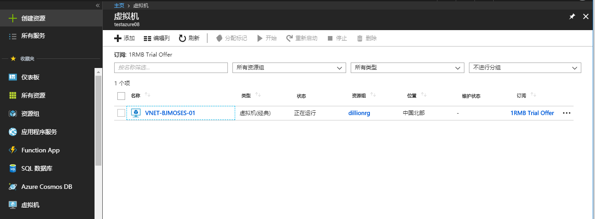
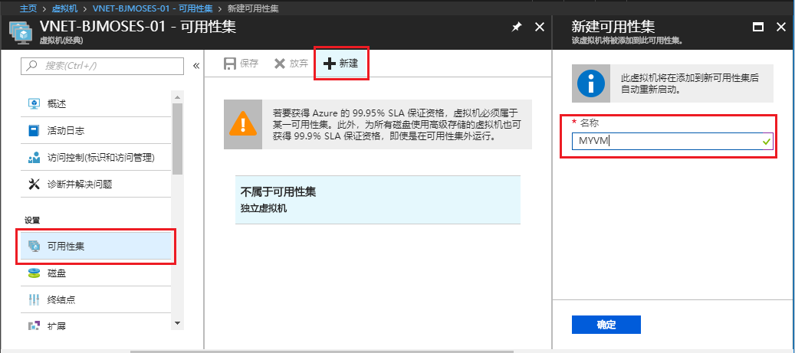
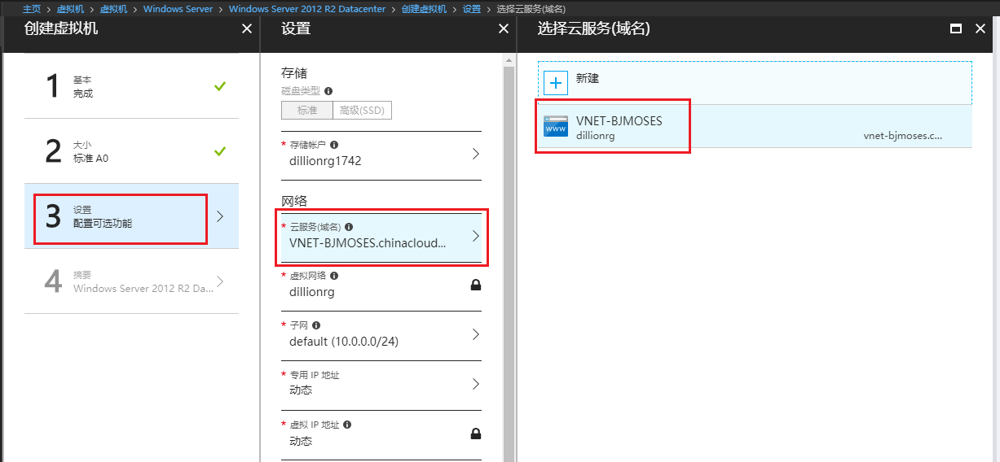
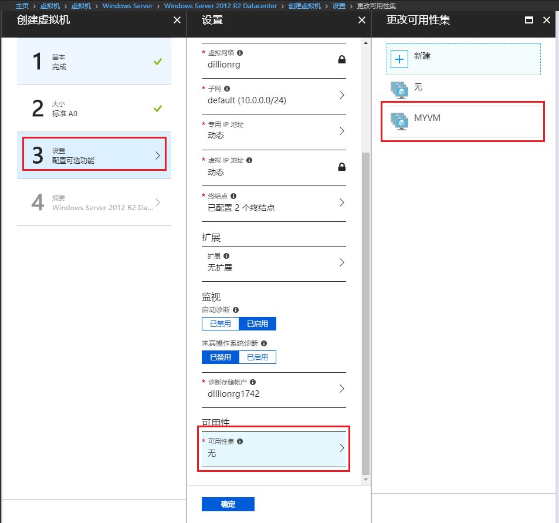
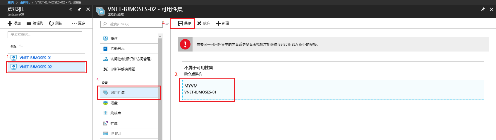
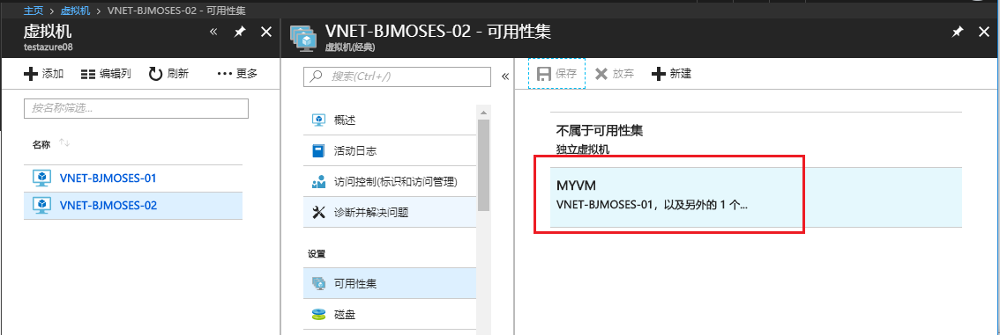

# 将经典虚拟机添加到可用性集中

## 相关概念

**可用性集**：可用性集可以保证高可用性，在应用程序中使用多台虚拟机可以确保在出现本地网络故障、本地磁盘硬件故障以及平台可能需要的任何计划内停机时，应用程序仍然可用。每个可用性集至少包含两台虚拟机。

## 详细步骤

1. 经典虚拟机-(本例) VNET-BJMOSES-01

    

2. 在虚拟机侧边栏设置中选择“可用性集”，在可用性集中，点击“新建”，在“可用性集名称”中，输入可用性集的名称，单击保存创建可用性集

    

3. 创建第二台经典虚拟机 (VNET-BJMOSES-02) ，在设置选项中选择与 VNET-BJMOSES-01 同一云服务(域名)

    

4. 将第二台虚拟机添加到可用性集(本例：MYVM)

    有以下两种方式可以实现将虚拟机添加到可用性集:

    a. 创建虚拟机时，在设置选项中选择可用性集

    

    b. 创建虚拟机后，在虚拟机侧边栏设置中选择“可用性集”，选择可用性集，保存设置

    

    结果如下：

    

## 注意事项

- 要放入相同可用性集的虚拟机必须属于相同的云服务。
- 将现有虚拟机添加到可用性集可能会导致虚拟机重新启动以最终确定它是可用性集中的成员。