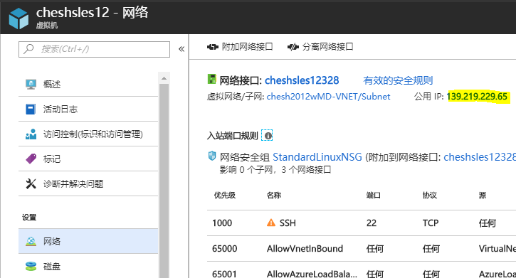
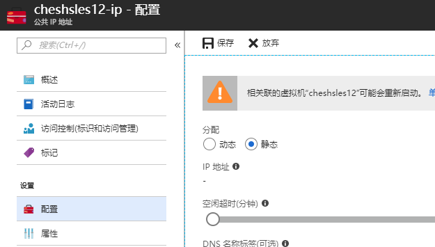
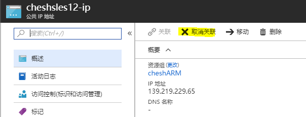
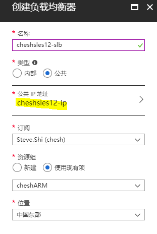
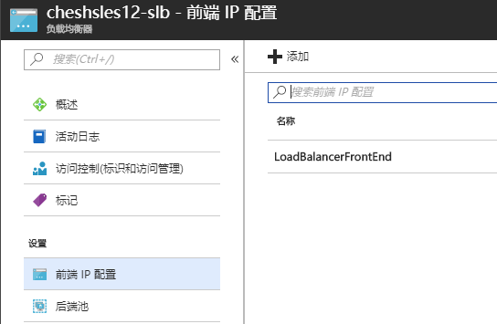
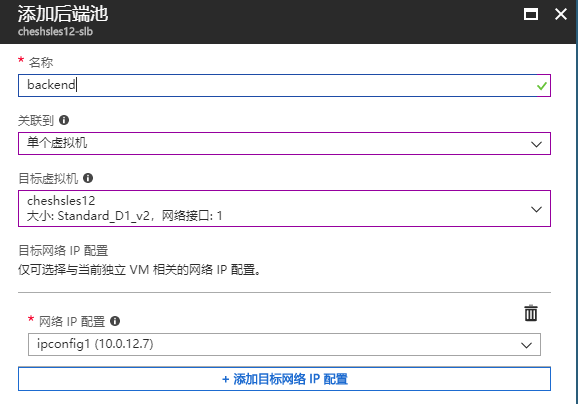
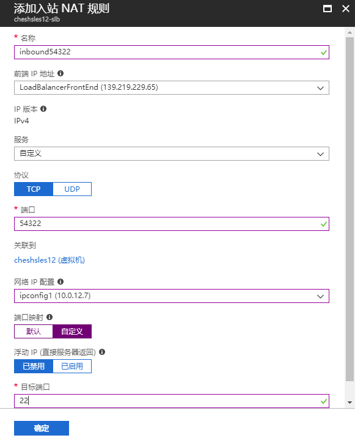
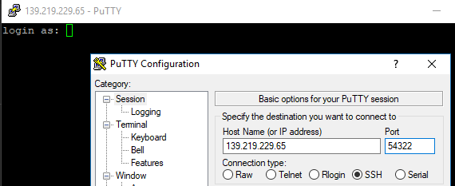

# 如何利用负载均衡器为现有 ARM 虚拟机配置高位端口映射

在使用 Azure 虚拟机时，用户可能会观察到一个现象：经典部署的虚拟机由于基于云服务，自带了高位端口映射功能，而新版的资源管理器（ARM）部署模式默认没有端口映射功能，导致 SSH 22，RDP 3389 等端口暴露在外网，为安全管理埋下了隐患。

在资源管理器部署模式中，我们可以利用 Azure 负载均衡器，为现有的虚拟机添加端口映射功能，防止关键管理端口受到来自公网的恶意扫描。利用固定外网 IP 和复用 Azure 虚拟网卡，我们甚至不需要改变 Azure 虚拟机的公网 IP 和 MAC 地址，就能完成此操作。

## 使用 Azure 门户进行配置

1. 找到当前虚拟机，进入 “**网络**” 标签页，点击当前公网 IP。

    

2. 在公网 IP 页面，进入 “**配置**” 标签页，将分配方式改为**静态**，保证在操作过程中公网 IP 不会改变。

    > [!NOTE]
    > 在虚拟机开机时更改公网 IP 会导致虚拟机重启，请事先做好关机准备。

    

3. 确认公网 IP 地址分配模式已变为静态后，关闭虚拟机。

4. 在公网 IP 的 “**概述**” 页面，点击 “**取消关联**”，将公网 IP 与虚拟机网卡的关联解除。

    

5. 在虚拟机当前的资源组中创建一个新的负载均衡器，配置如下，其中使用的公共 IP 地址就是上一部取消关联的 IP 地址。

    

6. 在负载均衡器创建完成后，点击 “**前端 IP 配置**” 标签页，确认公网 IP 已经与负载均衡器绑定。

    

7. 选择 “**后端池**”，点击 “**添加**” 按钮，在弹出的菜单中配置如下，并点击 “**更新**” 按钮。

    

8. 选择 “**入站 NAT 规则**”，点击 “**添加**” 按钮，在弹出的菜单中配置如下，并点击 “**确认**”按钮。

    > [!NOTE]
    > 如果虚拟机是 Windows 系统，请将目标端口改为 RDP 的 3389 端口。

    

9. 在入站 NAT 规则更新完毕后，开启虚拟机，并尝试通过新的高位端口访问虚拟机，确认连通性正常。

    

至此，单台虚拟机的端口映射就已配置完毕。

# 通过 Azure PowerShell 进行配置

```powershell
$RG = "RGName"
$vmName = "VMName"
$newSLBName = $vmName + "-slb"
$publicPort = "54322"
$privatePort = "22"

$vm = Get-AzureRmVM -ResourceGroupName $RG -Name $vmName
$location = $vm.Location
$vmNICName = ($vm.NetworkProfile.NetworkInterfaces.id).Split("/")[8]
$nic = Get-AzureRmNetworkInterface -Name $vmNICName -ResourceGroupName $rg
$pipName = ($nic.IpConfigurations[0].PublicIpAddress.Id).Split("/")[8]
$pip = Get-AzureRmPublicIpAddress -Name $pipName -ResourceGroupName $RG
$pip.PublicIpAllocationMethod = "Static"
$updatedPIP = Set-AzureRmPublicIpAddress -PublicIpAddress $pip

Stop-AzureRmVM -Name $vmName -ResourceGroupName $RG #-Force

$frontend = New-AzureRmLoadBalancerFrontendIpConfig -Name "MyFrontEnd" -PublicIpAddress $updatedPIP
$backendAddressPool = New-AzureRmLoadBalancerBackendAddressPoolConfig -Name "MyBackendAddPoolConfig02" 
$probe = New-AzureRmLoadBalancerProbeConfig -Name "MyProbe" -Protocol "TCP" -Port $publicPort -IntervalInSeconds 5 -ProbeCount 2
$inboundNatRule = New-AzureRmLoadBalancerInboundNatRuleConfig -Name "MyinboundNatRule1" -FrontendIPConfiguration $frontend -Protocol "TCP" -FrontendPort $publicPort -BackendPort $privatePort -IdleTimeoutInMinutes 5
$newSLB = New-AzureRmLoadBalancer -Name $newSLBName -ResourceGroupName $RG -Location $location -FrontendIpConfiguration $frontend -BackendAddressPool $backendAddressPool -Probe $probe -InboundNatRule $inboundNatRule

$nic = Get-AzureRmNetworkInterface -Name $vmNICName -ResourceGroupName $rg
$nic.IpConfigurations[0].PublicIpAddress = @{}
$nic.IpConfigurations[0].LoadBalancerBackendAddressPools = $newSLB.BackendAddressPools[0]
$nic.IpConfigurations[0].LoadBalancerInboundNatRules = $newSLB.InboundNatRules[0]
Set-AzureRmNetworkInterface -NetworkInterface $nic

Start-AzureRmVM -Name $vmName -ResourceGroupName $RG
```

> [!NOTE]
> 本脚本只经过默认配置的虚拟机测试，不支持多网卡或单网卡内有多个 IP 配置的虚拟机。

## 常见问题

- **Q：** 我可以为其他端口配置端口映射吗？

    **A：** 当然可以，在配置入站 NAT 规则时将目标端口更改成 80 或 443，即可为 HTTP 或 HTTPS 端口配置高位端口映射。

- **Q：** 我需要更改网络安全组的端口规则么？

    **A：** 如果是单台 VM，不需要更改网络安全组配置。网络安全组是位于 Azure 虚拟机使用的虚拟网卡上，当流量通过负载均衡器时，目标端口已经从高位地址转换为低位的 22 或 3389 端口。如果负载均衡器的后端池中是多台虚拟机，则推荐在负载均衡器上另配置一个网络安全组来限制进站流量。

- **Q：** 为什么虚拟机的 IP 地址和 MAC 地址都不会变？

    **A：** 在更改配置时，我们固定并复用了外网 IP。内网 IP 和 MAC 地址都与虚拟机的虚拟网卡绑定，在我们的配置过程中并没有被改变。

- **Q：** 为什么配置后我的虚拟机网卡中看不到公网 IP 了？

    **A：** 这是正常现象，因为公网 IP 实际绑定在负载均衡器上，而不是虚拟机网卡上。从虚拟机界面应该可以看到公网 IP。

## 扩展阅读

- [使用 Azure 门户创建面向 Internet 的负载均衡器](https://docs.azure.cn/zh-cn/load-balancer/load-balancer-get-started-internet-portal)
- [创建、更改或删除公共 IP 地址](https://docs.azure.cn/zh-cn/virtual-network/virtual-network-public-ip-address)
- [使用门户管理网络安全组](https://docs.azure.cn/zh-cn/virtual-network/virtual-network-manage-nsg-arm-portal)