# 利用模板部署为现有 ARM 虚拟机添加可用性集

众所周知，Azure 平台通过加入[可用性集](https://docs.azure.cn/zh-cn/virtual-machines/windows/manage-availability)的多台虚拟机来保证虚拟机中业务的高可用性。<br>
但是 Azure 资源管理部署模式的 Azure 虚拟机在创建之后就无法更改可用性集，如果需要更改虚拟机的可用性集，则需要删除虚拟机进行重建。如何调用现有的资源，如何保留各项配置，则是重建过程中的常见问题。

本文提供了一个快捷简便的方法，利用 Azure 的模板部署功能，将现有的虚拟机快速重新创建，添加或更改其可用性集配置。

> [!IMPORTANT]
> 使用本文所描述的步骤会使虚拟机中基于扩展的配置丢失，如诊断扩展配置或备份扩展配置，需要重新配置。对于有备份的虚拟机，建议暂时停止虚拟机的备份，在重建虚拟机后重新配置。

## 操作步骤

### 创建虚拟机所需的可用性集

通过 [Azure 门户](https://portal.azure.cn/)创建可用性集，建议与现有虚拟机放在同一个资源组内，并选择与现有虚拟机相同的位置。<br>
如果虚拟机使用了托管磁盘，在最后一项 “**使用托管的磁盘**” 中选择 “**是(对齐)**”，如果虚拟机未使用托管磁盘，在最后一项中选择 “**否(经典)**”。

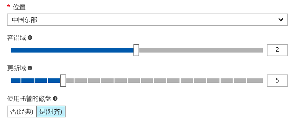

### 从 Azure 门户获得当前虚拟机的模板

参考文档 : [从资源组导出模板](https://docs.azure.cn/zh-cn/azure-resource-manager/resource-manager-export-template#export-the-template-from-resource-group)，将模板下载到本地。

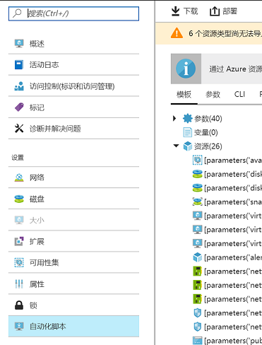

### 修改模板

将下载的模板文件解压，使用 json 文本编辑器打开 template.json 文件。

1. template.json 文件主要分为三个部分：**parameter**、**variables** 和 **resources**。
    
    - parameters : 决定了部署时需要调用的参数，无需更改。
    - variables : 是部署时需要用到的变量，无需更改。
    - resources : 字段决定了本次实际部署的资源，由于我们只需要调用现有的网卡、可用性集等资源，无需部署这些资源，所以只需要保留现有虚拟机和虚拟机扩展的相关配置，其他无关资源都需要删除。

2. 在 resources 字段中找到 `"type": "Microsoft.Compute/virtualMachines"` 和 `"type": "Microsoft.Compute/virtualMachines/extensions"` 字段，即当前虚拟机和扩展的配置。

3. 删除 resources 字段中无关资源的内容，只保留当前虚拟机和虚拟机扩展的相关配置。在删除时请将无关资源的大括号中所有内容都删除，包括大括号本身。

    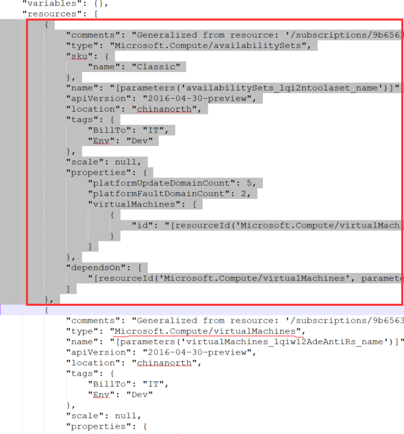

4. 在 parameters 中找到先前创建的可用性集，记下 parameter 名字。

    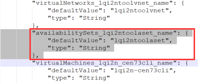

5. 在虚拟机的 properties 字段中添加 `availabilitySet` 字段: 
    
    > [!NOTE]
    > 此处 parameters 应为可用性集名称，注意结尾大括号后要有逗号。

    ```json
    "availabilitySet": {
    "id": "[resourceId('Microsoft.Compute/availabilitySets', parameters('availabilitySets__name'))]"
    },
    ```

    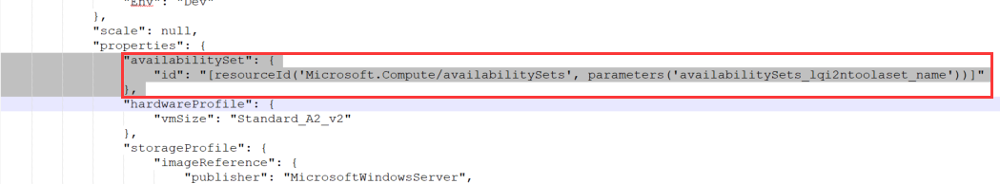

6. 删除 properties 字段下 `storageProfile` 字段中的 `imageReference` 字段。

    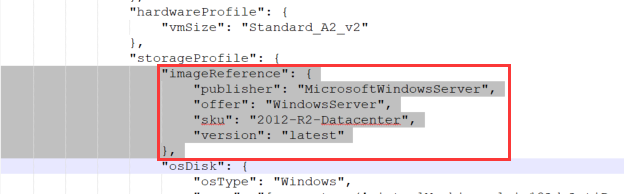

7. 删除 properties 字段中的 `osProfile` 字段。

    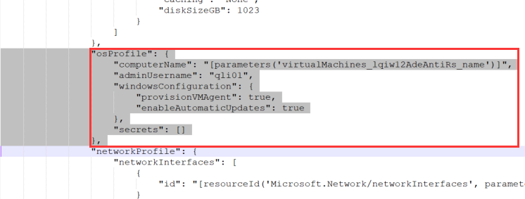

8. 修改 `osDisk` 和 `dataDisks` 字段中的 `createOption` 字段为 `Attach`。

    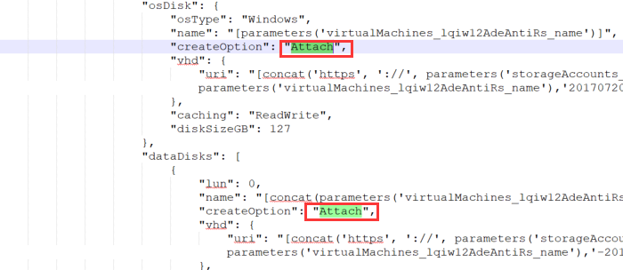

9. 删除虚拟机的 `dependsOn` 字段，包括上一行最后的逗号。

    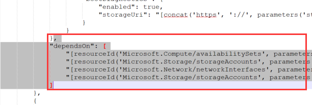

10. 对修改完的模板进行检查，保证 resources 字段中只包含需要重创的虚拟机和其扩展配置。

> [!NOTE]
> 请确保以上所修改的模板没有多余的空行，最后几行也没有多余的逗号。

### 删除当前虚拟机

在 [Azure 门户](https://portal.azure.cn/)中删除需要重建的虚拟机，保留其他资源如网卡、磁盘等。

### 进行模板部署

在 [Azure 门户](https://portal.azure.cn/)左侧点击 “**新建**” 按钮，搜索 “**模板部署**”。

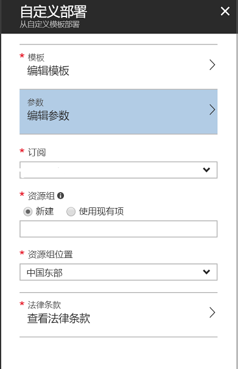

将之前修改完的模板贴到模板中，点击 “**保存**”。

点击 “**参数**”，在空白的参数中填入 **null**。

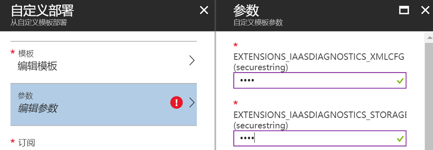

选择相应的**订阅**和**资源组**。<br>
点击 “**法律条款**” 选择 “**购买**”，即可进行部署。

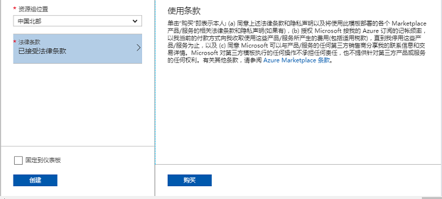

## 后续步骤

1. 在门户中查看虚拟机当前的可用性集。
2. 测试虚拟机连通性。
3. 重新配置诊断扩展或备份服务。

## 扩展阅读

- [创建和部署模板](https://docs.azure.cn/zh-cn/azure-resource-manager/resource-manager-create-first-template)
- [模板的最佳实践](https://docs.azure.cn/zh-cn/azure-resource-manager/resource-manager-template-best-practices)
- [使用 PowerShell 部署模板](https://docs.azure.cn/zh-cn/azure-resource-manager/resource-group-template-deploy)
- [使用 Azure CLI 部署模板](https://docs.azure.cn/zh-cn/azure-resource-manager/resource-group-template-deploy-cli)