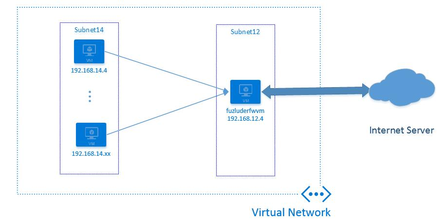
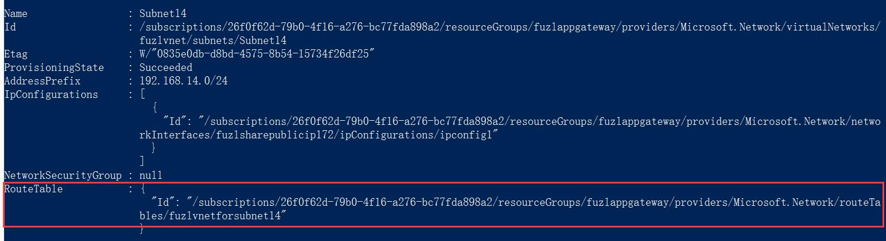
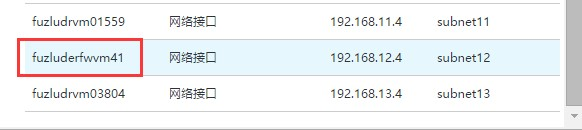
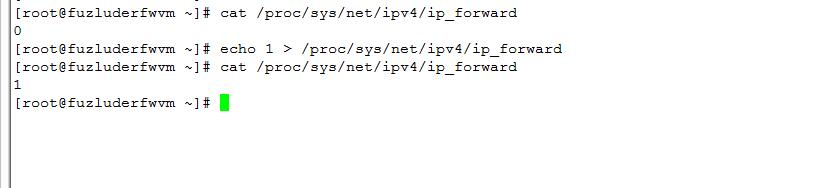
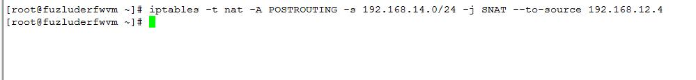
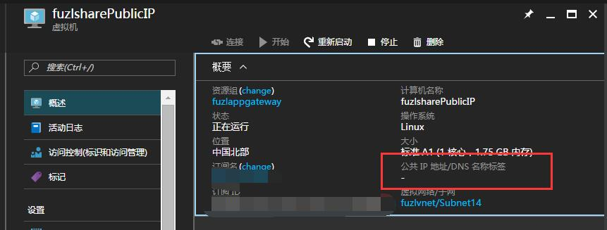
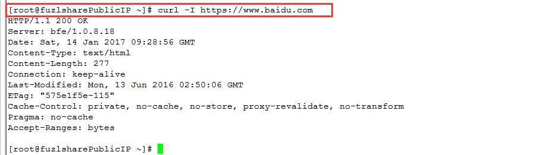

<properties
	pageTitle="ARM 虚拟机使用同一个公共 IP 访问公网的解决方案"
	description="ARM 虚拟机使用同一个公共 IP 访问公网的解决方案"
	service=""
	resource="virtualmachines"
	authors=""
	displayOrder=""
	selfHelpType=""
	supportTopicIds=""
	productPesIds=""
	resourceTags="Virtual Machines, PowerShell ,ARM, Public IP"​
	cloudEnvironments="MoonCake" />
<tags 
	ms.service="virtual-machines-aog"
	ms.date=""
	wacn.date="02/07/2017" />
# ARM 虚拟机使用同一个公共 IP 访问公网的解决方案

Azure 目前有两种部署模型：资源管理器 ARM 和经典 ASM。ASM 的虚拟机默认共用云服务的 VIP 来访问 Internet，ARM 的虚拟机默认使用自己的公共 IP 访问 Internet。因为有的服务器有访问白名单的设置，因此有的客户可能想实现的一个需求就是 ARM 的多个虚拟机也共用一个公共 IP 来访问公网的某个服务器，这样就不需要在对方的白名单上添加多个虚拟机的公共 IP 地址。下面介绍如何实现这个方案。

虚拟网络里 `Subnet14` 子网中的多台虚拟机将共用 `Subnet12` 中的虚拟机 `fuzluderfwvm` 访问 Internet 上的某台服务器。假设 Internet 上的这台服务器的地址是 `111.0.0.0/8` 这个网段的，这里以百度示例。下面介绍操作步骤。

1.	首先借助 Azure 的自定义路由功能，创建一个路由表，将 `Subnet14` 这个子网访问 Internet 服务器的流量定向到虚拟机 fuzluderfwvm。下面通过 Azure Powershell 来操作。其实也可以在门户上创建。

		#创建一个路由条目
		$route = New-AzureRmRouteConfig -Name subnet14route -AddressPrefix 111.13.100.91/8 -NextHopType VirtualAppliance -NextHopIpAddress 192.168.12.4
		#创建一个路由表，关联上面创建的路由条目
		$routeTable = New-AzureRmRouteTable -ResourceGroupName fuzlappgateway –Location “China North” -Name fuzlvnetforsubnet14 -Route $route
		#将上面创建的路由条目关联到子网Subnet14
		$vnet = Get-AzureRmVirtualNetwork -ResourceGroupName fuzlappgateway -Name fuzlvnet
		Set-AzureRmVirtualNetworkSubnetConfig -Name Subnet14 -VirtualNetwork $vnet -AddressPrefix 192.168.14.0/24 –RouteTable $routeTable
		#保存虚拟网络的配置
		Set-AzureRmVirtualNetwork -VirtualNetwork $vnet

	保存成功后，我们看到 `Subnet14` 上已经关联了上面创建的路由表。

	

2.	在虚拟机 `fuzluderfwvm` 上开启 IP 转发并对访问 `Subnet14` 子网中访问百度的流量做 SNAT。

	1.	在平台层面，开启虚拟机的 IP 转发功能 :
	
		在门户上看到，虚拟机 `fuzludrfwvm` 的网卡名称为 `fuzluderfwvm41`。

		

			#获取网卡对象
			$nicfwvm = Get-AzureRMNetworkInterface -ResourceGroupName fuzlappgateway -Name fuzluderfwvm41
			#开启IP转发
			$nicfwvm.EnableIPForwarding = 1
			#保存配置
			Set-AzureRmNetworkInterface -NetworkInterface $nicfwvm

	2.	在虚拟机 `fuzluderfwvm` 内部开启 IP 转发功能 :
	
			echo 1 >/proc/sys/net/ipv4/ip_forward
		
		

		
	3.	在虚拟机 `fuzluderfwvm` 内做一个 SNAT，将 `Subnet14` 中虚拟机访问百度数据包的源地址改为虚拟机 `fuzluderfwvm` 的地址 : 

			iptables -t nat -A POSTROUTING -s 192.168.14.0/24 -j SNAT --to-source 192.168.12.4
		
		

3.	在 `Subnet14` 内的一台虚拟机 `fuzlsharePublicIP` 上进行测试。为了凸显测试效果，这里将 `fuzlsharePublicIP` 这台虚拟机的公网 IP 地址移除。这样 `fuzlsharePublicIP` 将无法访问公网。

	

	但是在这台虚拟机上依然可以访问百度。因为根据我们上面定义的规则，这台虚拟机将使用 `fuzluderfwvm` 的公共 IP 访问百度。
	
	