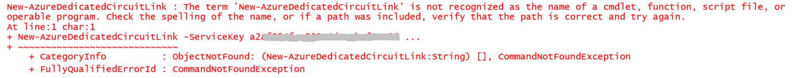
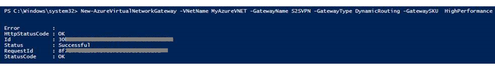
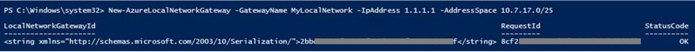
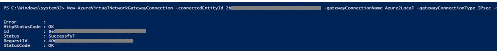
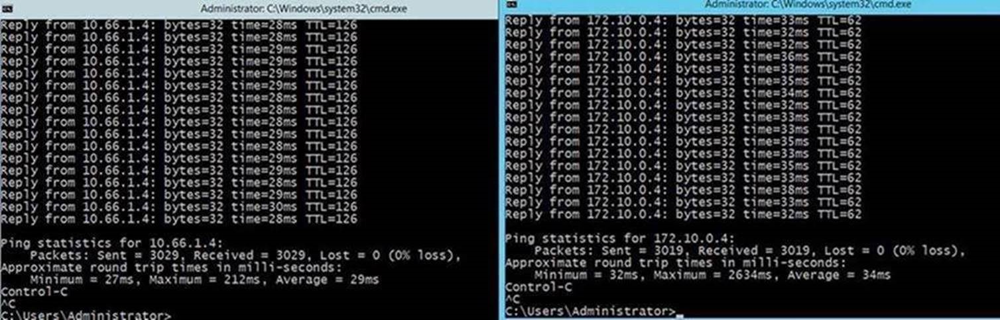
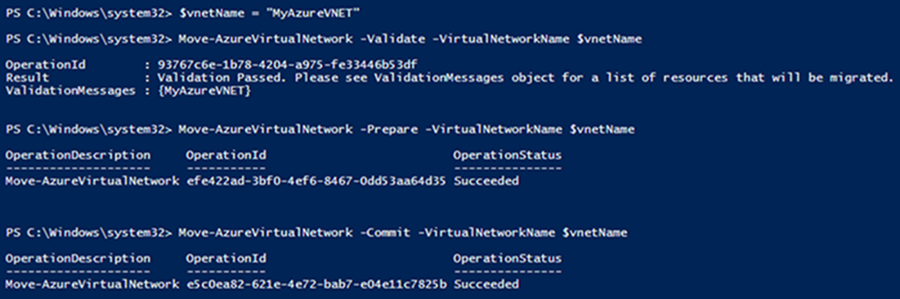

# 如何在 ASM 环境下部署以及迁移 ER/S2S 共存环境

## 简介

出于可用性考虑，实际业务中有很多适合 Express Route、S2S VPN 共存的情况：我们可以将 S2S VPN 配置为 Express Route 的安全故障转移路径，也可以把 S2S VPN 连接到不是 ER 进行连接的站点。

如何在 ASM 环境下配置 S2S VPN 和 ER 共存的详细方法在官方网站已有相关内容，参见：[配置 ExpressRoute 和站点到站点并存连接（经典）](/expressroute/expressroute-howto-coexist-classic)。该文档的介绍基于您已熟悉了解 ASM Vnet 等相关知识，实际操作中仍可能遇到问题。

## 本文目标

我们基于[上述文档](/expressroute/expressroute-howto-coexist-classic)和几个实际的迁移案例，对本地同一网络既配置 ER 又配置 S2S VPN 网关的情景做了实验。<br>
以下逐步介绍了每一步具体配置，可能遇到的报错和解决办法我们会用**【注意】**的方式标出，供您参考。

在本文最后，也附上如何将共存环境的 Vnet 从 ASM 迁移至 ARM 的方法。2017 年 11 月起，Azure 平台支持直接迁移同时含有 ER 和 S2S VPN 的虚拟网络。<br>
如果您发现迁移 Validate 报错，建议先参考[Azure 平台支持迁移的资源](/virtual-machines/linux/migration-classic-resource-manager-overview)以确认被迁移的部署中是否有不支持的功能：

## 创建共存环境

### 创建虚拟网络架构并定义本地站点及网关
1. Powershell 配置环境：

    PowershellGet 使用的是 1.0.0.1 版本，Azure 使用的是 4.3.1 版本。<br>
    可以使用其他版本进行部署，但是不保证其他版本可能会出现部分 Powershell 命令集的兼容问题。

2. 获取网络配置文件：

    ```
    Get-AzureVNetConfig -ExportToFile c:\NetworkConfig.xml
    ```

3. 使用文本编辑器添加本地站点网络地址空间及网关 IP，同时创建新的虚拟网络：

    ```xml
    <LocalNetworkSite name="MyLocalNetwork">
        <AddressSpace>
            <AddressPrefix>10.7.17.0/25</AddressPrefix>
        </AddressSpace>
        <VPNGatewayAddress>1.1.1.1</VPNGatewayAddress>
    </LocalNetworkSite>
    …………………………………………………………..
    <VirtualNetworkSite name="MyAzureVNET" Location="China North">
        <AddressSpace>
            <AddressPrefix>10.17.159.192/26</AddressPrefix>
        </AddressSpace>
        <Subnets>
            <Subnet name="Subnet-1">
                <AddressPrefix>10.17.159.192/27</AddressPrefix>
            </Subnet>
            <Subnet name="GatewaySubnet">
                <AddressPrefix>10.17.159.224/27</AddressPrefix>
            </Subnet>
        </Subnets>
        <Gateway>
            <ConnectionsToLocalNetwork>
                <LocalNetworkSiteRef name="MyLocalNetwork">
                <Connection type="Dedicated" />
                </LocalNetworkSiteRef>
            </ConnectionsToLocalNetwork>
        </Gateway>
    </VirtualNetworkSite>
    ```
    > [!NOTE]
    > 1. 网关子网应大于或等于`/27`。
    > 2. 官方文档中未配置`<LocalNetworkSite>`字段（默认已创建），请您根据实际情况修改或新增，以免出现以下 `Missing LocalNetworkSiteRef` 错误。

    ```powershell
    PS C:\Windows\system32> Set-AzureVNetConfig -ConfigurationPath c:\NetworkConfig.xml
    ```

    

4. 保存该文件。

5. 在 PowerShell 中使用以下命令上载网络配置文件：

    ```powershell
    Set-AzureVNetConfig -ConfigurationPath c:\NetworkConfig.xml
    ```

    > [!NOTE]
    > - 输出 OperationStatus 下应看到 `Succeeded`（如下图）。如果不是这样，请检查一下 xml 文件是否有格式上的错误。
    > 
    > - 请确保 GatewaySubnet 子网必须是 `/27` 或更短（比如`/26`, `/25`）。
    > - 请确保 Connection type 是 `Dedicated`。

### 创建 ExpressRoute 网关

使用以下命令创建 ExpressRoute 网关：

```powershell
New-AzureVNetGateway -VNetName MyAzureVNET -GatewayType DynamicRouting -GatewaySKU HighPerformance
```


> [!NOTE]
> - 请确保 GatewaySKU 为   `Standard/HighPerformance/UltraPerformance`。
> - 请确保 GatewayType 为 `DynamicRouting`。

### 导入 ER 模块

使用以下命令导入 ER 模块：

```powershell
Import-Module 'C:\Program Files (x86)\Microsoft SDKs\Azure\PowerShell\ServiceManagement\Azure\ExpressRoute\ExpressRoute.psd1'
```
> [!NOTE]
> 官方文档中未注明导入模块，如果您之前没有使用 PowerShell 配置过 ER 环境，请导入上述模块，以免出现以下 `not recognized as the name of a cmdlet` 错误。
> PS C:\Windows\system32> New-AzureDedicatedCircuitLink -ServiceKey a2af054f-c932-4dcc-baf9-a26612e260f8 -VNetName MyAzureVNET
> 

### 将 ER 网关关联到 ER 线路

通过以下命令进行关联：

```powershell
New-AzureDedicatedCircuitLink -ServiceKey <service-key> -VNetName MyAzureVNET
```


### 创建配置 S2S VPN 网关

1. 通过以下命令创建 S2S VPN 网关：

    ```powershell
    New-AzureVirtualNetworkGateway -VNetName MyAzureVNET -GatewayName S2SVPN -GatewayType DynamicRouting -GatewaySKU  HighPerformance
    ```
    > [!NOTE]
    > - 请确保 GatewaySKU 为 `Standard/HighPerformance/UltraPerformance`；
    > - 请确保 GatewayType 为 `DynamicRouting`。
    > 

2. 创建完毕后可以通过 `Get-AzureVirtualNetworkGateway`查看。

    > [!NOTE]
    > 建议将这里的 Gatewayid 存为 `$azure-s2s-vpn-gateway-id` 变量用于后续建立连接，网关 IP 用于客户侧本地 VPN 设备配置。

### 创建本地站点 VPN 网关实体（来提供公共 IP 和本地地址空间等本地网关设置）

1. 通过以下命令创建本地站点 VPN 网关：

    ```powershell
    New-AzureLocalNetworkGateway -GatewayName MyLocalNetwork -IpAddress <MyLocalGatewayIp> -AddressSpace <MyLocalNetworkAddress>
    ```
    

2. MyLocalNetwork 名称请与 netcfg 文件中的名称保持一致。
3. MyLocalNetworkAdress 有多个地址空间时，可以写成 `$MyLocalNetworkAdress = @(“10.1.2.0/24","10.1.3.0/24","10.2.1.0/24")`。
4. 创建完毕后可以通过 `Get-AzureLocalNetworkGateway` 查看（建议同样记录这里的 `local-network-gateway-id` 用于后续建立连接）。

> [!NOTE]
> 在 ER 和 S2S VPN 共存的环境下，VPN 的 local network site 地址段实际不会参考 VNetconfig 中的内容（但 Vnetconfig 中需要声明），实际参照的是在 PowerShell 中创建的 `New-AzureLocalNetworkGateway` 相关配置。

### 在客户侧配置本地 VPN 设备以连接到新网关

推荐设备配置可参考：[关于用于站点到站点 VPN 网关连接的 VPN 设备和 IPsec/IKE 参数](/vpn-gateway/vpn-gateway-about-vpn-devices)

### 将 Azure 上 S2S VPN 连接到本地网关

1. 连接命令（创建 Connection）:

    ```powershell
    New-AzureVirtualNetworkGatewayConnection -connectedEntityId <local-network-gateway-id> -gatewayConnectionName Azure2Local -gatewayConnectionType IPsec -sharedKey abc123 -virtualNetworkGatewayId <azure-s2s-vpn-gateway-id>
    ```
    

2. 完成此步骤后，就完成了通过 S2S VPN 连接建立本地网络与 Azure 之间的连接。

> [!NOTE]
> 客户建立 S2S VPN 时 可以复用已有的 LocalNetworkSite，把它连接到新的 AzureVnetGateway，这不会影响现有的连接。
> 经过测试，ASM 和 ARM 这样操作都是可行的。
> 附上 ASM 模式下，在 on-prem 本地 ping 两个 Azure Vnet 的结果：没有丢包。
> 


## 测试迁移 Vnet、网关和相关的部署

### 注册订阅以便进行资源迁移（如果已经执行过注册请跳过）

```powershell
Select-AzureRmSubscription -SubscriptionName <Your Subscription Name>
Register-AzureRmResourceProvider -ProviderNamespace Microsoft.ClassicInfrastructureMigrate
Get-AzureRmResourceProvider -ProviderNamespace Microsoft.ClassicInfrastructureMigrate
```

### 根据需要移动 ER 线路

[使用 PowerShell 将 ExpressRoute 线路从经典部署模型移动到 Resource Manager 部署模型](/expressroute/expressroute-howto-move-arm)

### 转移虚拟网络（验证、准备、迁移）

```powershell
Move-AzureVirtualNetwork -Validate -VirtualNetworkName $vnetName
Move-AzureVirtualNetwork -Prepare -VirtualNetworkName $vnetName
Move-AzureVirtualNetwork -Commit -VirtualNetworkName $vnetName
```



> [!NOTE]
> 迁移过程中可以通过该命令终止迁移`Move-AzureVirtualNetwork -Abort $vnetName`。