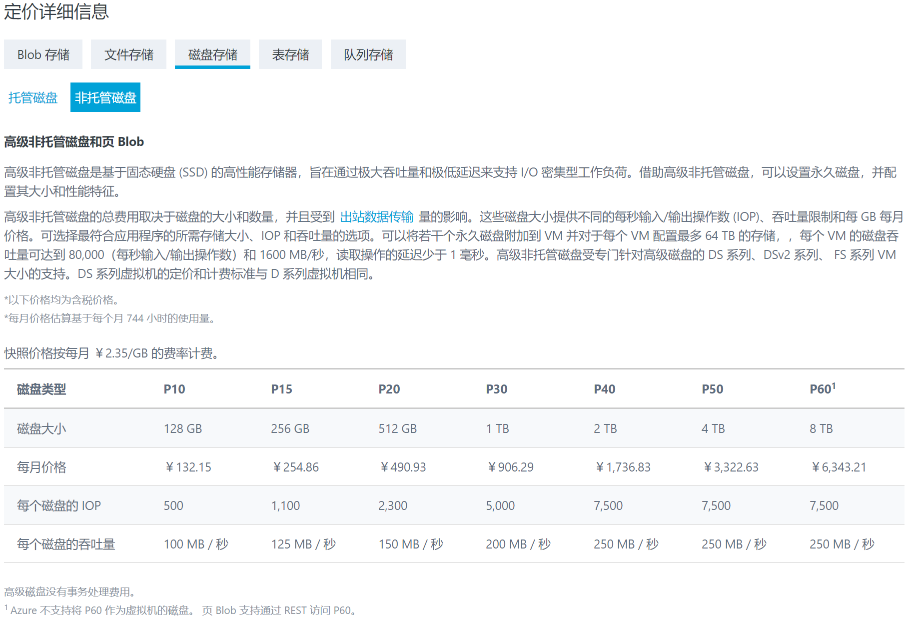
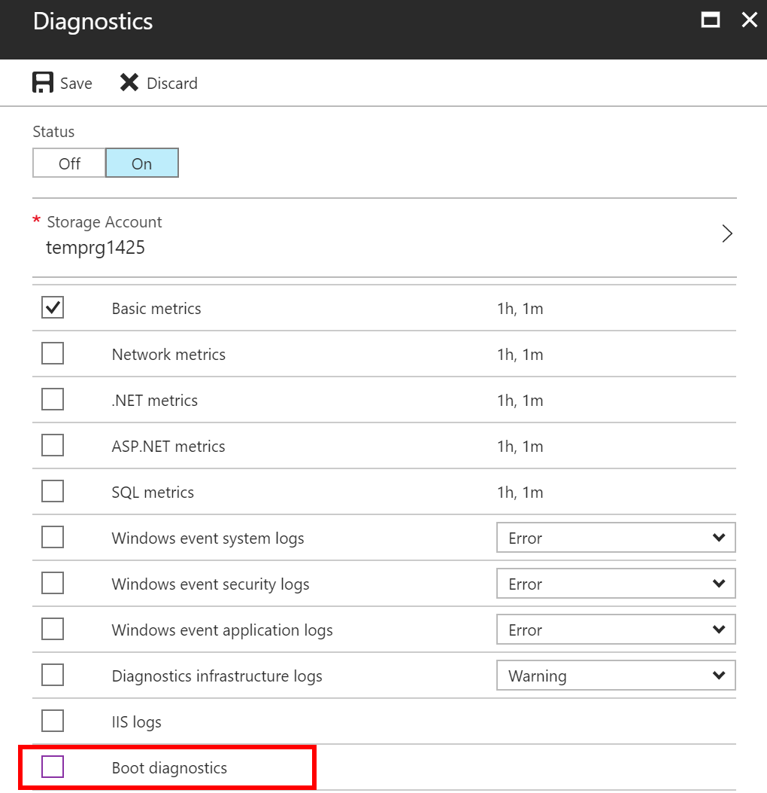
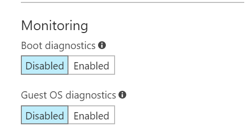

# 经典高级虚拟机使用启动诊断功能的注意事项

根据经典模式的设计，经典虚拟机无论通过命令行 `Set-AzureVMBootDiagnostics` 或者通过门户启用启动诊断（BootDiagnostic），都会在虚拟机当前操作系统磁盘所在的存储账号下生成启动诊断容器和相关的屏幕截图或者日志文件。

这些文件默认是以 Page Blob 的格式存放的，Page Blob 也就是在 Azure 中 VHD 磁盘的存储类型。

对于普通磁盘虚拟机，存储的收费是按照实际使用量来计算的，因此启用该功能增加的额外的存储成本几乎微不可计。

但对于使用了 SSD 磁盘的高级虚拟机，那么启动诊断的日志和屏幕截图也会以 Page Blob 的方式存放在高级存储账户中。根据 [存储价格详情](https://www.azure.cn/pricing/details/storage/) 的定义，高级磁盘是按大小和数量来收费；小于指定级别的盘自动与上级对齐。也就是说，放在高级存储账户下的可能不到 1MB 的启动诊断数据，将会按照 P10 的价格来收费。

若客户在不知情的情况下为经典模式的虚拟机开启了启动诊断，则可能在账单中多出一些 P10 的开销。目前这是设计所致，若客户希望避免这类开销，建议暂时将启动诊断关闭；并删除高级存储账号下已经生成的容器和启动诊断日志、截图。

## 注意事项

1. 启动诊断并不是诊断扩展，用户仍然有选择开启诊断扩展监控虚拟机内部性能。在设置诊断功能时，去掉 `Boot Diagnostics` 即可。

    

2. 在 [Azure 门户](https://portal.azure.cn)创建经典普通磁盘虚拟机时，启动诊断默认是开启的；而创建经典高级磁盘虚拟机时，默认启动诊断是关闭的。这也是考虑到用户容易忽略默认选项而避免可能产生的额外费用的设计。

    

3. 如果用户在虚拟机运行期间开启了启动诊断。经典模式下不会立即产生启动诊断的数据，也就是不会立即在存储账号中生成 Page Blob。一般要等到下次虚拟机重新分配时，才会生成数据。

4. 该情况只在经典模式的高级磁盘虚拟机才存在，对于 ARM 模式的虚拟机没有该情况。
