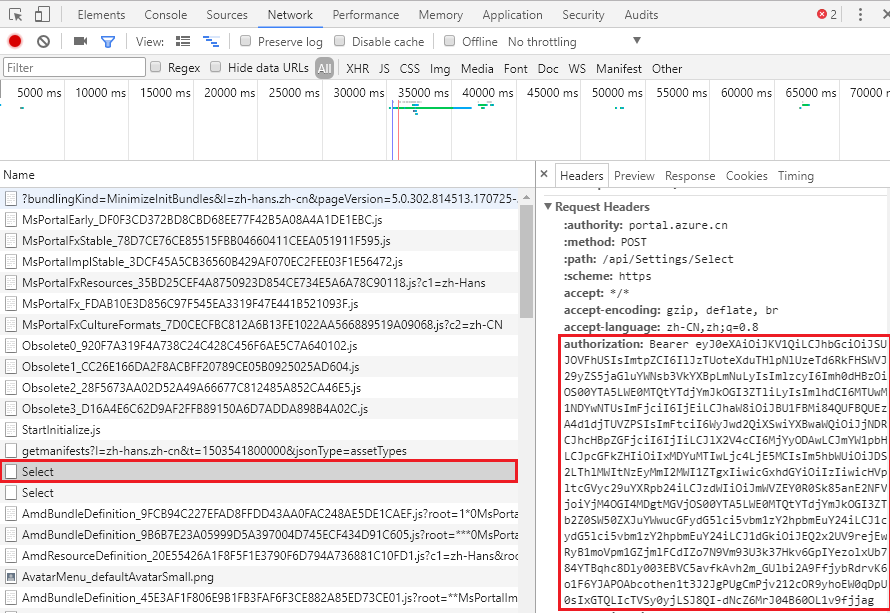
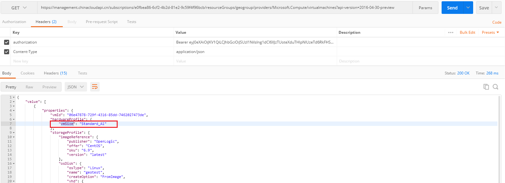
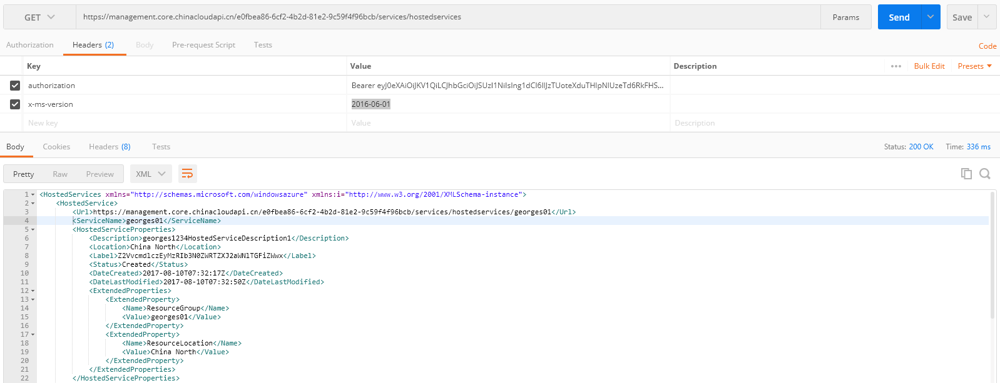

# REST 接口获取订阅下虚拟机信息

在有些场景下，客户期望通过使用 REST 接口来统计某个订阅下的虚拟机信息，比如：获取订阅下某个 Size 虚拟机的总数量。实际上这是一个按属性进行分组统计的典型场景，对于这种需求，我们更建议使用 Powershell 或 SDK 来实现。

无论哪种方式，我们均需要注意，虚拟机存在两种部署模型：ASM（经典模式）和 ARM（资源管理器模式），那么不同的部署模型也对应着不同的 REST 协议，SDK、Powershell 命令亦如此。

本文我们将重点介绍使用 REST 接口来达成这个需求的基本思路，一般来说这个过程需要通过程序调用 REST，然后实现分组统计的业务逻辑即可。

## <a id="section1"></a>关于虚拟机 REST 接口的认证

无论是哪种部署模型的虚拟机，目前其 REST 接口都支持基于 AAD 的认证方式，早期的 ASM 虚拟机同样支持 x509 证书认证，处于一致性考虑，这里我们介绍两种都支持的 AAD 认证方式。

在调用接口时，我们需要提供一个基于 AAD 的认证 Token，总体来说有两种方式获取这个 Token:

### 方式一：浏览器从门户获取临时 Token

1. 通过 Chrome 浏览器登录 [Azure 门户](https://portal.azure.cn/)。
2. 按 F12 弹出开发者工具界面，选择 “**Network**” 选项卡，此时刷新登录页面，在 “**Network**” 中找到 “**Select**” 项，找到 “**authorization**”，该值即可用于认证我们调用的 REST 请求。

    

### 方式二：代码方式获取认证授权 Token

1. 通过 PowerShell 获取认证凭据

    ```PowerShell
    # 1.在 PowerShell 中，登录 Azure 账户
    Login-AzureRmAccount -EnvironmentName AzureChinaCloud

    # 2.选择当前订阅 ID
    Set-AzureRmContext -SubscriptionId "订阅 ID"

    # 3.创建 AD Application
    $azureAdApplication = New-AzureRmADApplication -DisplayName "georgeapp" -HomePage "https://www.georgeapp.org" -IdentifierUris "https://www.georgeapp.org/example" -Password "1QAZxsw2"
    $azureAdApplication

    # 4.为你的 AD 应用创建服务凭证
    New-AzureRmADServicePrincipal -ApplicationId $azureAdApplication.ApplicationId

    # 5.为服务凭证授权。如果想了解更多内容，请参考：https://azure.microsoft.com/zh-cn/documentation/articles/role-based-access-control-what-is/
    New-AzureRmRoleAssignment -RoleDefinitionName Contributor -ServicePrincipalName $azureAdApplication.ApplicationId 
    ```

    执行上述操作后，就可以获取可用的认证凭据信息：

    - tentantId：第二步执行完成后返回
    - subId：第二步指定的订阅 ID 
    - clientId：第三步执行完成后返回
    - clientSecret：第三步中设置的 Password

2. 通过代码获取认证 Token

    - Java 示例

        ```Java
        private String getAccessToken() {
            AuthenticationContext context = null;
            AuthenticationResult result = null;
            ExecutorService service = null;
            service = Executors.newFixedThreadPool(1);

            try {
                context = new AuthenticationContext(
                    String.format("%s/%s", 
                    "https://login.chinacloudapi.cn", tentantId),
                    true, 
                    service);
                ClientCredential cred = new ClientCredential(
                    clientId, 
                    clientSecret);
                Future<AuthenticationResult> future =   
                    context.acquireToken(
                        "https://management.chinacloudapi.cn/", cred,
                        null);
                result = future.get();
            } catch (MalformedURLException e) {
                e.printStackTrace();
            } catch (InterruptedException e) {
                e.printStackTrace();
            } catch (ExecutionException e) {
                e.printStackTrace();
            } finally {
                service.shutdown();
            }
            return result.getAccessToken();
        }
        ```

    - Python 示例

        ```Python
        from msrestazure.azure_active_directory import AADTokenCredentials, ServicePrincipalCredentials

        client_id = '16a94c84-c6ba-4f19-aa48-3353f8ffe1dd'
        client_secret = '123456'
        tenant_id = 'b388b808-0ec9-4a09-a414-a7cbbd8b7edd'
        subscription_id = 'e0fbea86-6cf2-4b2d-81e2-9c59f4f96bdd'

        credentials = ServicePrincipalCredentials(client_id,client_secret,tenant=tenant_id,china='true')

        print(credentials.token)
        ```

    - C# 示例

        ```C#
        public static async Task<string> GetAccessTokenAsync()
        {
            AuthenticationContext context = new 
            AuthenticationContext(
                string.Format("https://login.chinacloudapi.cn/{0}", tenantId), 
                false);
            var credential = new UserPasswordCredential("订阅账号", "订阅密码");
            AuthenticationResult authenticationResult = 
            await context.AcquireTokenAsync(
                "https://management.chinacloudapi.cn/", 
                clientId, 
                credential);
            string token = authenticationResult.AccessToken;
            return token;
        } 
        ```

## 调用示例

1. ARM API（资源管理器模式）:

    - 实现原理：

        1. 先获取一个订阅下的所有资源组。
        2. 获取每个资源组下面的虚拟机信息。
        3. 根据每个虚拟机信息的 vmSize 进行分组统计（这个逻辑，比较适合用程序实现）。

    - 参考接口:

        1. [Resource Groups - List](https://docs.microsoft.com/zh-cn/rest/api/resources/ResourceGroups/List)
        2. [List the virtual machines in a resource group](https://docs.microsoft.com/zh-cn/rest/api/compute/virtualmachines/virtualmachines-list-resource-group)

    - 测试准备：

        1. Endpoint: 上述 API 连接中的 API 终结点是 Global Azure 服务，我们需要修改为 China Azure 终结点，即将 `https://management.azure.com` 换成 `https://management.chinacloudapi.cn`。
        2. Authorization: 参考[《关于虚拟机 REST 接口的认证》](#section1)部分。

    - 接口测试：

        1. [Resource Groups - List](https://docs.microsoft.com/zh-cn/rest/api/resources/ResourceGroups/List)

            1. 测试请求：`https://management.chinacloudapi.cn/subscriptions/e0fbea86-6cf2-4b2d-81e2-9c59f4f96bcb/resourcegroups?api-version=2017-05-10`
            
            2. 参数设置：
            
                - Authorization：上一步中浏览器中拿到的 Authorization 值
                - Content-Type：application/json
            
            3. Postman 测试：
                
                
        
        2. [List the virtual machines in a resource group](https://docs.microsoft.com/zh-cn/rest/api/compute/virtualmachines/virtualmachines-list-resource-group)

            1. 测试请求：`https://management.chinacloudapi.cn/subscriptions/e0fbea86-6cf2-4b2d-81e2-9c59f4f96bcb/resourceGroups/geogroup/providers/Microsoft.Compute/virtualmachines?api-version=2016-04-30-preview`

            2. 参数设置：

            - Authorization：上一步中浏览器中拿到的 Authorization 值
            - Content-Type：application/json

            3. Postman 测试：

                

2.	ASM API（经典模式）:

    - 实现原理：

        1. 先获取一个订阅下的所有云服务
        2. 获取每个云服务下的部署
        3. 获取每个部署下的角色
        4. 根据角色 RoleSize 进行分组统计

    - 参考接口:

        1. [List Cloud Services](https://msdn.microsoft.com/zh-cn/library/azure/ee460781.aspx)
        2. [Get Deployment](https://msdn.microsoft.com/zh-cn/library/azure/ee460804.aspx)
        3. [Get Role](https://msdn.microsoft.com/zh-cn/library/azure/jj157193.aspx)

    - 测试准备：

        1. Endpoint: 上述 API 连接中的 API 终结点是 Global Azure 服务，我们需要修改为 China Azure 终结点，即将 `https://management.core.windows.net` 换成 `https://management.core.chinacloudapi.cn` 
        2. 同样可以基于 AAD 方式认证，参考前面[《关于虚拟机 REST 接口的认证》](#section1) 部分。

    - 接口测试：

        1. [List Cloud Services](ttps://msdn.microsoft.com/zh-cn/library/azure/ee460781.aspx)

            1. 测试请求： `https://management.core.chinacloudapi.cn/e0fbea86-6cf2-4b2d-81e2-9c59f4f96bcb/services/hostedservices`
        
            2. 参数设置：

                - Authorization：Chrome 浏览器拿到的那个认证 Token
                - x-ms-version：2016-06-01
            
            3. Postman 测试：
        
                

        2. 关于 [Get Deployment](https://msdn.microsoft.com/zh-cn/library/azure/ee460804.aspx)、[Get Role](https://msdn.microsoft.com/zh-cn/library/azure/jj157193.aspx) 的调用也非常简单，与 [List Cloud Services](https://msdn.microsoft.com/zh-cn/library/azure/ee460781.aspx) 类似，不在赘述。

## 最后说明

通过 REST 接口，我们能获取到某个虚拟机的各种属性信息，但最终的业务达成还需要通过程序来实现，比如分组统计的逻辑。期望这篇文档对您有所帮助。