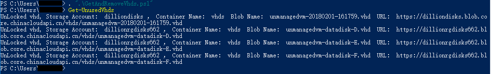
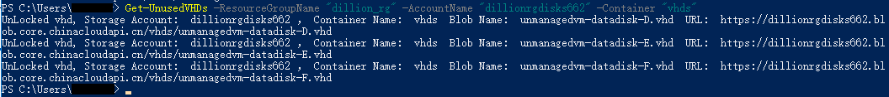
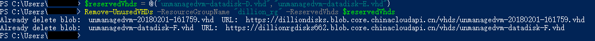
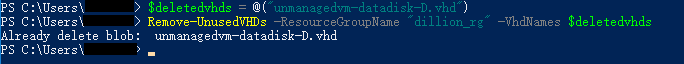
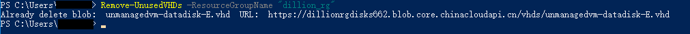

# 如何查找并删除未被使用的非托管磁盘源 .vhd 文件

删除虚拟机时，与该虚拟机相关联的操作系统盘和数据磁盘不会被删除，最终会留在 Azure 存储账户中，从而导致用户继续承担这些磁盘的存储费用。

本文主要介绍了如何使用 PowerShell 查找并删除未被使用的非托管磁盘源 .vhd 文件。主要包括以下内容：

* [查看当前订阅下未被使用的源 .vhd 文件](#getUnusedVHDs)
* [保留所需的源 .vhd 文件，删除其他的源 .vhd 文件](#keepReservedVhds)
* [删除指定的源 .vhd 文件](#removespecifiedVhds)
* [删除订阅下或者指定资源组中未被使用的源 .vhd 文件](#removeAllVhds)
* [详细 Powershell 脚本](#detailsScript)

如果您使用的是托管磁盘，请参阅[如何查找并删除未被使用的托管磁盘](aog-virtual-machines-how-to-find-and-delete-unused-disks.md)。

> [!IMPORTANT]
> 如果从资源组或存储账户中删除非托管磁盘源 .vhd 文件，Microsoft 则无法为用户恢复数据。为防止重要数据丢失，请将重要数据在本地备份。

## 实现思路

非托管磁盘源 .vhd 文件以页 Blob 的方式存储在存储账户中，通过查看页 Blob 的名称来判断是否是源 .vhd 文件，通过检查属性 LeaseState 来判断源文件是否被租用，然后进行删除。

> [!NOTE] 
> 默认情况下，创建新的 VM 时，系统磁盘会存储在存储账户中的 vhds 容器中，为了方便管理源 .vhd 文件,建议将所有的源 .vhd 文件都放在 vhds 容器中。本文中所有的源 .vhd 文件都放在 vhds 容器中，并且在本文使用的脚本中，默认设置容器名称为 vhds 。

## <a id="getUnusedVHDs"></a> 查看当前订阅下未被使用的源 .vhd 文件

遍历所有的存储账户，在 vhds 容器中根据 Blob 的文件名和属性查找出未被使用的源 .vhd 文件。

> [!NOTE]
> 在本示例中，将 [PowerShell Function 脚本](#detailsScript)放在用户文件夹下的 "GetAndRemoveVhds.ps1" 文件中。在运行相关命令前，先执行脚本文件，定义 Function , 然后调用相关的 Function 执行查询和删除命令。

```powershell
# 执行脚本文件
. ".\GetAndRemoveVhds.ps1"
# 查看订阅下所有未被使用的托管磁盘。
Get-UnusedVHDs
```


也可以使用以下代码查看指定资源组、存储账户以及容器名称中未被使用的源 .vhd 文件。

```powershell
Get-UnusedVHDs -ResourceGroupName "<资源组名称>" -AccountName "<存储账户名称>" -Container "< Blob 容器名称>"
```




## <a id="keepReservedVhds"></a> 保留所需的源 .vhd 文件，删除其他的源 .vhd 文件

> [!NOTE]
> 使用该脚本删除源 .vhd 文件时，会将被 Lock 的源 .vhd 文件解锁并删除，所以在删除前再次检查是否需要删除，如果需要保留源 .vhd 文件，请使用下列的代码指定保留源 .vhd 文件。
> 输入的 .vhd 文件名称需要 **保留 .vhd 后缀**。

```powershell
$reservedVhds = @("<源 .vhd 文件 Blob 名称>","<源 .vhd 文件 Blob 名称>")
Remove-UnusedVHDs -ResourceGroupName "<资源组名称>" -ReservedVhds $reservedVhds
```



## <a id="removespecifiedVhds"></a> 删除指定的源 .vhd 文件

> [!NOTE]
> 输入的 .vhd 文件名称需要**保留 .vhd 后缀**。

```powershell
$deletedvhds = @("<源 .vhd 文件 Blob 名称>")
Remove-UnusedVHDs -ResourceGroupName "<资源组名称>" -VhdNames $deletedvhds
```



## <a id="removeAllVhds"></a> 删除订阅下或者指定资源组中未被使用的源 .vhd 文件

```powershell
#删除资源组中未被使用的源 .vhd 文件
Remove-UnusedVHDs -ResourceGroupName "<资源组名称>"
```



如果使用以下命令，则会删除当前订阅下所有 Blob 容器名称为 vhds 中未被使用的源 .vhd 文件。

```powershell
#删除当前订阅下 vhds 容器中未被使用的源 .vhd 文件
Remove-UnusedVHDs
```

## <a id = "detailsScript"></a> 详细 PowerShell 脚本

```powershell
# 获取未被使用的源 .vhd 文件
Function Get-UnusedVHDs()
{
    #ResourceGroupName:资源组名称；AccountName：存储账户名称；Container：Blob容器名称
    Param($ResourceGroupName, $AccountName, $Container);
    $storages = New-Object System.Collections.ArrayList; 
    if(($ResourceGroupName -ne $Null) -and ($AccountName -ne $Null))
    {
        $storages = Get-AzureRmStorageAccount -ResourceGroupName $ResourceGroupName -AccountName $AccountName -WarningAction Ignore;
    }
    elseif(($ResourceGroupName -ne $Null) -and ($AccountName -eq $Null))
    {
        $storages = Get-AzureRmStorageAccount -ResourceGroupName $ResourceGroupName -WarningAction Ignore;
    }
    else
    {
        $storages = Get-AzureRmStorageAccount -WarningAction Ignore;
    }

    if($Container -eq $Null)
    {
        #设置默认容器
        $Container = "vhds";
    }
    #遍历所有的存储账户，在 vhds 容器中根据 Blob 的文件名和 Url 查找出未被使用的 VHD。
    Foreach ($storage in $storages)
    {
        $storageAccountName = $storage.StorageAccountName;
        $blobs = Get-AzureStorageBlob -Context $storage.Context -Container $Container -ErrorAction Ignore;
        foreach ($blob in $blobs)
        {
            if ($blob.BlobType -eq "PageBlob")
            {
                $url = $blob.ICloudBlob.Uri.AbsoluteUri;
                if ($url.EndsWith(".vhd"))
                {
                    #根据 Blob 的属性判断当前源 .vhd 文件是否被租用
                    if($blob.ICloudBlob.Properties.LeaseState -eq "Available")
                    {
                        if($blob.ICloudBlob.Properties.LeaseStatus -eq "Locked")
                        {
                            Write-Host "Locked vhd, Storage Account: " $storageAccountName "， Container Name: " $Container " Blob Name: " $blob.Name " URL: " $url;
                        }
                        else
                        {
                            Write-Host "UnLocked vhd, Storage Account: " $storageAccountName "， Container Name: " $Container " Blob Name: " $blob.Name " URL: " $url;
                        }
                    }
                }
            }
        }
    }
}
# 删除未使用的源 .vhd 文件
Function Remove-UnusedVHDs()
{
    # ResourceGroupName:资源组名称; AccountName: 存储账户名称; Container: Blob 容器名称; 
    # VhdNames: 要删除的源 .vhd 文件; ReservedVhds：需要保留的源 .vhd 文件
    Param($ResourceGroupName, $AccountName, $Container, [String[]]$VhdNames, [String[]]$ReservedVhds);
    $storages = New-Object System.Collections.ArrayList; 
    if(($ResourceGroupName -ne $Null) -and ($AccountName -ne $Null))
    {
        $storages = Get-AzureRmStorageAccount -ResourceGroupName $ResourceGroupName -AccountName $AccountName -WarningAction Ignore;
    }
    elseif(($ResourceGroupName -ne $Null) -and ($AccountName -eq $Null))
    {
        $storages = Get-AzureRmStorageAccount -ResourceGroupName $ResourceGroupName -WarningAction Ignore;
    }
    else
    {
        $storages = Get-AzureRmStorageAccount -WarningAction Ignore;
    }

    if($Container -eq $Null)
    {
        $Container = "vhds";    #设置默认容器
    }

    if($VhdNames -ne $Null)
    {
        foreach($vhd in $VhdNames)
        {
            foreach ($storage in $storages)
            {
                $blob = Get-AzureStorageBlob -Context $storage.Context -Container $Container -Blob $vhd -ErrorAction Ignore;
                if($blob -ne $Null)
                {
                    if($blob.ICloudBlob.Properties.LeaseStatus -eq "Locked")
                    {
                        $blob.ICloudBlob.BreakLease();
                        Write-Host "Successfully break lease on blob: " $blob.Name " URL: " $url;
                    }
                    Remove-AzureStorageBlob -Context $storage.Context -Container $Container -Blob $vhd -Force;
                    Write-Host "Already delete blob: " $vhd;  
                }
            }
        }
    }
    else
    {
        #遍历所有的存储账户，在 vhds 容器中根据 Blob 的文件名和 Url 查找出未被使用的 VHD。
        Foreach ($storage in $storages)
        {
            $blobs = Get-AzureStorageBlob -Context $storage.Context -Container $Container -ErrorAction Ignore;
            foreach ($blob in $blobs)
            {
                if ($blob.BlobType -eq "PageBlob")
                {
                    $url = $blob.ICloudBlob.Uri.AbsoluteUri;
                    if ($url.EndsWith(".vhd"))
                    {
                        #根据 Blob 的属性判断当前源 .vhd 文件 是否被租用
                        if($blob.ICloudBlob.Properties.LeaseState -eq "Available")
                        {
                            if($ReservedVhds -ccontains($blob.Name))
                            {#保留源 .vhd 文件
                            }
                            else
                            {
                                if($blob.ICloudBlob.Properties.LeaseStatus -eq "Locked")
                                {
                                    $blob.ICloudBlob.BreakLease();
                                    Write-Host "Successfully break lease on blob: " $blob.Name " URL: " $url;
                                }
                                
                                Remove-AzureStorageBlob -Context $storage.Context -Container $Container -Blob $blob.Name -Force;
                                Write-Host "Already delete blob: " $blob.Name " URL: " $url;                            
                            }
                        }
                    }
                }
            }
        }
    }
}
```