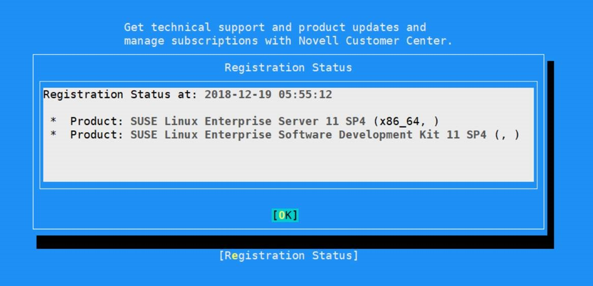
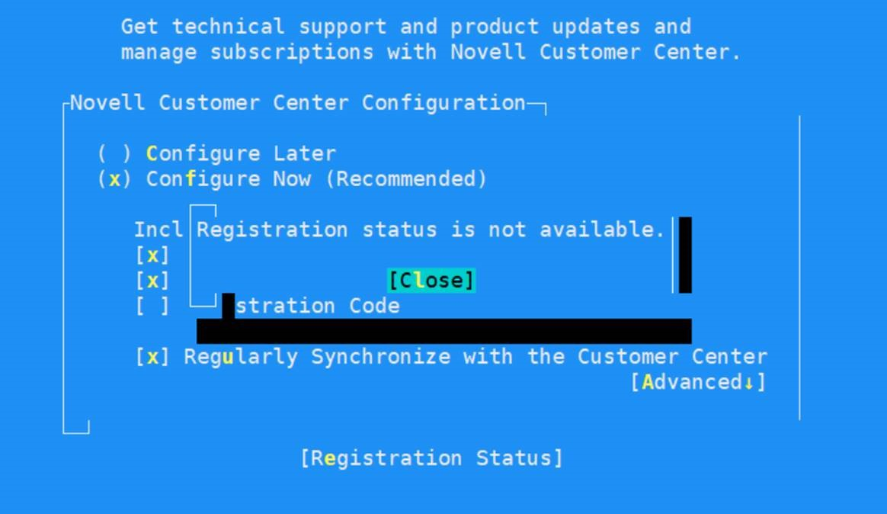

# 如何确认 SUSE Linux Enterprise Server 虚拟机注册状态

目前 Azure 中国提供的 SUSE Linux Enterprise Server 虚拟机镜像包括自带订阅和 BYOS（Bring Your Own Subscription）两种类型：前者在虚拟机操作系统层面可以得到 SUSE 官方技术支持；后者可以方便企业用户使用已有的订阅进行注册，注册之后方可获取 SUSE 官方技术支持。

## SUSE Linux Enterprise Server 11 系列

针对 SUSE Linux Enterprise Server 11 系列可以使用如下方法进行注册信息确认：

1. 使用 SSH 登录目标 SUSE 虚拟机，并切换至 root 用户。

2. 输入 `yast2`。

3. 依次进入 Support-Novell Customer Center Configuration。

4. 在 Novell Customer Center Configuration 界面使用 Tab 键打开 *Registration Status*。

5. 在 Details 中可以看到详细注册信息。

6. 此为注册成功示例：

    

7. 此为未注册示例：

    

## SUSE Linux Enterprise Server 12 系列和 15 系列

针对 SUSE Linux Enterprise Server 12 系列和 15 系列可以使用如下方法进行注册信息确认：

```bash
sudo SUSEConnect --status
```

1. 如下为未注册输出结果：

    ```json
    [{"identifier":"SLES","version":"12.3","arch":"x86_64","status":"Not Registered"}]
    ```

2. 如下为已注册输出结果：

    ```json
    [{"identifier":"sle-module-hpc","version":"12","arch":"x86_64","status":"Registered"},{"identifier":"sle-sdk","version":"12.3","arch":"x86_64","status":"Registered"},{"identifier":"sle-module-containers","version":"12","arch":"x86_64","status":"Registered"},{er":"sle-module-adv-systems-management","version":"12","arch":"x86_64","status":"Registered"},{"identifier":"sle-module-web-scripting","version":"12","arch":"x86_64","status":"Registered"},{"identifier":"sle-module-legacy","version":"12","arch":"x86_64","stat"status":"Registered"},{"identifier":"sle-module-public-cloud","version":"12","arch":"x86_64","status":"Registered"}]
    ```