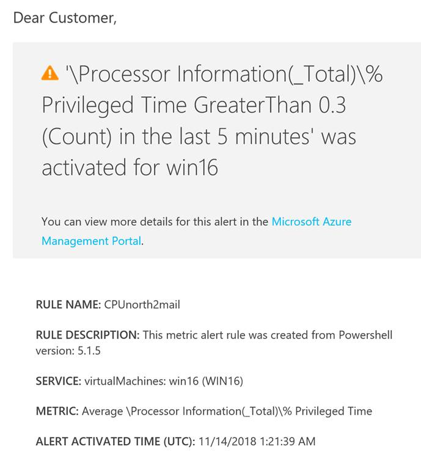

# 如何在中国东部 2 北部 2 为 Windows 虚拟机创建警报规则

## 问题描述

由于现在中国北部 2 中国东部 2 都暂时不支持直接通过门户网页设置警报规则，建议用户通过以下 PowerShell 方式为中国新区的 Windows 虚拟机设置警报规则。

## 解决方法

1. 在 Azure 门户网页上为 Windows 虚拟机[开启诊断设置](https://docs.azure.cn/virtual-machines/windows/monitor#diagnostics-and-metrics)；

2. 在 PowerShell 中创建一个中国东区或北区的警报规则，将其目标指向北 2 或东 2 的虚拟机，选择您需要触发警报的指标和阈值，以及相关警报行为。脚本示例如下：

    ```powershell
    Add-AzureRmMetricAlertRule -Name CPUnorth2mail -Location "China East" -ResourceGroup "test-east" -TargetResourceId "/subscriptions/19a55c58-8bxxxxxxx0c99/resourceGroups/Lab/providers/Microsoft.Compute/virtualMachines/test" -MetricName "\Processor Information(_Total)\% Privileged Time" -Operator GreaterThan -Threshold 0.4 -WindowSize 00:05:00 -TimeAggregationOperator Average -Action $actionEmail
    ```

3. 配置成功后，如您选择了邮件警报方式，将会收到如下邮件：

    

## 更多信息

* [Get-AzureRmAlertRule](https://docs.microsoft.com/azure/monitoring-and-diagnostics/alert-metric-classic#with-powershell)
* [性能指标](https://docs.azure.cn/monitoring-and-diagnostics/monitoring-supported-metrics#microsoftcomputevirtualmachines)

|Azure metric|
|----|
|\Processor(_Total)\% Processor Time|
|\Processor Information(_Total)\% Privileged Time|
|\Processor(_Total)\% User Time|
|\Processor Information(_Total)\Processor Frequency|
|\Memory\% Committed Bytes In Use|
|\Memory\Available Bytes|
|(memoryInMB - \Memory\Available Bytes)/memoryInMB|
|\Memory\Committed Bytes|
|\Memory\Commit Limit|
|\Memory\Commit Limit - \Memory\Committed Bytes|
|\Memory\Cache Faults/sec|
|\Memory\Page Faults/sec|
|\Memory\Page Reads/sec|
|\Memory\Pages/sec|
|\Memory\Pages/sec - \Memory\Page Reads/sec|
|\Memory\Pool Paged Bytes|
|\Memory\Pool Nonpaged Bytes|
|\Memory\Transition Faults/sec|
|\PhysicalDisk(_Total)\Disk Transfers/sec|
|\PhysicalDisk(_Total)\Disk Reads/sec|
|\PhysicalDisk(_Total)\Disk Writes/sec|
|\LogicalDisk(_Total)\Free Megabytes|