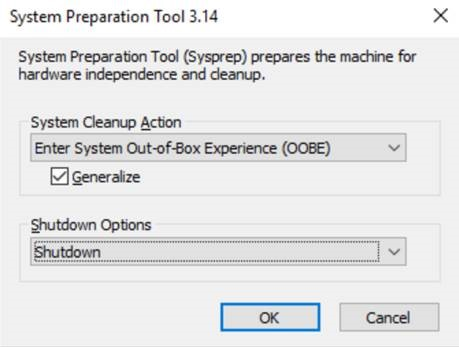
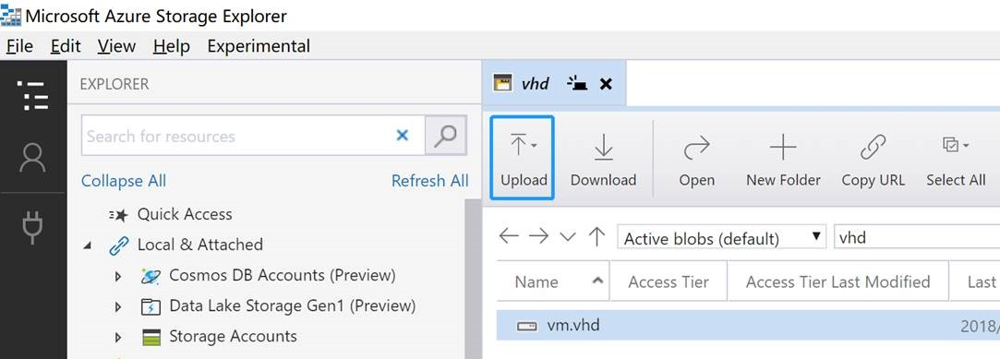
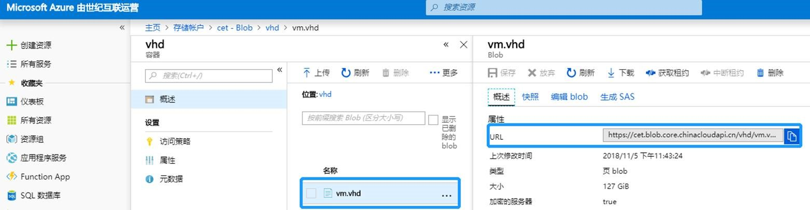
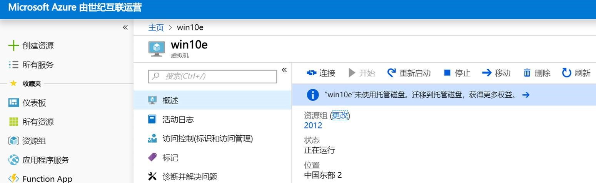
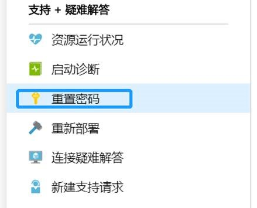

# 如何在 Azure 中创建 Windows 10 Enterprise 虚拟机

在一些特定的测试和使用场景存在使用 Windows 10 Enterprise 虚拟机的需求，本文将介绍如何在 Azure 中创建 Windows 10 Enterprise 虚拟机，具体步骤如下：

## 准备工作

1. Hyper-V 管理器：版本: 10.0.17134.1
2. Raw image：Windows_10_Enterprise_EN-US_x64.ISO

## 步骤

1. 在本地 Hyper-V 管理器中新虚拟机：

    * 创建过程中，指定代数为第一代（目前 Azure 仅支持第一代 Hyper-V）。

    * 其他均使用默认配置。

2. 虚拟机创建完毕之后，删除还原点。

3. 在虚拟机 Remote settings 中设置允许远程连接。

4. 在虚拟机防火墙-高级配置中添加入站规则，允许 3389 端口入站。

5. 启动 Windows update，并安装更新，请务必安装 5 月累积[更新](https://portal.msrc.microsoft.com/zh-cn/security-guidance/advisory/CVE-2018-0886)。

6. 全部更新安装完毕后，使用 sysprep 准备虚拟机：

    

7. 当虚拟机关闭之后使用 PowerShell 命令转换 vhdx 文件并固定：

    ```powershell
    Convert-VHD "C:\Users\Public\Documents\Hyper-V\Virtual hard disks\Win10.vhdx" -DestinationPath "C:\Users\Public\Documents\Hyper-V\Virtual hard disks\vm.vhd" -VHDType Fixed
    ````

8. 使用 Azure Storage Explorer 上传转换生成的 VHD 文件至目标存储账户的容器中：

    

    

9. 根据实际需求，可以分别创建托管虚拟机和非托管磁盘虚拟机：

    * 采用从 VHD 创建托管镜像方式，可以创建托管磁盘虚拟机，参考[通过上传的 VHD 创建托管映像](https://docs.azure.cn/zh-cn/virtual-machines/windows/upload-generalized-managed#create-a-managed-image-from-the-uploaded-vhd)。

    * 使用以下命令在 PowerShell ISE 中可以创建非托管磁盘虚拟机，斜体参数为自定义参数；

    ```powershell
    $rgName = "2012"
    $subnetName = "SubNet2"
    $singleSubnet = New-AzureRmVirtualNetworkSubnetConfig -Name $subnetName -AddressPrefix 10.0.0.0/24
    $location = "China east2"
    $vnetName = "vnet2"
    $vnet = New-AzureRmVirtualNetwork -Name $vnetName -ResourceGroupName $rgName -Location $location -AddressPrefix 10.0.0.0/16 -Subnet $singleSubnet
    $ipName = "IP2"
    $pip = New-AzureRmPublicIpAddress -Name $ipName -ResourceGroupName $rgName -Location $location -AllocationMethod Dynamic
    $nicName = "Nic2"
    $nic = New-AzureRmNetworkInterface -Name $nicName -ResourceGroupName $rgName -Location $location -SubnetId $vnet.Subnets[0].Id -PublicIpAddressId $pip.Id
    $cred = Get-Credential
    $imageURI = "https://cet.blob.core.chinacloudapi.cn/vhd/vm.vhd"
    $storageAccName = "cet"
    $vmName = "win10e"
    $vmSize = "Standard_A2"
    $computerName = "win10e"
    $osDiskName = "OsDisk"
    $skuName = "Standard_GRS"
    $storageAcc = Get-AzureRmStorageAccount -ResourceGroupName $rgName -AccountName $storageAccName
    $vmConfig = New-AzureRmVMConfig -VMName $vmName -VMSize $vmSize
    $vm = Set-AzureRmVMOperatingSystem -VM $vmConfig -Windows -ComputerName $computerName -Credential $cred
    $vm = Add-AzureRmVMNetworkInterface -VM $vm -Id $nic.Id
    $osDiskUri = '{0}vhds/{1}-{2}.vhd' -f $storageAcc.PrimaryEndpoints.Blob.ToString(),  $vmName.ToLower(), $osDiskName
    $vm = Set-AzureRmVMOSDisk -VM $vm -Name $osDiskName -VhdUri $osDiskUri -CreateOption fromImage -SourceImageUri $imageURI -Windows
    New-AzureRmVM -ResourceGroupName $rgName -Location $location -VM $vm
    ```

10. 创建完成，验证，并激活 Windows 10：

    

## 后续步骤

如果在验证过程中 RDP 访问时提示用户被禁用，可以使用重置密码功能进行重置：

