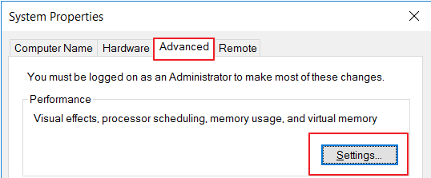
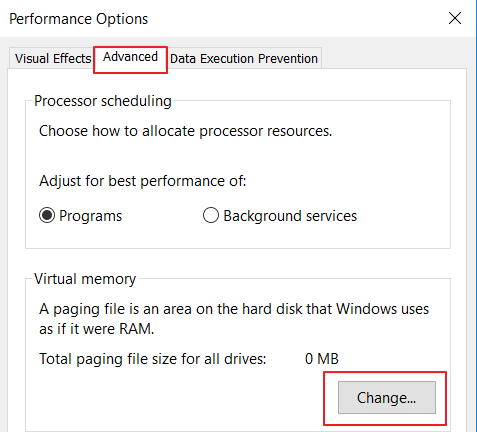
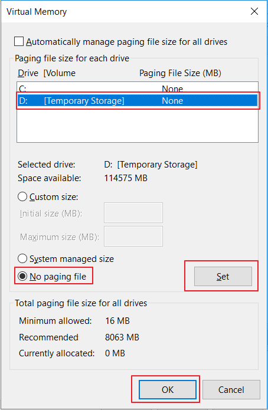
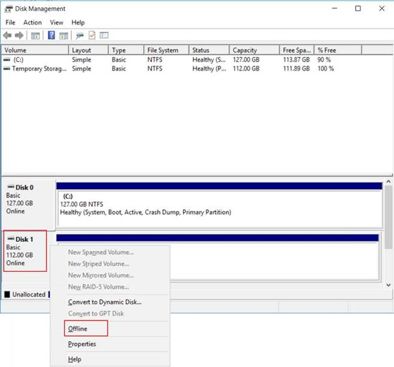

# 如何禁用虚拟机的临时盘

## 问题描述

由于 Azure 虚拟机的特殊性,每一个虚拟机在部署运行之后, 系统都会分配一块临时盘, 用作内存交换分区使用, 以提高虚拟机的性能。 但是临时磁盘存在丢失数据且数据无法恢复的风险。 将虚拟机移到另一主机时，可能会发生数据丢失的情况。调整虚拟机大小、更新主机、主机硬件故障等都是需要移动虚拟机的原因。在没有性能需求的情况下, 是否可以禁用虚拟机的临时磁盘, 以避免用户的使用不当, 造成数据丢失呢? 以下提供了如何禁用虚拟机临时磁盘的方法。

## 解决方法

### Linux 虚拟机

1. 登录虚拟机, 切换到 root 用户。
2. 打开文件/etc/waagent.conf。
3. 找到行: `ResourceDisk.Format=y`。
4. 将改行修改为: `ResourceDisk.Format=n`。
5. 保存并退出。
6. 重启虚拟机之后, 临时盘就不会被自动挂载起来。

### Windows 虚拟机

1. 以管理员身份登录 Windows 虚拟机.
2. 点击搜索 “**advanced system settings**” -> 选择 “**Advanced**” -> “**Performance**” -> “**Settings**”：

    

3. 在性能选项页面,  选择 “**Advanced**” -> “**Virtual memory**” -> “**Change**”。

    

4. 在虚拟内存页面, 选择临时盘 -> 选择 “**No Paging file**” -> 点击 “**Set**” 按钮 -> “**OK**” 按钮。
    

5. 重启虚拟机。
6. 再次以管理员身份登录 Windows 虚拟机。
7. 点击开始 -> 运行 -> `diskmgmt.msc`, 打开磁盘管理。
8. 选择 “**Temporary Storage**”, 右键点击 “**offline**”。

    

9. 再次重启虚拟机,打开 “**我的电脑**” 就看不到该临时磁盘了。