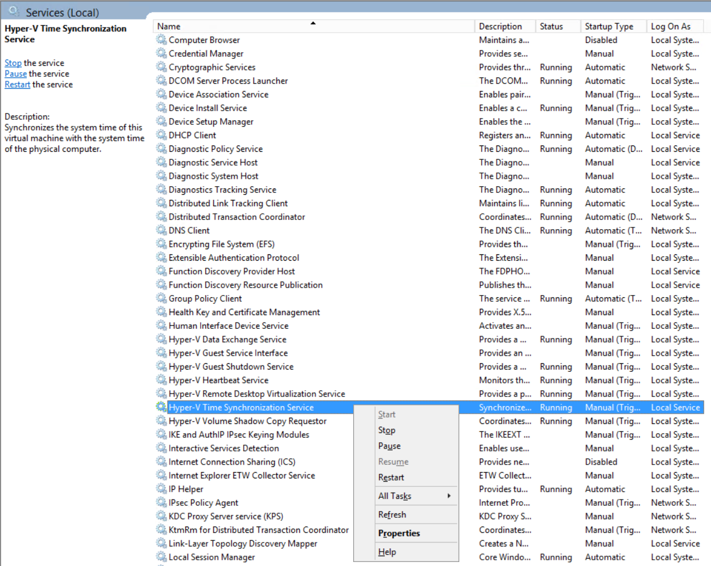

# 如何禁用 Azure 虚拟机的日期时间同步

## 问题描述

由于 Azure 虚拟机的特殊性，物理主机会实时同步虚拟机的时间和日期。当有特殊需求时，客户想要停止日期时间的同步，但是一些常见的关闭 NTP 服务等操作都会失败。

## 解决方案

> [!IMPORTANT]
> 强烈不建议禁用 Azure 虚拟机的日期时间同步以避免不可预测的潜在风险。
如果有特殊需求的客户，请参照如下步骤来实现。

### Windows 虚拟机

1. 点击 “**开始**” -> “**运行**” -> “**services.msc**”
2. 在打开的 Windows 服务管理列表中，找到服务 “**Hyper-V Time Synchronization Service**”。
3. 选择该服务，右键选择“**关闭**”。
4. 之后，物理主机与虚拟机的日期时间同步就会停止。
5. 重新启动该服务，就会恢复日期时间的同步。



### Linux 虚拟机

1. 执行下列命令，获取 lsvmbus 工具：
    ```
    # wget https://raw.githubusercontent.com/torvalds/linux/master/tools/hv/lsvmbus
    # chmod u+x lsvmbus
    ```
2.	执行命令，获取同步日期时间的驱动设备：

    ```
    # python lsvmbus -vvv  |grep -A 4 -i "Time Synchronization"
    VMBUS ID 11: Class_ID = {9527e630-d0ae-497b-adce-e80ab0175caf} - [Time Synchronization]
            Device_ID = {2dd1ce17-079e-403c-b352-a1921ee207ee}
            Sysfs path: /sys/bus/vmbus/devices/vmbus_11
            Rel_ID=11, target_cpu=0
    ```

3.	记录上述高亮显示的设备 ID。
4.	执行命令：

    ```
    # echo 2dd1ce17-079e-403c-b352-a1921ee207ee > /sys/bus/vmbus/drivers/hv_util/unbind
    ```

5.	至此，日期时间同步已被禁用，可以通过 date 等命令来自行调整。
6.	重启虚拟机，即可恢复日期时间同步，如果需要永久禁用，可以在 rc.local 文件中，手工编辑启动脚本来实现。