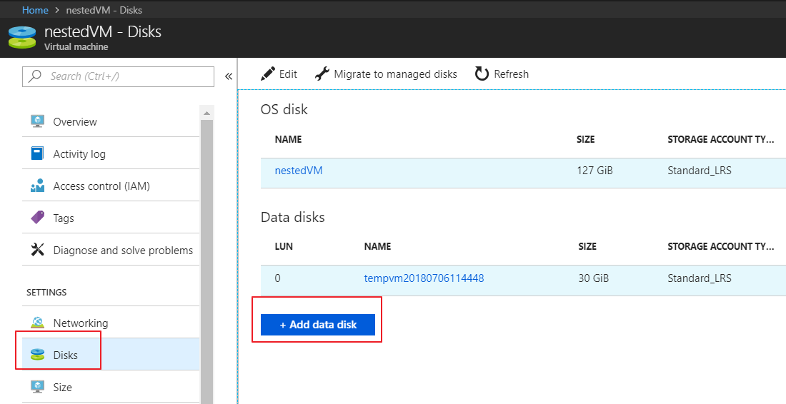
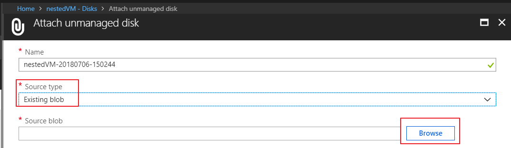
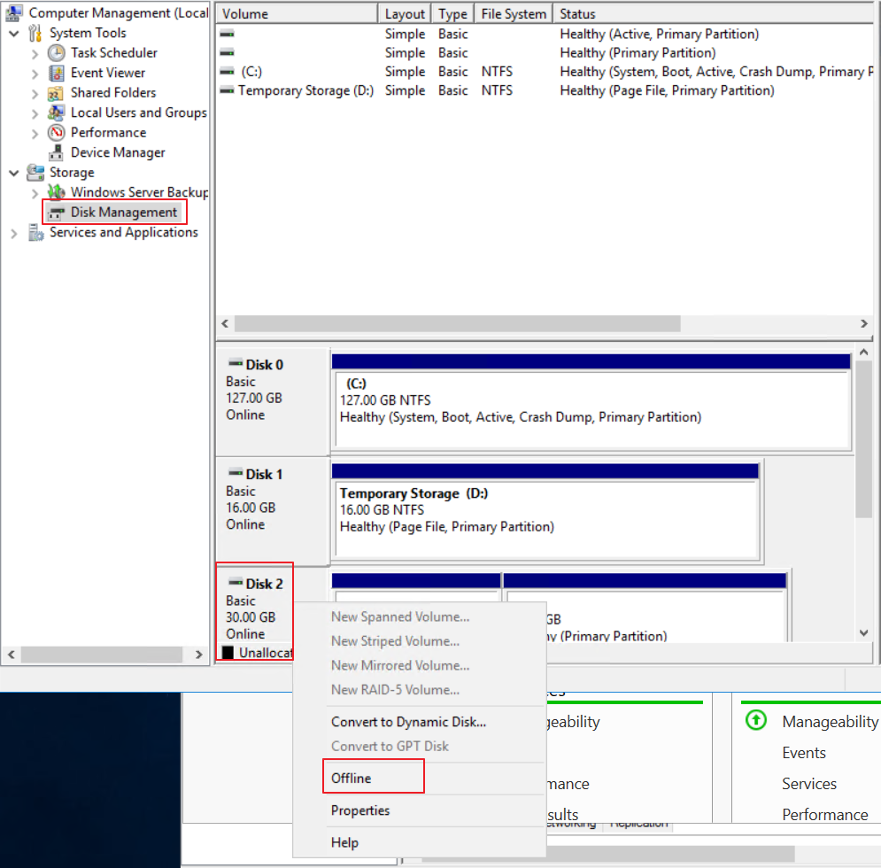
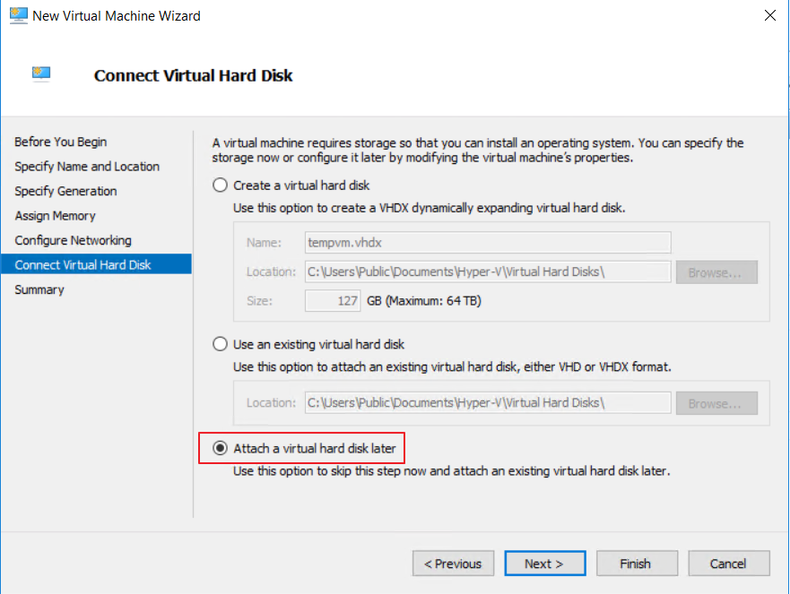
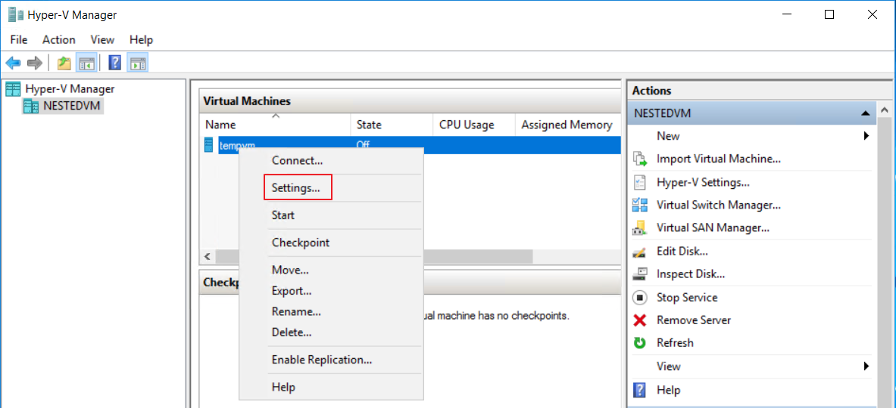
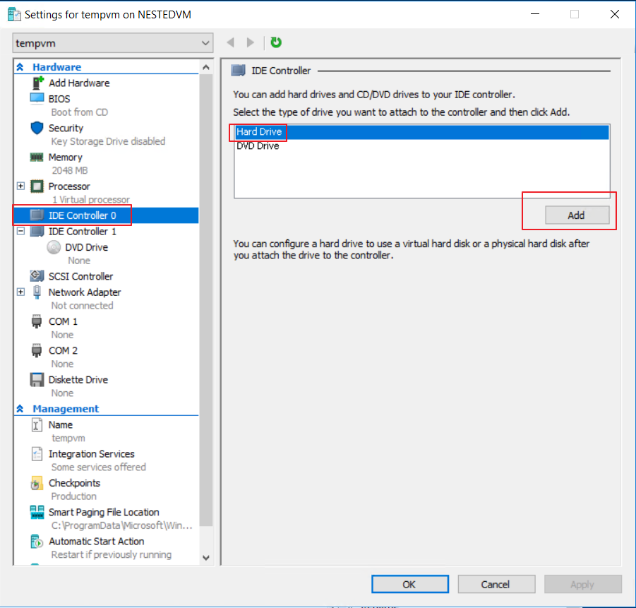
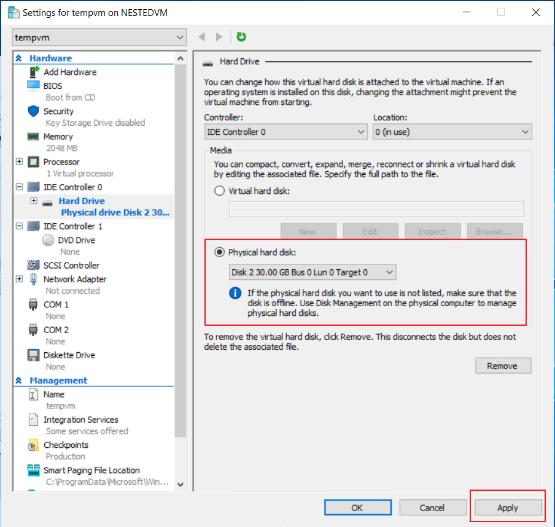
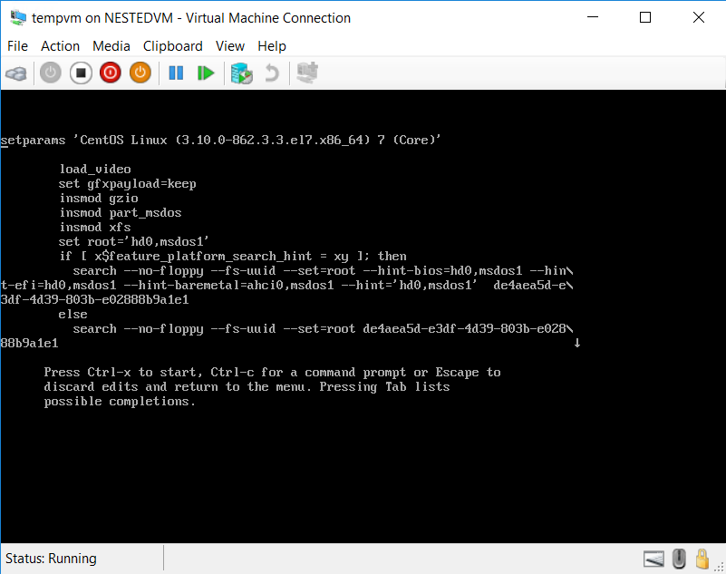

# 如何通过 Hyper-V Console 方式修复虚拟机无法访问的问题

## 问题描述

在很多场景下，客户的虚拟机由于系统故障，或者错误的配置导致无法正常通过 SSH/RDP 方式访问虚拟机，在这种情况下，除了联系 Azure 技术支持中心寻求协助之外，客户还可以通过以下方式来实现 Hyper-V Console 访问虚拟机，并进行自主修复。

## 解决方案

1. 在 Azure 新数据中心（China East 2 & China North 2），部署一台 V3 系列的 Windows Server 2016 Datacenter。假定该虚拟机为 TempVM。
2. 通过 RDP 登陆 TempVM。
3. 启用 Hyper-V 的功能，具体步骤参考如下：

    1. 打开服务器管理（Server Manager），在**管理菜单（Manage Menu）**中，点击**添加角色和功能（Add Roles and Features）**。
    2. 按照向导，点击**下一步**。
    3. 在选择服务器角色部分，从列表中，选中 “**Hyper-V**”。
    4. 继续按照向导，完成 Hyper-V 角色和功能的安装。
    5. 重启虚拟机。

4. 通过 [Azure 门户](https://portal.azure.cn/)，找到故障虚拟机，假定该虚拟机为 IssueVM。（建议对该虚拟机进行备份之后进行后续操作）
5. 记录 IssueVM 的系统盘的名字以及存储位置。
6. 通过 [Azure 门户](https://portal.azure.cn/)，找到 TempVM，点击**磁盘**，在磁盘管理页面，点击**添加磁盘**。

    

7. 在添加磁盘页面选择源类型为已存在的 Blob。

    

8. 找到 IssueVM 的系统盘，并点击 OK，并保存。
9. 通过 RDP 登陆 TempVM。
10. 打开磁盘管理，找到新附加的 IssueVM 的系统盘，右键选择 “**offline**”

    

11. 通过 Server Manager 打开 Hyper-V Manager。
12. 右键新建虚拟机。并按照向导进行下一步。
13. 在**连接虚拟磁盘（Connect Virtual Hard Disk）**页面，选择**稍后附加虚拟磁盘（Attach a virtual hard disk later）**。

    

14. 点击**完成**。
15. 在 Hyper-V Manager 里找到新建的虚拟机，右键**配置（Settings）**。

    

16. 选择 **IDE Controller 0**。
17. 选择 **Hard Drive**，点击**添加**。

    

18. 选择**物理硬盘（Physical hard disk）**。
19. 选择附加的 IssueVM 的系统盘。

    

20. 点击 **Apply**。
21. 到此，可以通过 Hyper-V Console 访问 IssueVM，并进行深入的分析排查和修复了。

    