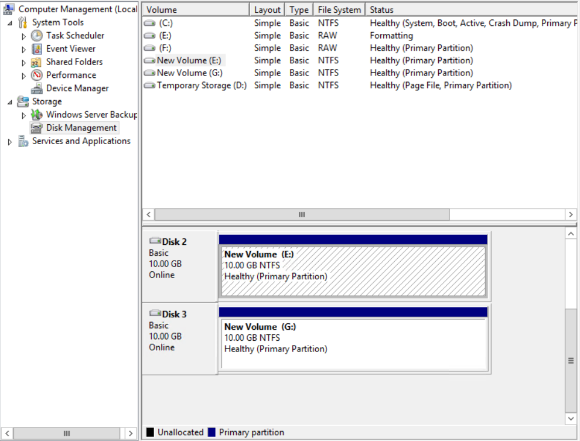
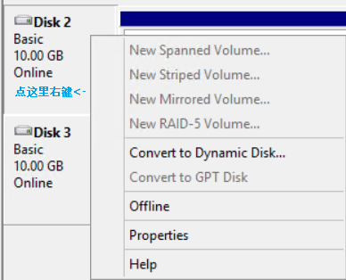
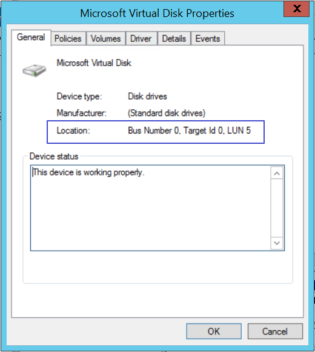

# 如何定位虚拟机内部附加的数据磁盘

## 现象描述

在很多场景下,客户会挂载多个数据磁盘到虚拟机上,为了提高性能和易扩展性，会使用到 raid 或者 lvm 逻辑卷来组合磁盘使用，在进行数据迁移和备份时，会涉及到数据磁盘的管理，由于数据磁盘在虚拟机内部和 Azure 存储账号内的命名方式不一样， 客户会经常对一大堆磁盘如何进行一一对应而深感头痛。 

## 解决方案

以下主要介绍如何定位虚拟机内部附加的数据磁盘在存储账号里的对应关系。

### Linux虚拟机环境

案例中，Linux 虚拟机采用的是 CentOS 7.3,其他版本的 Linux 操作系统会略有区别，请注意区分。

1. 创建 CentOS 7.3 虚拟机。

2. 创建两块数据磁盘，名字为：

        LunTest-LunTest-0-201706130314040006 （对应vhd： LunTest-LunTest-0613-1.vhd）
        LunTest-LunTest-1-201706130315590578 （对应vhd： LunTest-LunTest-0613-2.vhd）

3. 将上述数据磁盘附加到虚拟机。

4. 以管理员身份登录虚拟机，并切换到 root 用户。

5. 执行命令：`#fdisk -l`

        [root@LunTest chpaadmin]# fdisk  -l |grep -i Disk
        Disk /dev/sda: 32.2 GB, 32214351872 bytes, 62918656 sectors
        Disk label type: dos
        Disk identifier: 0x000c7e0e
        Disk /dev/sdb: 75.2 GB, 75161927680 bytes, 146800640 sectors
        Disk label type: dos
        Disk identifier: 0x7ca6a8d6
        Disk /dev/sdc: 10.7 GB, 10737418240 bytes, 20971520 sectors
        Disk /dev/sdd: 10.7 GB, 10737418240 bytes, 20971520 sectors

6. `/dev/sdc` 和 `/dev/sdd` 为上述附加的数据磁盘，可以看到，这两块数据盘大小一致，无法准确区分对应的是 Azure 存储账号里的哪一块数据磁盘。

以下介绍如何来进行区分：

1. 执行命令：`# dmesg -T |grep -i scsi`:

        [root@LunTest chpaadmin]# dmesg -T |grep -i scsi
        [Tue Jun 13 03:11:14 2017] SCSI subsystem initialized
        [Tue Jun 13 03:11:14 2017] Block layer SCSI generic (bsg) driver version 0.4 loaded (major 251)
        [Tue Jun 13 03:11:16 2017] scsi host0: ata_piix
        [Tue Jun 13 03:11:16 2017] scsi host1: ata_piix
        [Tue Jun 13 03:11:16 2017] scsi host2: storvsc_host_t
        [Tue Jun 13 03:11:16 2017] scsi 2:0:0:0: Direct-Access     Msft     Virtual Disk     1.0  PQ: 0 ANSI: 4
        [Tue Jun 13 03:11:16 2017] scsi host3: storvsc_host_t
        [Tue Jun 13 03:11:16 2017] scsi: waiting for bus probes to complete ...
        [Tue Jun 13 03:11:16 2017] scsi 1:0:0:0: CD-ROM            Msft     Virtual CD/ROM   1.0  PQ: 0 ANSI: 5
        [Tue Jun 13 03:11:16 2017] scsi host4: storvsc_host_t
        [Tue Jun 13 03:11:16 2017] scsi host5: storvsc_host_t
        [Tue Jun 13 03:11:16 2017] scsi 5:0:1:0: Direct-Access     Msft     Virtual Disk     1.0  PQ: 0 ANSI: 4
        [Tue Jun 13 03:11:16 2017] sr 1:0:0:0: [sr0] scsi3-mmc drive: 0x/0x tray
        [Tue Jun 13 03:11:16 2017] sr 1:0:0:0: Attached scsi CD-ROM sr0
        [Tue Jun 13 03:11:16 2017] sd 2:0:0:0: [sda] Attached SCSI disk
        [Tue Jun 13 03:11:16 2017] sd 5:0:1:0: [sdb] Attached SCSI disk
        [Tue Jun 13 03:11:23 2017] sd 2:0:0:0: Attached scsi generic sg0 type 0
        [Tue Jun 13 03:11:23 2017] sr 1:0:0:0: Attached scsi generic sg1 type 5
        [Tue Jun 13 03:11:23 2017] sd 5:0:1:0: Attached scsi generic sg2 type 0
        [Tue Jun 13 03:14:16 2017] scsi 4:0:0:0: Direct-Access     Msft     Virtual Disk     1.0  PQ: 0 ANSI: 4
        [Tue Jun 13 03:14:16 2017] sd 4:0:0:0: Attached scsi generic sg3 type 0
        [Tue Jun 13 03:14:16 2017] sd 4:0:0:0: [sdc] Attached SCSI disk
        [Tue Jun 13 03:16:23 2017] scsi 4:0:0:1: Direct-Access     Msft     Virtual Disk     1.0  PQ: 0 ANSI: 4
        [Tue Jun 13 03:16:23 2017] sd 4:0:0:1: Attached scsi generic sg4 type 0
        [Tue Jun 13 03:16:23 2017] sd 4:0:0:1: [sdd] Attached SCSI disk

7. 上述显示的 "4:0:0:0" 和 "4:0:0:1" 分别为磁盘 `/dev/sdc` 和 `/dev/sdd` 的设备挂载地址，最后一位为磁盘的 LUN ID.

8. 通过 PowerShell，执行以下命令来获取数据磁盘的 LUN ID：

        PS C:\Users\chpa> $vm = Get-AzureVM -ServiceName luntest -Name luntest
        PS C:\Users\chpa> $vm.VM.DataVirtualHardDisks

        HostCaching         : None
        DiskLabel           : 
        DiskName            : LunTest-LunTest-0-201706130314040006
        Lun                 : 0
        LogicalDiskSizeInGB : 10
        MediaLink           : https://tcportalvhdsgrnnb3k173zr.blob.core.chinacloudapi.cn/vhds/LunTest-LunTest-0613-1.vhd
        SourceMediaLink     : 
        IOType              : Standard
        ExtensionData       : 

        HostCaching         : None
        DiskLabel           : 
        DiskName            : LunTest-LunTest-1-201706130315590578
        Lun                 : 1
        LogicalDiskSizeInGB : 10
        MediaLink           : https://tcportalvhdsgrnnb3k173zr.blob.core.chinacloudapi.cn/vhds/LunTest-LunTest-0613-2.vhd
        SourceMediaLink     : 
        IOType              : Standard
        ExtensionData       :

9. 至此，通过 LUN ID 将虚拟机内部的数据磁盘和 Azure 存储账号的磁盘一一对应起来了。

### Windows 虚拟机环境

案例中，Windows 虚拟机采用的是 Windows Server 2012 R2,其他版本的 Windows 操作系统会略有区别，请注意区分。

1. 创建 Windows Server 2012 R2 虚拟机。

2. 创建两块数据磁盘，名字为：

        dcuser-dcuser-0-201706130918520846（对应vhd： dcuser-dcuser-noid.vhd）
        dcuser-dcuser-1-201706130924230994（对应vhd： dcuser-dcuser-noid-too.vhd）

3. 将上述数据磁盘附加到虚拟机。

4. 以管理员身份登录虚拟机。

5. 打开电脑管理->磁盘管理：

    

6. 点击磁盘右键打开磁盘属性：

    

7. 在通常页可以看到磁盘的 LUN ID：

    

8. 通过 PowerShell，执行以下命令来获取数据磁盘的 LUN ID：

        PS C:\Users\chpa> $vm = Get-AzureVM -ServiceName dcuser -Name dcuser
        PS C:\Users\chpa> $vm.vm.DataVirtualHardDisks
        HostCaching         : None
        DiskLabel           : 
        DiskName            : dcuser-dcuser-0-201706130918520846
        Lun                 : 5
        LogicalDiskSizeInGB : 10
        MediaLink           : https://tcportalvhdsgrnnb3k173zr.blob.core.chinacloudapi.cn/vhds/dcuser-dcuser-noid.vhd
        SourceMediaLink     : 
        IOType              : Standard
        ExtensionData       : 
        HostCaching         : None
        DiskLabel           : 
        DiskName            : dcuser-dcuser-1-201706130924230994
        Lun                 : 1
        LogicalDiskSizeInGB : 10
        MediaLink           : https://tcportalvhdsgrnnb3k173zr.blob.core.chinacloudapi.cn/vhds/dcuser-dcuser-noid-too.vhd
        SourceMediaLink     : 
        IOType              : Standard
        ExtensionData       :

9. 至此，通过 LUN ID 将虚拟机内部的数据磁盘和 Azure 存储账号的磁盘一一对应起来了。