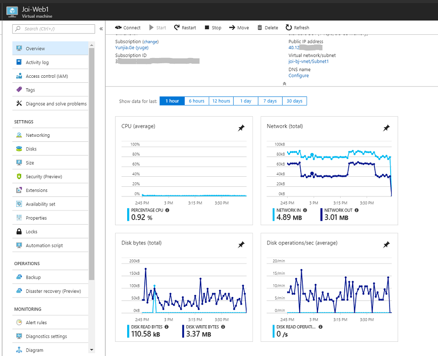

# 如何查询虚拟机流量异常及相关安全加固建议

## 应用场景

当从 Azure 门户的 Dashboard 上发现虚拟机流量异常高，或收到了监控警报时，我们一般通过流量分析可以确定这些流量属于正常流量还是异常攻击。

那么，怎么样提前加固虚拟机的安全，对虚拟机的安全问题做防范呢？

以下提供了相关的安全加固建议：

- [如何快速排查是否流量异常](#section1)
- [安全加固建议 – 平台层面](#section2)
  - [业务端口](#section2-1)
  - [Vnet 网络安全最佳实践](#section2-2)
  - [ACL/NSG](#section2-3)
  - [其他提供安全性的功能](#section2-4)
- [安全加固建议 – VM 层面](#section3)
  - [RDP/SSH](#section3-1)
  - [Jumpbox](#section3-2)
  - [Key Login](#section3-3)
  - [Anti-Virus](#section3-4)
  - [Audit](#section3-5)
  - [Monitor](#section3-6)
  - [Update](#section3-7)

## 如何快速排查是否流量异常

您可以直接在 [Azure 门户](https://portal.azure.cn) – “**虚拟机**” - “**Overview**” 界面看到 **Dashboard**：

如果发现流量异常，可以通过以下步骤快速自查：

1. 是否有异常登录
2. 是否有异常进程
3. 在虚拟机中查看关键文件是否有被篡改或删除的情况
4. 是否有异常操作记录和定时任务
5. 通过杀毒软件对虚拟机进行磁盘扫描

## 安全加固建议 – 平台层面

1. 仅开放必须的业务端口

    所有虚拟机的业务端口, 按照实际需求, 有针对性的开放, 如数据库端口只开放给应用虚拟机。 
    建议将敏感的 RDP 登录设置 ACL 白名单，即只允许指定 IP 进行 RDP/SSH。 
    修改常用的 Endpoint 外部端点为非默认端点，如修改 RDP/SSH 的 3389/22 端口为高位随机端口等。

2. 合理规划 Vnet/Subnet

    合理规划 Azure 虚拟网络有助于尽量减少公网暴露的风险，您可参考[这里](https://docs.azure.cn/zh-cn/security/azure-security-network-security-best-practices)介绍的一系列 Azure 网络安全最佳实践，这些最佳实践衍生自我们的 Azure 网络经验和客户的经验。

3. 对开放的端口/业务设置 ACL/NSG

    如果虚拟机是直接暴露在公网的，请尽量减少开放的端口，如果您的服务是有限范围内访问的，可以针对 Endpoint 设置 ACL，指定受信任的 IP 进行连接该服务器。 
    统一用途的虚拟机放置到同一子网, 集中化对子网配置网络安全组； 
    有特殊需求的虚拟机，对网络接口单独设置网络安全组。 
    配置方法及示例可参考： 

    - [经典虚拟机添加相应端口并配置 ACL](https://docs.azure.cn/zh-cn/articles/azure-operations-guide/virtual-network/aog-virtual-network-add-endpoint-and-acl)
    - [使用门户管理 NSG](https://docs.azure.cn/zh-cn/virtual-network/virtual-network-manage-nsg-arm-portal)

4. 如果您使用了 AppGW 做负载均衡，可以考虑启用 WAF 功能。

    WAF 基于 [OWASP 核心规则集](https://www.owasp.org/index.php/Category:OWASP_ModSecurity_Core_Rule_Set_Project)，对后端服务进行集中保护，避免其受到常见的攻击和漏洞伤害（比如 SQL 注入攻击、跨站点脚本攻击等）。

## 安全加固建议 – VM 层面

- RDP/SSH

    如果业务允许, 修改 Windows 虚拟机的 RDP 端口为自定义。 
    修改 Linux 虚拟机的 SSH 端口为自定义，禁止 root 登录，禁止空密码登录。

- Jumpbox

    如果环境允许，可以在 Azure 中配置一台部署有安全防护的堡垒机作为跳板，堡垒机通过内网 IP 到连接到关键业务的生产 VM（生产 VM 不需要开放 ssh 公共端口，Internet 无法连接），杜绝外部 SSH/RDP 端口被扫描。

- Key Login

    针对 Linux 虚拟机, 如果环境允许，禁止用户通过密码登录，改用 ssh key 方式来登录访问, 防止密码泄露或者被包里破解； 
    修改所有常用用户的密码为复杂密码（大小写字母，数字，特殊字符的组合），且用户密码要定期更新。 
    密钥创建的详细方法可以参考官方文档：[如何在 Azure 上的 Windows 中使用 SSH 密钥](https://docs.azure.cn/zh-cn/virtual-machines/linux/ssh-from-windows)。

- Anti-Virus

    在虚拟机中安装常用杀毒软件（比如 ClamAV 等开源杀毒软件）。 
    Azure Doc 中提供了对虚拟机批量安装并配置 Microsoft Anti-Malware 扩展的 PowerShell 脚本，该脚本适用于经典部署虚拟机和资源管理部署虚拟机。 
    详细配置及脚本请参考[为订阅内虚拟机批量安装并配置 Microsoft Anti-Malware 扩展](https://docs.azure.cn/zh-cn/articles/azure-operations-guide/virtual-machines/windows/aog-virtual-machines-howto-batch-config-anti-malware)一文。

- Audit

    对于虚拟机的系统文件或者核心数据, 启用安全审计, 以保证出现问题时, 有据可查。

- Monitor

    对于虚拟机的 CPU、内存、网络和磁盘进行实时监控, 并设置合适的阈值, 当超过阈值时, 提前告警, 进行人工干预。

- Update

    在环境允许的情况下, 时刻保持 Windows 虚拟机的安全更新至最新。
    更新 Linux 虚拟机的内核版本至最新。
5.在虚拟网络中增加NVA（network virtual appliance）,如防火墙，WAF等，拓扑中逻辑部署在应用服务器前面过滤请求流量。
