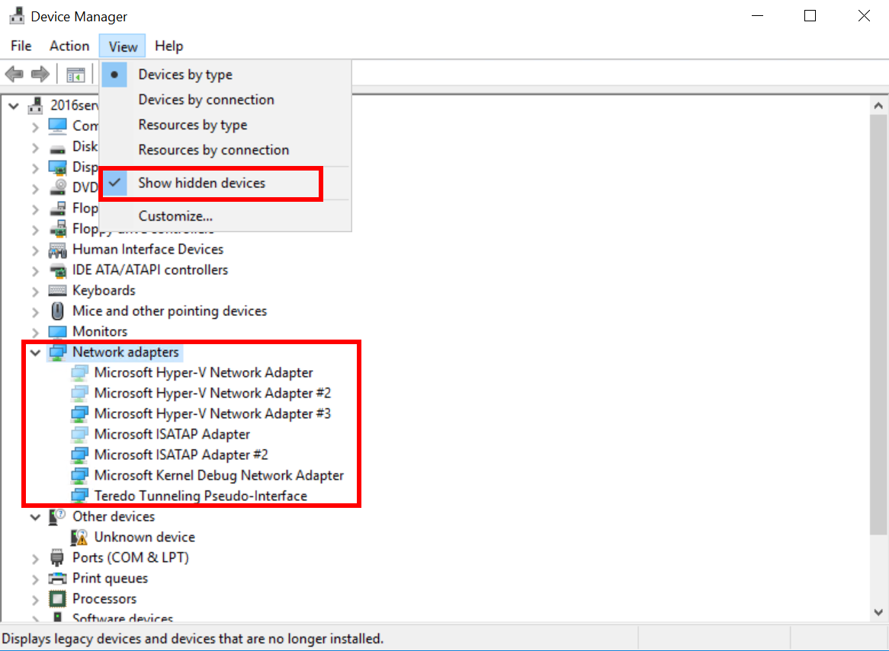
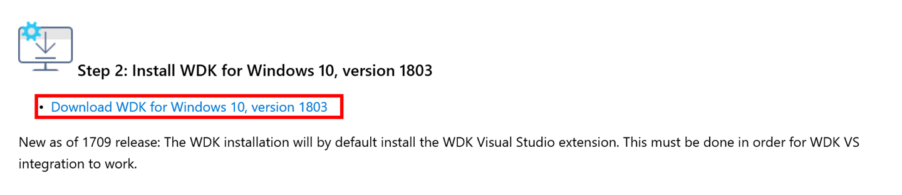
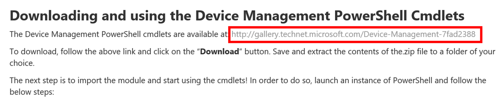
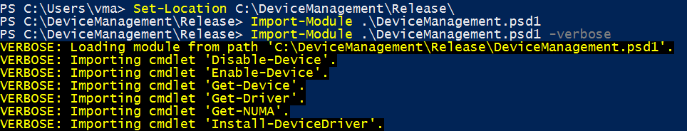
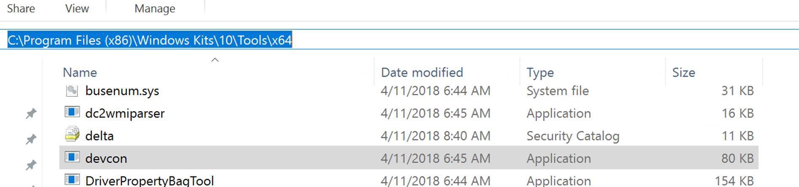
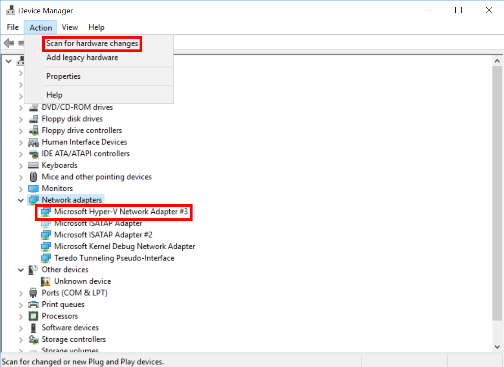

# 如何移除隐藏网络适配器

在特定场景下我们会发现 Windows Server 虚拟机中存在多个隐藏网络适配器。这是一个已知问题，对虚拟网卡的相关操作会触发此类现象。例如删除的网卡仍会以隐藏设备的形式出现在设备管理器中。当虚拟机中存在大量隐藏网络适配器时，可能会影响虚拟机的网络连通性，这会导致挂载 Azure File Share 失败等问题。

## 存在少量隐藏网络适配器

可以根据以下方法进行删除:

1. 在 CMD 窗口中输入以下命令：

    ```bash
    set devmgr_show_nonpresent_devices=1
    start devmgmt.msc
    ```

2. 在设备管理器中勾选显示隐藏设备，删除隐藏的网络适配器：

    

## 存在大量隐藏网络适配器

可以使用如下方法进行批量删除：

1. 在虚拟机中安装 [Windows Driever Kit(WDK)](https://docs.microsoft.com/zh-cn/windows-hardware/drivers/download-the-wdk#download-iconimagesdownload-installpng-step-2-install-wdk-for-windows-10-version-1803) 来获取 devcon.exe。

    

2. 下载、解压并导入 [Device Management Powershell Cmdlets](https://blogs.technet.microsoft.com/wincat/2012/09/06/device-management-powershell-cmdlets-sample-an-introduction/)。

    

    ```bash
    Set-Location C:\DeviceManagement\Release\
    Import-Module .\DeviceManagement.psd1 -verbose
    ```

    

3. 使用 `Get-Device` 命令列出隐藏的网络适配器。

    ```bash
    Get-Device -ControlOptions DIGCF_ALLCLASSES | Sort-Object -Property Name | Where-Object {($_.IsPresent -eq $false) -and ($_.Name -like “Microsoft Hyper-V Network Adapter*”) } | ft Name, DriverVersion, DriverProvider, IsPresent, HasProblem, InstanceId -AutoSize
    ```

4. 获取隐藏的网络适配器。

    ```bash
    $hiddenHypVNics = Get-Device -ControlOptions DIGCF_ALLCLASSES | Sort-Object -Property Name | Where-Object {($_.IsPresent -eq $false) -and ($_.Name -like “Microsoft Hyper-V Network Adapter*”) }
    ```

5. 在 Powershell 中设定路径到 devcon.exe 下, 并使用以下循环语句来删除隐藏网络设备.

    

    ```bash
    Set-Location "C:\Program Files (x86)\Windows Kits\10\Tools\x64"
    ForEach ($hiddenNic In $hiddenHypVNics) { $deviceid = “@“ + hiddenNic.Instance; .\devcon.exe /r remove $deviceid }
    ```

6. 最终隐藏网络设备删除完毕。

    