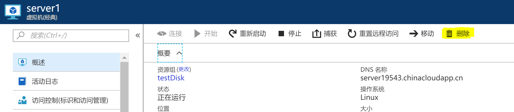
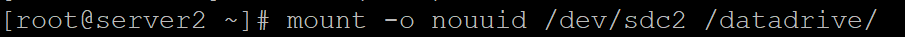
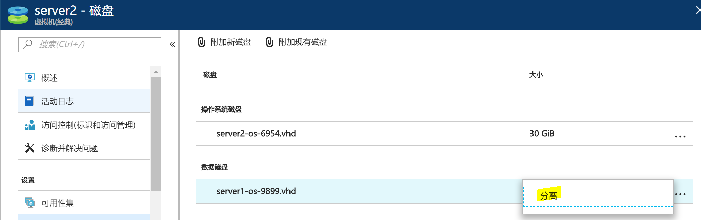
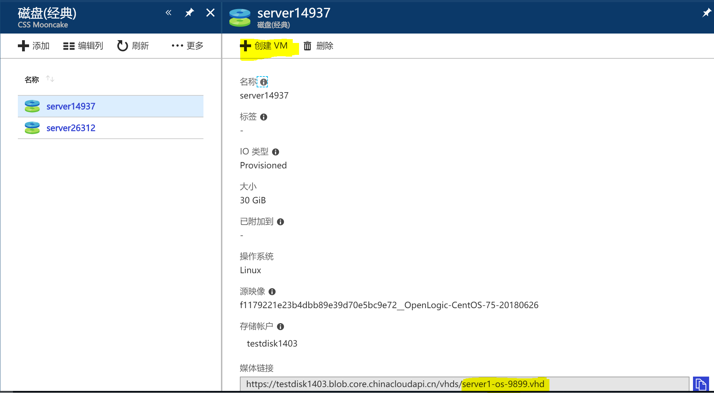

# 如何将 Linux 经典虚拟机的 OS 盘挂载为数据磁盘

本文以 CentOS 为例，说明如何将 Linux 经典虚拟机的 OS 盘挂载为数据磁盘。

1. 删除 VM，保留磁盘。

    

2. 新建一台同类型 VM（新），将原 VM 的 OS 盘作为数据盘挂载。

    **VM（新）** -> **磁盘** -> **附加现有磁盘** -> **位置** -> **选择存储账户** -> **vhds** -> **原 VM OS 磁盘**

    > [!NOTE]
    > 挂载的 OS 盘必须以 .vhd 结尾，若不是 .vhd 结尾可以在 Storage Explorer 中重命名。

    挂载完成后效果如下，数据磁盘处显示原 VM OS 盘：

    

3. Putty 登录 VM（新）。首先使用 `dmesg` 来查找磁盘（用于发现新磁盘的方法可能各不相同）。以下示例使用 `dmesg` 来筛选 SCSI 磁盘：

    

    此处，`sdc` 是我们需要的磁盘。

4. 新建文件夹用于挂载磁盘。此处新建文件夹 `/datadrive`。使用以下命令挂载：

    

5. 进入 `/datadrive` 查看原虚拟机 OS 盘内容。

    

6. 若要重新使用 OS 盘创建虚拟机，首先 `umount disk`。

    

7. 将原 VM OS 磁盘分离。

    

8. 在磁盘（经典）中找到原 VM OS 磁盘。点击上方 “**创建 VM**”。

    

9. 按照提示创建 VM。
