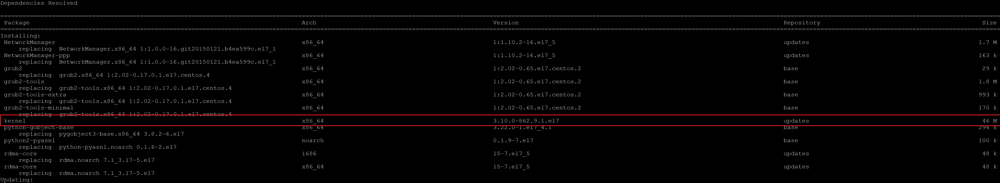
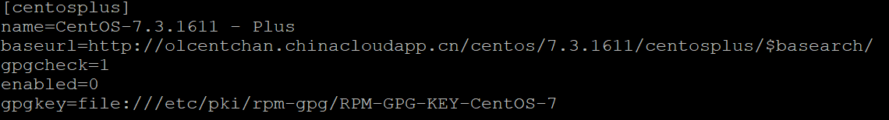
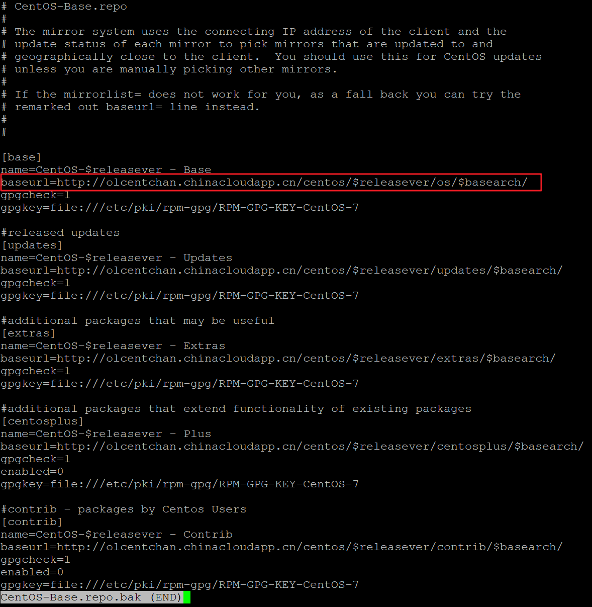
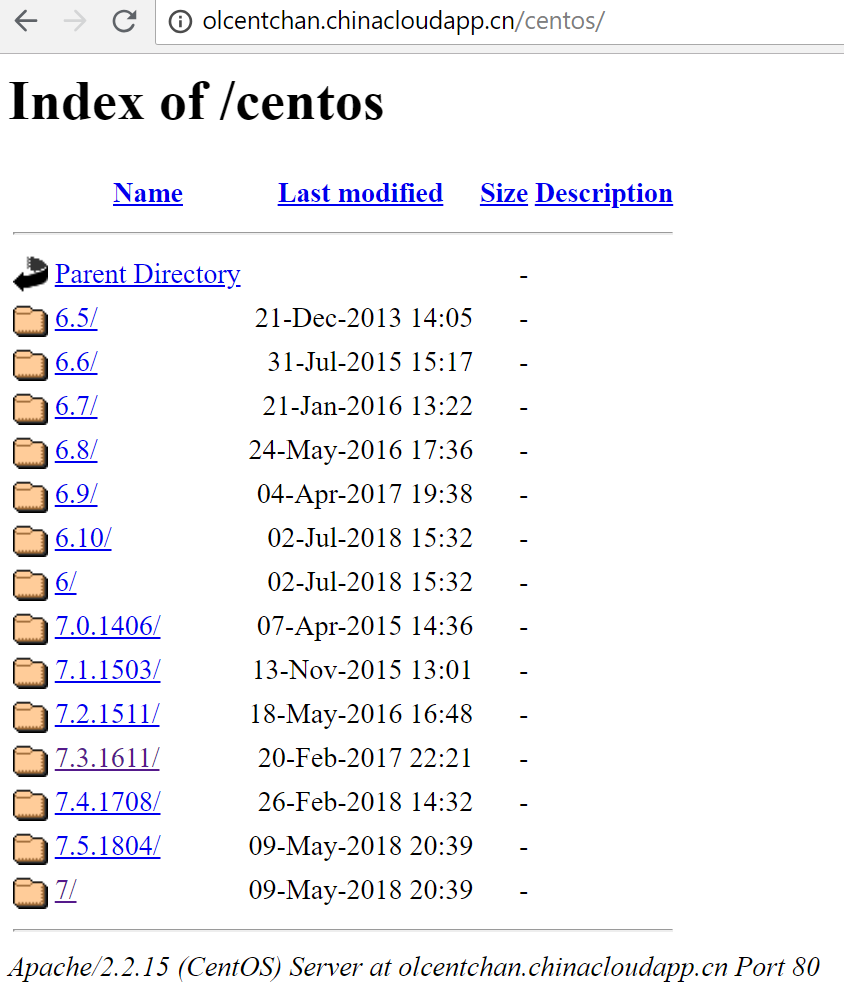
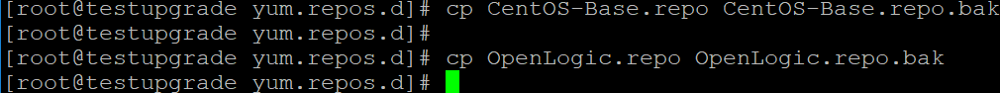
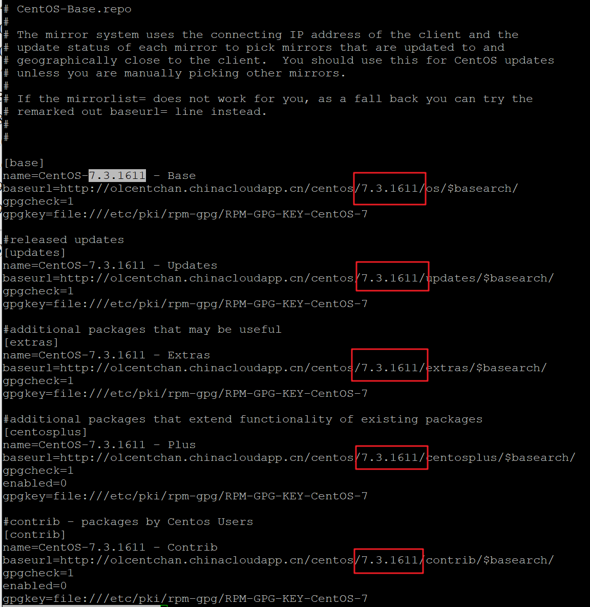
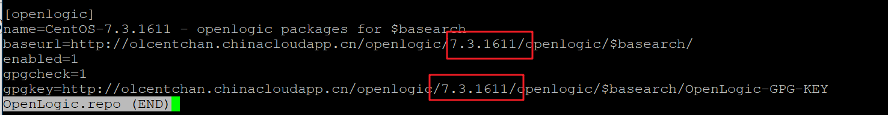
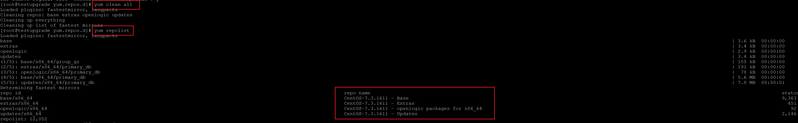
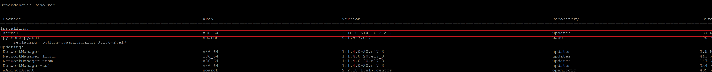
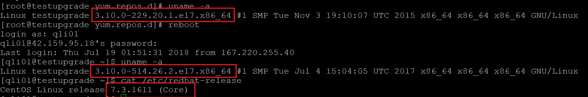

# 如何升级 CentOS 到指定小版本

CentOS 的更新方式和其他 Linux 发行版本不同。首先，每个大版本会有一系列小版本。如 CentOS 6 是大版本，CentOS 6.1、CentOS 6.2 是小版本。当新的小版本发布后，CentOS 将不再继续更新前序小版本。

Azure 提供的 CentOS 镜像也是同样的更新规则。当 CentOS 最新小版本镜像发布后，原有前序小版本将不再更新。因此，我们建议用户使用最新的小版本镜像创建虚拟机，以保证系统拥有最新更新。 
若客户虚拟机已经创建一段时间，或者使用了旧版本的镜像创建了虚拟机，可以使用 `yum` 将系统更新到最新版本。在默认情况下，在系统中以 root 身份运行 `yum update`，将更新 OS 到目前最新的内核。

但在有些情况下，用户希望将系统更新到一个特定版本，而不是最新的版本。该如何操作呢？

这时就需要更改系统中的 Yum 仓库配置。 
首先介绍一下 Yum 仓库配置文件。Yum 的仓库配置文件放在文件夹 `/etc/yum.repos.d` 中，以 `.repo` 结尾。 
一个文件中可以配置多个仓库，也可以将不同仓库放在不同文件中。Yum 会扫描所有以 `.repo` 结尾的文件确认所有可用的仓库。

仓库格式如下：

`[repoid]`: repo ID。包括在中括号中，用以标志仓库，不能与其他仓库冲突。如：[base]、[extras]等。 
`name`: 仓库的描述信息，长短不限，可以有空格，但是必不可少。 
`baseurl`：仓库位置。可以是网站（`http://`），ftp 服务器(`ftp://`)，或者本地文件（`file:///`）。目录下一定要有一个 repodata 的文件夹存放包的元数据信息。 
`gpgcheck`: 下载 rpm 包之前是否需要自动进行来源（签名）合法性检测，`1` 表示要检查。 
`gpgkey`：如果启用 gpg 检测，则需要指定 gpgkey 的路径，即使导入过 gpgkey。 
`enabled`: 是否启用这个仓库，`0` 表示不启用，`1` 表示启用，默认是启用的。 

了解了仓库配置，我们就知道要安装不同版本的内核，其实就是使 `yum` 连接不同版本仓库。 

接下来，我们演示如何更改 Azure CentOS 虚拟机中的仓库配置文件，使其指向用户希望升级的内核版本。 
在默认的配置文件中，我们发现 `baseurl` 实际上指向的是大版本，也即如前所示，`yum update` 就是更新到最新的内核版本。

如果打开上述网页，我们会发现里面实际上存放了各个版本的仓库。

那么，接下来只需要将 OS 的 Yum 仓库配置文件指向特定版本就可以了。

切换到 `/etc/yum.repos.d` 下，先将原配置文件备份。

然后编辑文件，将其中的 `$releasever` 替换为上图中某个小版本。这里使用 `7.3.1611` 作为演示。

更改后两个文件的内容分别如下：

保存文件，回到命令行。 
执行 `yum clean all` 清除 Yum 在本机的缓存。 
若不执行该步骤，即使仓库更新过，但 Yum 可能使用缓存信息，而不会重新同步，导致更新的内核版本有误。 
执行 `yum repolist` 查看，会发现仓库信息已经更新过。

再次执行 `yum update`，安装的内核已经变成了特定老版本。

重启系统后，系统默认会切换成更新后的内核版本。

