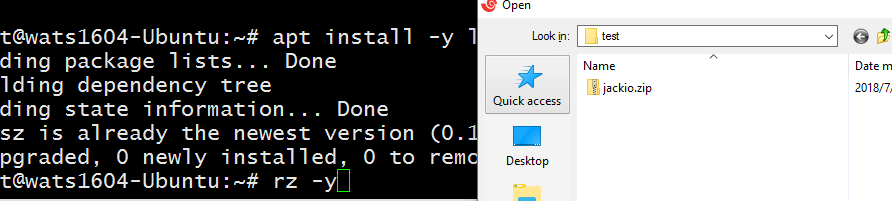
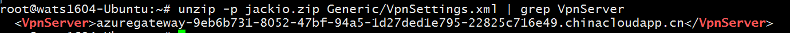
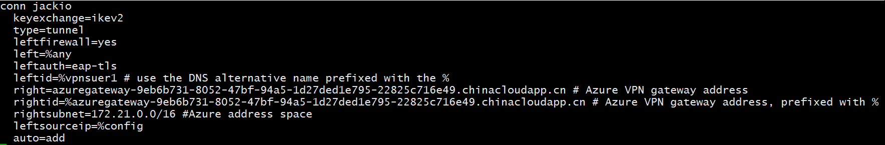
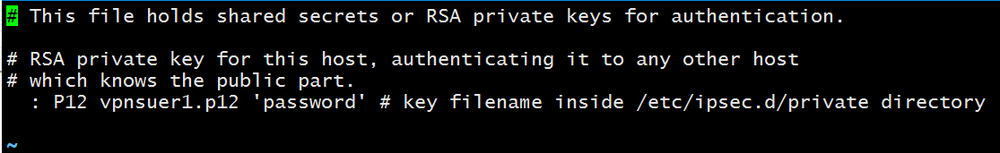
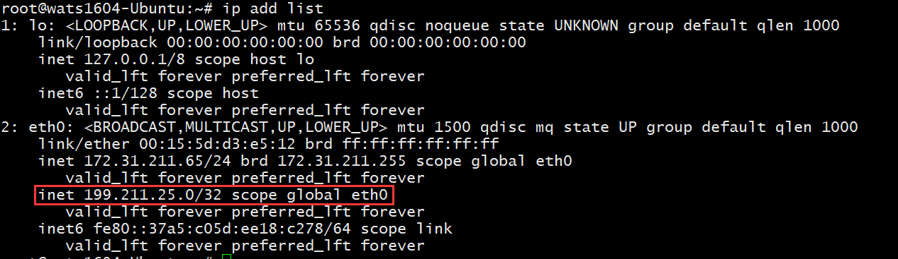
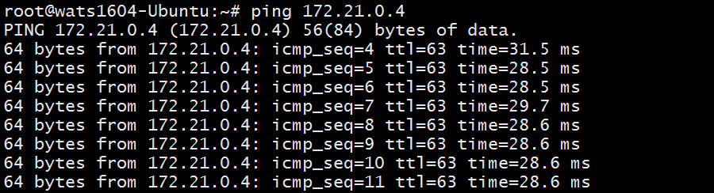
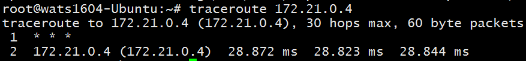

# Linux 操作系统下使用 StrongSwan 搭建到 Azure 的 点到站点 VPN

## 前言

在 Linux 操作系统下，可以使用开源的 StrongSwan 搭建到 Azure 的点到站点 VPN。<br>
在众多的 Linux 开源操作系统版本中，我们仅选择 Ubuntu、Suse 及 Centos 的某些版本为示例，向您展示 StrongSwan 配置 Azure Point to Site VPN 的操作过程。<br>
本文的示例仅供参考，需要向您说明的是，鉴于 Linux 拥有众多的开源版本，每个版本的安装操作命令可能不尽相同，关于如何有针对性的在不同版本的 Linux 操作系统下搭建 StrongSwan，已经超出了 Azure 的技术支持范畴，如您的 Linux 版本不在本文档的示例范围，请您自行咨询 Linux 开源社区或相关论坛。

1. 安装 StrongSwan 组件:

    - Ubuntu

        **Ubuntu 18.0** 之后的系统可参考文档：[安装 - Linux(strongSwan)](https://docs.azure.cn/zh-cn/vpn-gateway/point-to-site-vpn-client-configuration-azure-cert#installlinux) 进行安装。

        **Ubuntu 17.0** 以及之前的版本请参考以下步骤安装（以 Ubuntu 16.04 为例）:

        ```shell
        apt-get install strongswan-ikev2 strongswan-plugin-eap-tls libstrongswan-standard-plugins –y
        ```

    - Suse 

        Suse Linux 请参考以下步骤安装（以 Suse 12 SP3 为例）:

        ```shell
        sudo zypper install openssl strongswan iputils
        ```

    - Centos 

        Centos6 系列或 7 系列版本的可以参考以下步骤安装（以 CentOS 7.4 为例）：

        ```shell
        yum install -y epel-release
        yum install -y strongswan
        ```

2. 生成自签名 CA 证书:

    ```shell
    ipsec pki --gen --outform pem > caKey.pem
    ipsec pki --self --in caKey.pem --dn "CN=Azure VPN CA" --ca --outform pem > caCert.pem
    ```

3. 查看 CA 证书并将公钥证书上传到 Azure P2S VPN:

    ```shell
    openssl x509 -in caCert.pem -outform der | base64 -w0 ; echo
    ```

4. 使用 CA 证书生成客户端证书:

    ```shell
    export PASSWORD="password"
    export USERNAME="vpnsuer1"
    ipsec pki --gen --outform pem > "${USERNAME}Key.pem"
    ipsec pki --pub --in "${USERNAME}Key.pem" | ipsec pki --issue --cacert caCert.pem --cakey caKey.pem --dn "CN=${USERNAME}" --san "${USERNAME}" --flag clientAuth --outform pem > "${USERNAME}Cert.pem"
    ```

5. 根据生成的客户端私钥和公钥合成 p12 格式证书用于 VPN 客户端拨号。

    ```shell
    openssl pkcs12 -in "${USERNAME}Cert.pem" -inkey "${USERNAME}Key.pem" -certfile caCert.pem -export -out "${USERNAME}.p12" -password "pass:${PASSWORD}"
    ```

6. 从 Azure Gw 上下载客户端文件:

    

7. 安装 linux 上传下载工具:

    ```shell
    apt install -y lrzsz
    ```

    使用 `rz -y` 上传文件，保存为 `sz -y`。

    

    Suse Linux 请参考以下步骤安装（以 Suse Sp3 为例）:

    ```shell
    sudo zypper install lrzsz
    ```

8. 解压跟证书文件:

    ```shell
    unzip -j jackio.zip Generic/VpnServerRoot.cer -d /etc/ipsec.d/cacerts
    ```

9. 验证根证书:

    ```shell
    openssl x509 -inform der -in /etc/ipsec.d/cacerts/VpnServerRoot.cer -text -noout
    ```

10. 查看 Azure Gateway 拨入地址:

    ```shell
    unzip -p jackio.zip Generic/VpnSettings.xml | grep VpnServer
    ```

    

11. 拷贝之前生成的用户证书到相应目录:

    ```shell
    cp vpnsuer1.p12 /etc/ipsec.d/private/
    ```

12. 修改 `/etc/ipsec.conf` 添加配置:

    ```shell
    conn jackio
        keyexchange=ikev2
        type=tunnel
        leftfirewall=yes
        left=%any
        leftauth=eap-tls
        leftid=%vpnsuer1 # use the DNS alternative name prefixed with the %
        right=azuregateway-9eb6b731-8052-47bf-94a5-1d27ded1e795-22825c716e49.chinacloudapp.cn # Azure VPN gateway address
        rightid=%azuregateway-9eb6b731-8052-47bf-94a5-1d27ded1e795-22825c716e49.chinacloudapp.cn # Azure VPN gateway address, prefixed with %
        rightsubnet=172.21.0.0/16 #Azure VNET address space
        leftsourceip=%config
        auto=add
    ```

    

13. 修改预共享密钥配置文件，添加以下内容:

    ```shell
    vi /etc/ipsec.secrets
    : P12 vpnsuer1.p12 'password' # key filename inside /etc/ipsec.d/private directory
    ```

    

14. 修改 MTU:

    ```shell
    vi /etc/strongswan.d/charon/kernel-netlink.conf
    ```

    

15. 重启服务并连接:

    ```shell
    ipsec restart
    ipsec up jackio
    ```

16. 查看获取的 IP:

    ```shell
    ip add list
    ```

    

17. 测试链接：

    
    
