# 如何为基于 LVM 的 Linux 扩展根文件系统

Azure 中国区现已推出基于 LVM 的 CentOS 版本。该操作系统默认使用了 64GB 的 OS 磁盘。系统内部除 /boot 使用了单独的 /dev/sda1 分区，/mnt/resource 使用了临时磁盘 /dev/sdb1 外，其他挂载点都使用了逻辑卷。

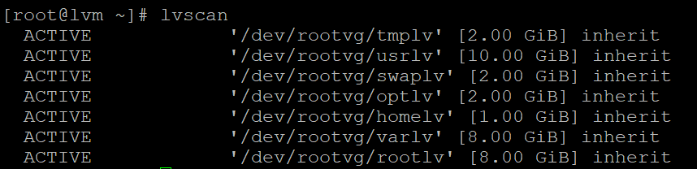

默认创建的文件系统并没有占用卷组全部可用空间，用户可根据需求扩展现有逻辑卷，或者创建新的逻辑卷和文件系统。

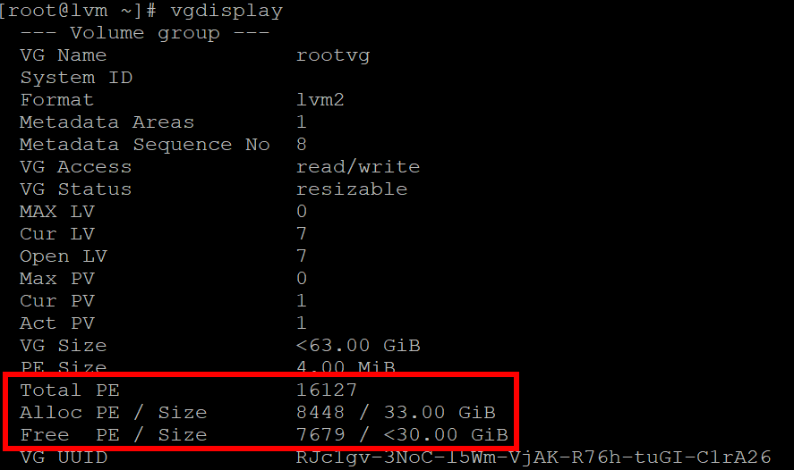

在一些情况下，64GB 的 OS 磁盘大小可能无法满足用户的需求，需要将其进行扩展以便继续扩展上层的文件系统空间。

这里介绍如何为 ARM 模式下的 LVM Linux 虚拟机扩展磁盘并扩展文件系统。<br>
本文示例使用 Azure 发布的 CentOS 7.4 LVM 创建的托管磁盘虚拟机进行演示，从 Azure 门户扩展磁盘的方式同样适用于非托管磁盘。

> [!NOTE]
> 对磁盘、分区或文件系统的操作可能引起数据丢失，建议做好数据的提前保护。

## 扩展磁盘

1. 首先，关闭虚拟机。请确认虚拟机处于停止分配状态。

    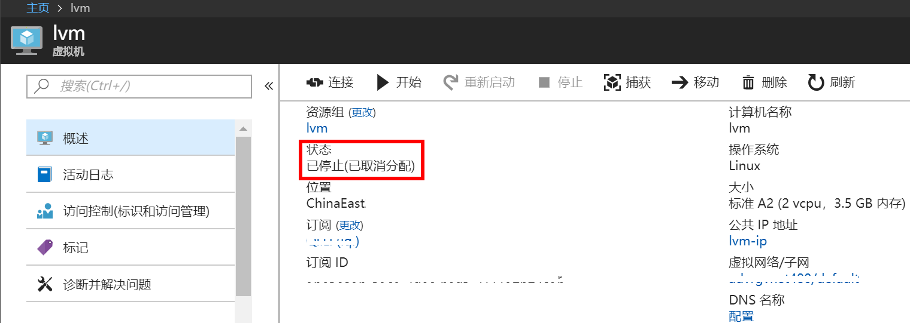

2. 点击 “**磁盘边栏**”，选择 OS 磁盘，进入磁盘配置页面。

    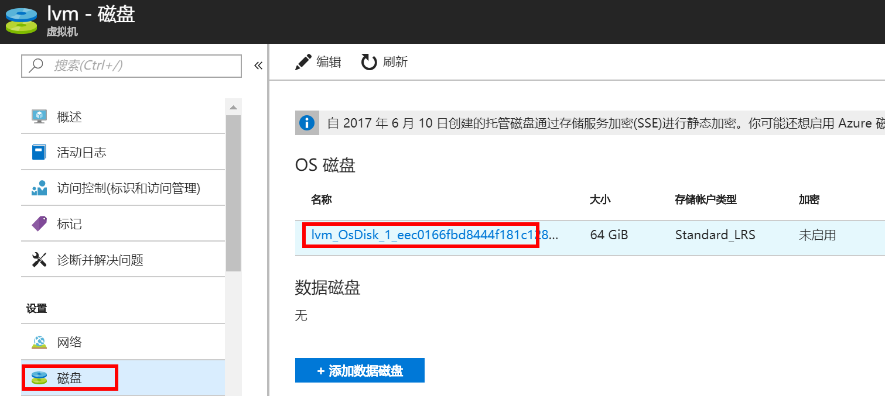

3. 更改大小，并点击 “**保存**”。

    Azure 不支持缩减磁盘，您需要输入一个大于当前值的数字。最大值 4096，即 4TB。

    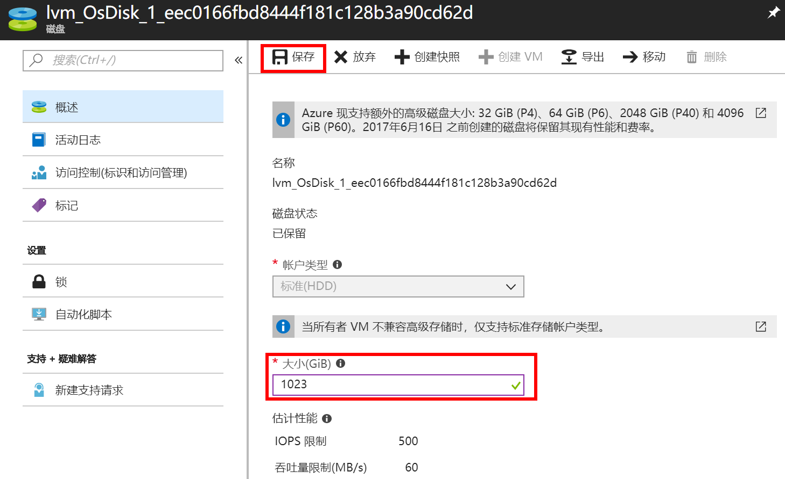

更改成功后，回到虚拟机概述页面，点击 “**开始**” 启动虚拟机。然后通过 SSH 登陆虚拟机进行系统内部的配置。

## 扩展文件系统

1. 首先 `fdisk` 查看磁盘大小已扩展。

    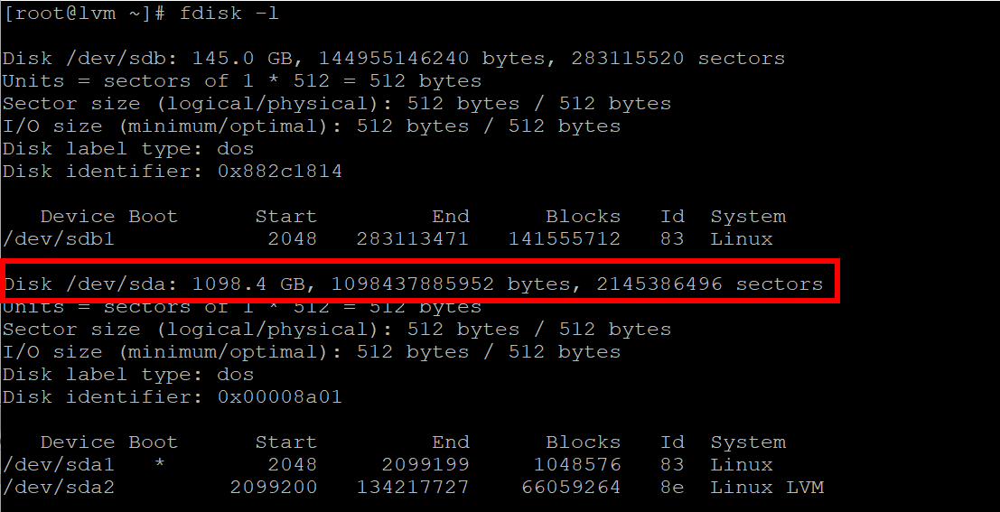

    LVM 提供了比简单分区更灵活的方式扩展文件系统（包括根目录）和磁盘。<br>
    对于简单分区方式的扩展，请参考另一篇文档：[如何在 Linux 虚拟机上扩展根文件系统](https://docs.azure.cn/zh-cn/articles/azure-operations-guide/virtual-machines/linux/aog-virtual-machines-qa-linux-root-file-system-extension)。

2. 新建 LVM 分区并加入现有 VG。

    首先创建 LVM 分区。

    ```shell
    # fdisk /dev/sda
    ```

    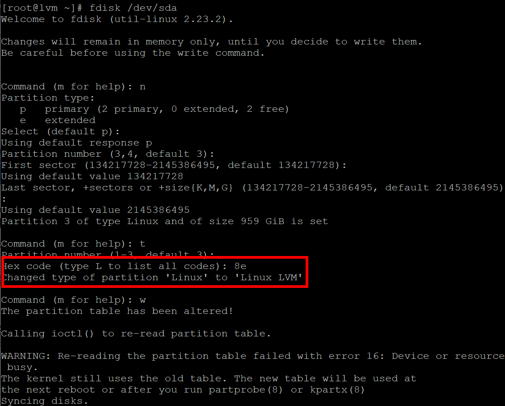

    创建 PV。若找不到新建的分区，先执行 `partprobe` 进行刷新:

    ```shell
    # partprobe
    # pvcreate /dev/sda3
    ```

    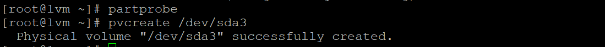

    将 PV 加入现有 VG。通过 `vgscan` 或 `vgdisplay` 查看 VG 的信息:

    ```shell
    # vgscan
    # vgextend rootvg /dev/sda3
    # vgdisplay
    ```

    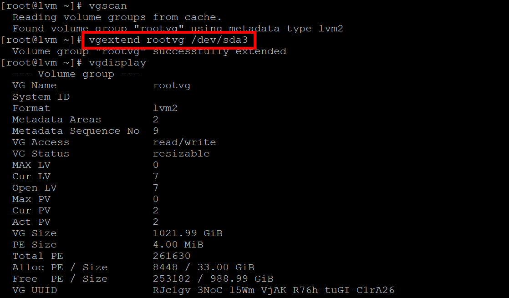

3. 扩展 LV。

    ```shell
    # lvextend -L +100GB /dev/rootvg/rootlv
    ```

    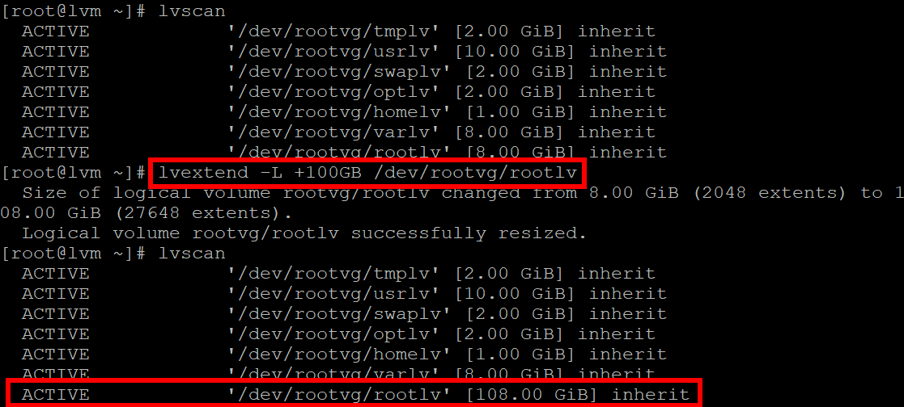

4. 扩展文件系统。

    ```shell
    # resize2fs /dev/rootvg/rootlv
    ```

    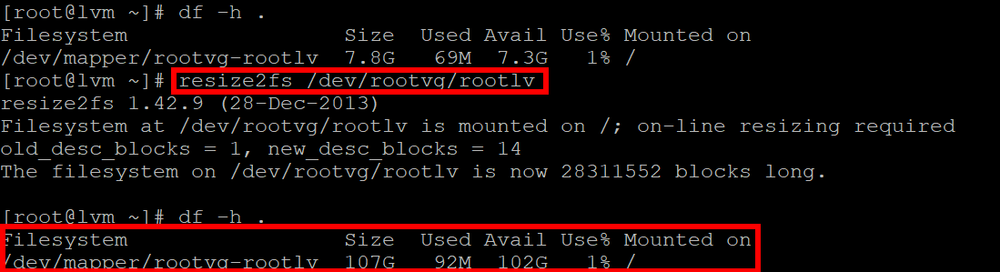

重复步骤 3 及 步骤 4 为其他 LV 扩展空间。

> [!IMPORTANT]
> 1. 标准存储账号的 IOPS 和吞吐量有限，增加磁盘尺寸并不会增加 IOPS 和吞吐量。若对性能有要求，建议升级到高级存储；或者通过增加数据磁盘的方式进行扩容，以此增加 IOPS 和吞吐量。
> 2. 目前 Azure 支持的最大数据磁盘为 4TB，但是在经典模式下 SSD 只支持最大 1TB。而不同虚拟机型号支持的数据磁盘不同，请在扩容前进行提前规划，综合考虑性能，容量和限制条件，防止遇到需求无法满足的情况。