# 如何管理和控制多网卡 Linux 虚拟机的流量走向

## 现象描述

多网卡虚拟机默认会使用主网卡跟外界进行通信，其他的辅网卡默认是不会被用来跟外界通信，可以使用本文介绍的方法修改虚拟机（CentosMultiNic-VM）的配置文件，从而实现其他的子网的虚拟机（TestVM）可以借助多网卡虚拟机的辅助网卡 eth2 访问公网，默认是通过主网卡 eth1 访问公网。

拓扑如下：

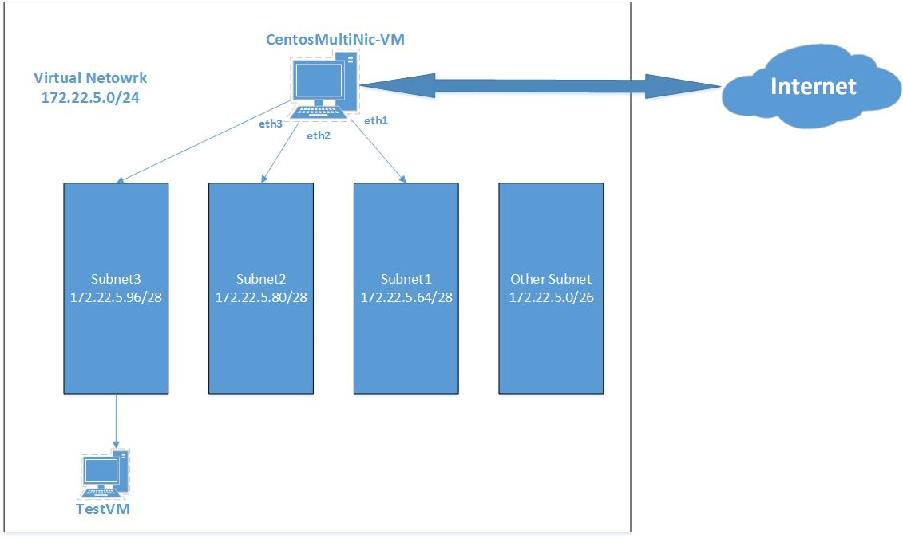

## 前期准备

1. 准备两台虚拟机 **CentosMultiNic-VM** / **TestVM** ，其中 **CentosMultiNic-VM** 为多网卡虚拟机。

    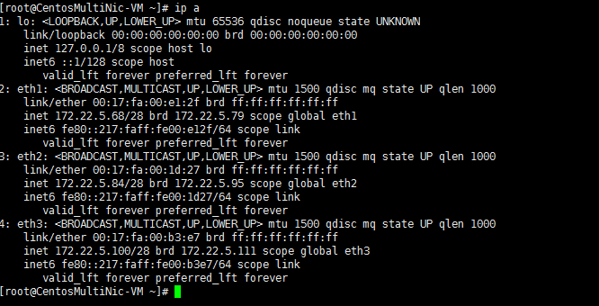

    
2. 创建虚拟网络 172.22.5.0/26，并且划分子网如下图所示：

    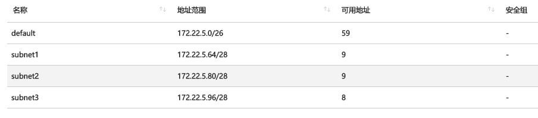

3. CentosMultiNic-VM 的三个网卡以及分别位于对应的子网: 

    - **eth1--subnet1**<br>
    - **eth2 --subnet2**<br>
    - **eth3 – subnet3**

## 配置部分

1. 配置 UDR 到 subnet3，从而实现子网 subnet3 的下虚拟机 **TestVM** 可以将流量引向 **CentosMultiNic-VM**。

    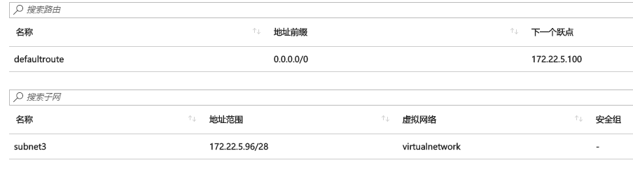

2. 通过 Azure 门户针对网卡开启 IP 转发设置,如下图所示：

    <table>
        <tr>
            <td>eth1</td>
            <td>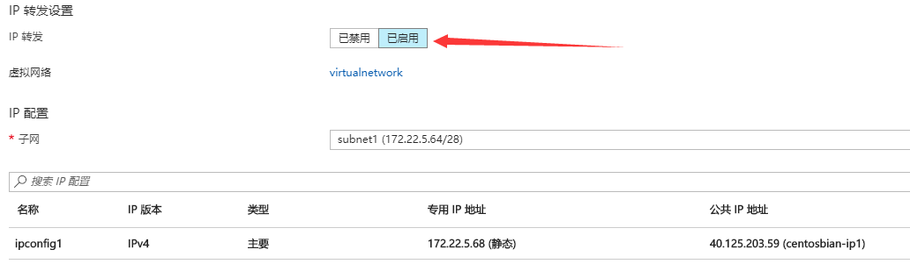</img></td>
        </tr>
        <tr>
            <td>eth2</td>
            <td>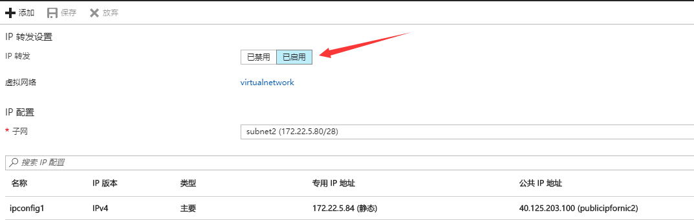</img></td>
        </tr>
        <tr>
            <td>eth3</td>
            <td>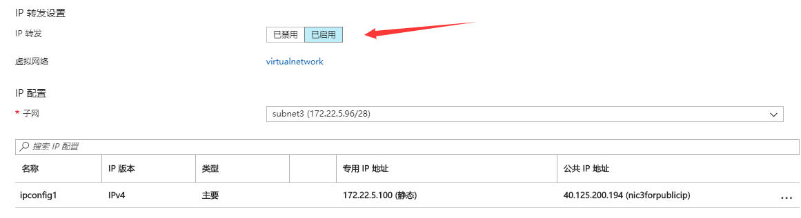</img></td>
        </th>
    </table>

3. 在虚拟机 **CentosMultiNic-VM** 修改配置：

    1. 默认虚拟机的路由是通过 eth1 出去访问公网，如下图所示：

        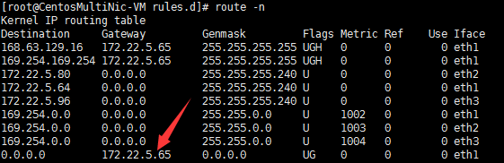

        删除系统自带的默认路由，并且添加默认路由指定下一条为 eth2，当删除系统自带的默认路由以后，可能会导致系统无法通过 SSH登录，建议可以在虚拟网络VNET中新建一台 jump server 做跳板机进行配置。

        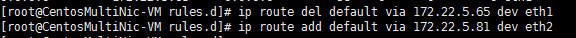

    2. 通过使用 iptables 的 nat 表做 snat 转换 

        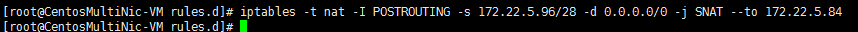

    3. 开启 linux 内核的 `ip_forwarding` 选项：

        ```
        sed -ri 's/net.ipv4.ip_forward = 0/net.ipv4.ip_forward = 1/g' /etc/sysctl.conf
        sysctl -p
        ```

        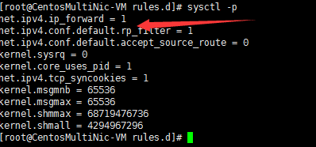

4. 测试

    此时在 TestVM 中进行 ping 测试，同时在 **CentosMultiNic-VM** 上抓包，如下图所示：

    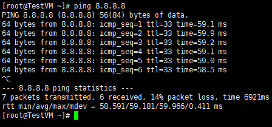

    在 **CentosMultiNic-VM** 抓包发现，ICMP 报文会经过 eth2，如下图所示：

    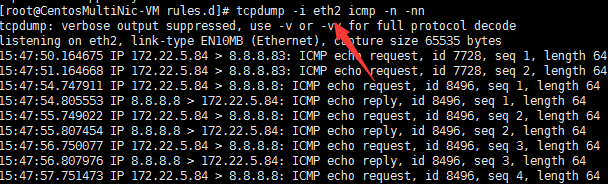

    另外，此时再次从公网访问虚拟机主网卡的公网 IP 就发现无法 SSH 了，如下图所示：

    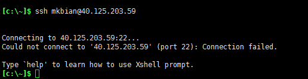

    这是因为在虚拟机内部修改了系统的默认路由导致的，可以通过配置策略路由来解决该问题：

    1. 在系统路由表的配置文件添加自定义路由表：

        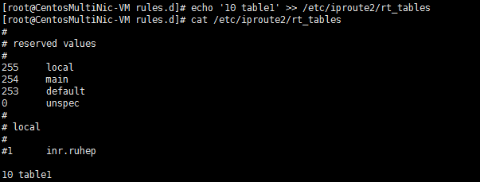

    2. 添加规则：从 `172.22.5.68` 离开的数据包去查找路由表 table1：

        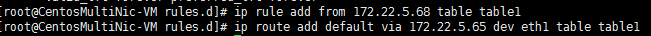

    添加策略路由后发现可以正常访问了，如下图所示：

    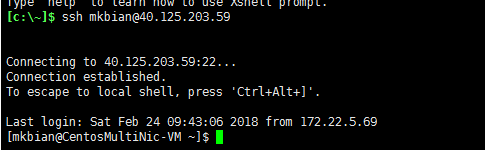

综上所述：可以在 linux 系统内添加多网卡和调整默认路由，使其他的虚拟机可以通过多网卡虚拟机的辅助网卡访问公网， 来控制虚拟机的流量走向
         以及通过使用策略路由，仍然可以实现SSH登录主网卡。

由于上述配置在虚拟机重启以后就会消失，如果想要永久生效的话，可以写入到**/etc/rc.local** 里。

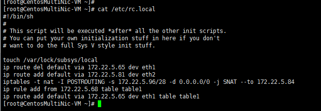
