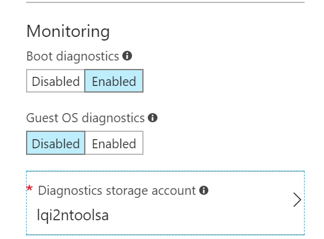
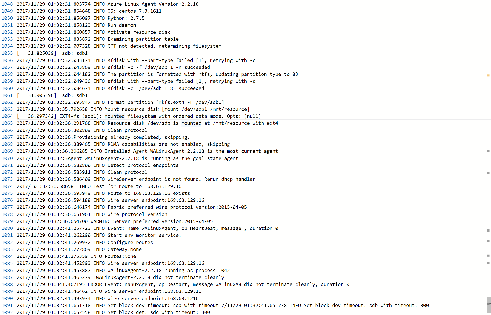
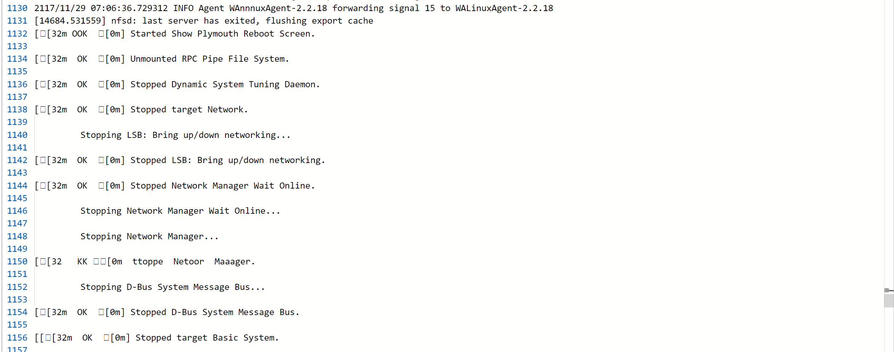
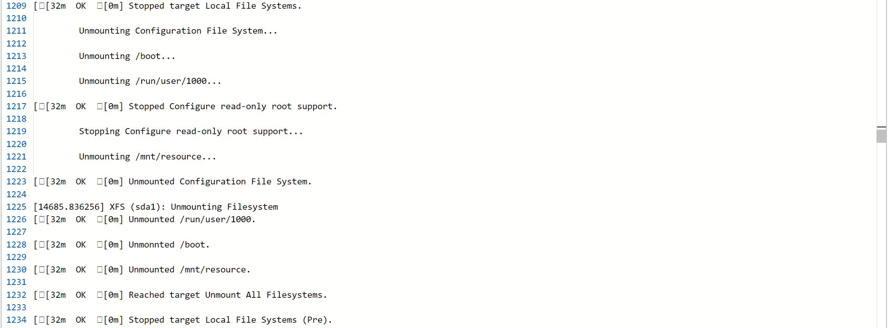
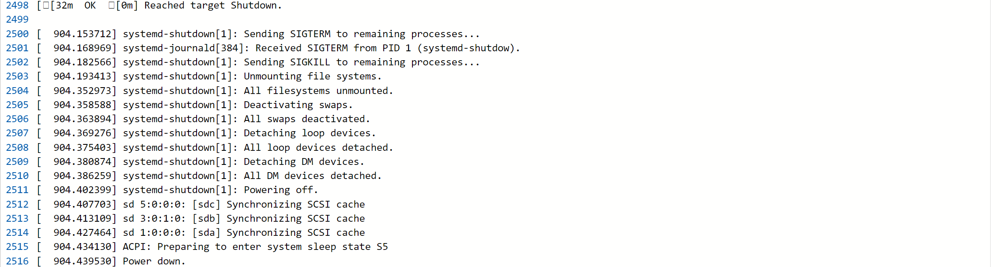
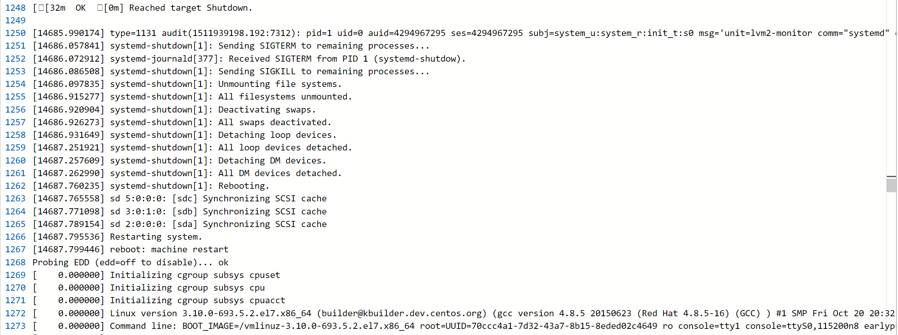

# Linux 启动诊断日志协助定位虚拟机启动或重启问题

很多用户可能没有注意到，在门户中创建虚拟机时，Azure 默认的监控配置是开启启动诊断。

默认的配置一般就是 Azure 推荐的做法。那么，为什么 Azure 推荐用户要开启启动诊断，这个启动诊断有什么用途呢？这里就来为大家介绍一下。

为了最大程度保证用户数据隐私，Azure 没有为用户提供类似虚拟机控制台之类的 console 界面。为什么呢？控制台是虚拟化提供的一个功能，如果用户登录控制台并进行一些关键任务的操作，很可能您的行为会被别有用心的人监视到，信息被暴露。Azure 的合规性是不允许这样的事情发生的。因此，使用 Azure 的虚拟机，只能通过远程桌面或者 SSH 连接进行操作。

但没有了控制台这样一个直接的入口，不免也给用户管理虚拟机带来了麻烦。尤其是当虚拟机因为某些原因不能正常访问时，用户很难通过自助的方式知道是虚拟机出了问题，还是网络出了问题，往往要求助于技术支持来解决。

为此，Azure 提供了启动诊断功能，将虚拟机控制台的输出重定向都用户定义的存储账号，并显示在门户中，这样用户就能知道虚拟机的实时状态，遇到连接访问问题时，能进行快速简单的自助排查。
启动诊断提供了两个信息：一是控制台的终端输出日志；而是控制台截屏。

Windows 启动没有日志输出，用户可以通过截屏看看虚拟机是否在就绪状态；如有问题，需要联系技术支持。但对于 Linux 来讲，这个功能能在很大程度上帮助用户在第一时间定位到问题。接下来以 CentOS 虚拟机为例，我们来看一看启动和关闭过程中，启动诊断日志能帮我们记录什么？

## CentOS 7 的启动过程和日志的对照

1. BIOS 阶段

    接通电源，BIOS 执行开机自检，初始化系统硬件组件，从加载的磁盘中查找 MBR。如果找到，读取 MBR 并加载其中的引导程序到内存。

2. MBR 阶段

    引导程序根据 MBR 记录，发现可启动的设备，加载 GRUB2 引导配置，并移交将控制权给 GRUB2。

3. GRUB2 阶段

    GRUB2 将压缩的内核镜像文件 vmlinuz 加载到内存，将驱动 initramfs 解压到一个临时的基于内存的文件系统 tmpfs。同时将控制权转交给内核。

    > [!NOTE]
    > 控制台输出日志中不会包含这三个过程，因为在内核模块加载前，终端等设备尚不能被内核调用，无法记录其信息。

4. 内核阶段

    内核挂载文件系统 tmpfs，通过其中的一些必须的块设备驱动模块，初始化硬件，访问真实的根文件系统。并以进程号 1 启动 systemd 进程。

    

    上图中的 probing EDD 的过程可以理解为内核识别设备的过程。紧接着接收来自 BIOS 的内存映射报告等，内核开始工作，启动系统。该日志会同步记录到系统的/var/log/dmesg 中。

5. Systemd 将 temfs 文件系统挂载在/sysroot，按照 initd 设置启动系统服务

    

    dmesg 并不会记录所有输出到控制台的信息，比如上图中的挂载 /sysroot 的过程和下面切换根文件系统 / 的过程。在这种时候，如果启动有问题，控制台日志能比较清楚地记录系统已经启动到哪个阶段。

6. 内核根文件系统从 initramfs/sysroot 切换到 /

    

    如果根文件系统有问题，或者其他的文件系统文件，经常在这个过程中会被卡住。需要用户接入手动修复文件系统等。

7. Systemd 根据系统默认启动级别，自动解决服务间的依赖关系并启动服务。完成后，登录界面弹出。

    

系统启动完成后，Azure VM 代理（waagent）开始运行，进行系统配置，如临时盘、网络路由、以及其他指定的扩展。这些是 Azure 虚拟机特定的后续配置，目的在于确保虚拟机能在 Azure 大网络中正常运行。

这一步完成后，系统就已经就绪了，用户能通过内部或者外部 IP 地址访问虚拟机。平台也认为虚拟机创建完成。

## CentOS 7 的关机或者重启

如果从门户或者 Azure 工具进行命令行的强制关机或者重启，大多数情况下，如果启动不成功都是开机过程出现问题，用户可以根据上述启动过程的日志排查是否启动被卡住。

若是通过系统命令如 `shutdown` 或者 `reboot` 进行软关机或软重启，那么，长时间不成功则可能是出现在关机过程或者启动过程。这个时候，控制台日志是一个很好的信息来源，帮助用户定位问题原因。

关机过程和开机相反，系统会首先尝试温和终止系统中的进程，终止内核服务，最后断电。我们看日志中会有大量的服务终止的记录，文件系统取消挂载，`systemd-shutdown` 停止系统服务的记录。

若是关机成功，最后的日志输出应该有类似 `shutdown` 或者 `Power Down`。若是重启成功，最后的记录则是 `restarting` 或者 `reboot`，后续再跟着系统启动的日志。 同时，在后台主机上，也能收到系统 guest 操作系统被关机或者重启的记录。

若是关机过程卡住了，该日志将不会有完整的输出，后台可能也不会有相关记录。在一定程度上给原因分析带来了难度。在这种情况下，用户可以根据日志输出判断否是系统或者应用有问题；或者收集该日志提供给技术支持部门进行分析诊断。

**关机成功显示**：

**重启成功显示**：

> [!NOTE]
> 经测试，虚拟机在后台同一个物理机上的声明周期内，该日志不会被覆盖，所有的重启开机记录都被保存在文件中。但如果对虚拟机进行了禁用启动 ，或者通过门户强制关机再重启，重新部署等操作，该日志可能无法完整保留下来。若用户急需恢复服务，但事后需要查找原因，建议首先将日志下载保存。点击日志按钮即可下载。
> 