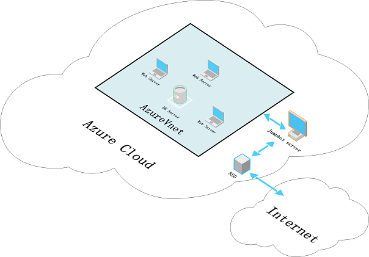

# Linux 虚拟机的安全加固

## 背景介绍

在云时代，各种层出不穷的安全问题越来越困扰着用户，数据被恶意删除，加密进行勒索。无差别的恶意攻击致使网络瘫痪。各种流氓软件极大地降低用户体验。基于 Azure 平台，我们已经通过各种安全手段来保护用户的资源和数据（相关介绍，请参考这里）。对于 IaaS 的用户，我们还需要在虚拟机内部进行安全加固来提升资源和数据的安全性。以下内容介绍了如何在 Linux 虚拟机内部通过一些“小手段” 来辅助提升 Linux 系统的安全性。

>[!IMPORTANT]
> 以下范例基于 Azure 平台部署的 CentOS7.3，如果您使用的是其他版本的 Linux 操作系统，请注意其中的差异性。

## 方案介绍

### Azure IaaS 安全架构



对于 IaaS 的虚拟机资源，除了业务需求对外访问的端口开放之外，所有的访问都通过跳板机（Jumpbox）进行内部访问，特别是数据库，重要的业务服务器，一定要启用防火墙进行安全加固。

### Linux 虚拟机的安全加固建议

1. 修改用户的密码口令策略：

    ```
    [root@centos-73-1 chpaadmin]# cat /etc/login.defs |grep -i pass
    # passwd command) should therefore be configured elsewhere. Refer to
    # Password aging controls:
    #       PASS_MAX_DAYS   Maximum number of days a password may be used.
    #       PASS_MIN_DAYS   Minimum number of days allowed between password changes.
    #       PASS_MIN_LEN    Minimum acceptable password length.
    #       PASS_WARN_AGE   Number of days warning given before a password expires.
    PASS_MAX_DAYS   99999		修改密码有效期
    PASS_MIN_DAYS   0
    PASS_MIN_LEN    5		修改密码长度
    PASS_WARN_AGE   7
    # the user to be removed (passed as the first argument).
    # Use SHA512 to encrypt password.
    ```

2. 修改危险文件（命令）权限:

    对于一些比较危险的操作，如：rm,mv,ifconfig,cron,vi 等。这类命令会直接对文件或者文件内容进行操作，那么建议上述操作只给具有 root 权限的管理员来执行。可以通过命令：`chmod 700 <command>`，来修改上述命令的权限。

3. 用户登录通知：

    目前，客户只能在发现数据或者虚拟机被恶意侵入或者用户的误操作导致了数据的丢失之后，采取善后的手段，但是并没法做到提前的预警。那么通过 PAM 模块，就可以实现用户登录，root 权限获取时，通过邮件等方式进行通知。以实现，预先知道，预先警惕的目标，降低受影响的范围。以下是通过 PAM 模块实现的邮件通知用户登录的功能。

4. 以管理员身份登录虚拟机，并切换成 root 用户。

5. 新建脚本 `/etc/ssh/login_notifiy.sh` (该脚本可以存放在任意位置，但是需要将后续的路径指定好即可),内容如下：

    ```
    #!/bin/bash

    [ "$PAM_TYPE" = "open_session" ] || exit 0
    {
    echo "User: $PAM_USER"
    echo "Ruser: $PAM_RUSER"
    echo "Rhost: $PAM_RHOST"
    echo "Service: $PAM_SERVICE"
    echo "TTY: $PAM_TTY"
    echo "Date: `date`"
    echo "Server: `uname -a`"
    } | mail -s "`hostname -s` $PAM_SERVICE login: $PAM_USER" user@yourdomain.com
    ```

6. 编辑文件 `/etc/pam.d/sshd`，在文件最后追加一行：

    `session optional pam_exec.so debug /bin/bash /etc/ssh/login-notify.sh`

7. 保存并退出。

8. 至此，每一个用户登录都会发邮件通知给收件人，内容包括用户名以及登录的 IP 地址信息。如果遇到陌生 IP，那么就要注意，该虚拟机是否正在遭受攻击。

9. 同理，你可以在把上述脚本应用到 `/etc/pam.d/` 其他模块中，比如 sudo，login 等，来进行监控。

## 相关文档

- [Linux 虚拟机的安全审计](aog-virtual-machines-linux-security-audit.md)
- [Linux 虚拟机的 SSH 双重登录认证](aog-virtual-machines-linux-ssh-two-factor-authentication.md)