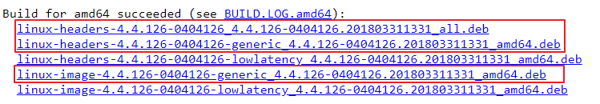

# 如何升级 Ubuntu 内核

## 问题描述

在 Ubuntu 系统运行过程中, 会遇到一些已知问题, 可以通过升级内核来进行修复。

以下是升级 Ubuntu 内核的大致步骤。

> [!NOTE]
> 以下范例为升级到 Ubuntu 内核 4.4.126。

## 解决方案

1. 访问 [Ubuntu 内核官网](http://kernel.ubuntu.com/~kernel-ppa/mainline/)下载。

2. 选择您要升级的内核版本, 点击进入下载页面,找到 amd64 的内核下载, 参考如下:

    

    只需要下载高亮显示的三个 deb 文件即可。

3. 登录 Ubuntu 虚拟机,并切换到 root 用户。

4. 执行以下命令, 进行下载:

    ```
    # wget http://kernel.ubuntu.com/~kernel-ppa/mainline/v4.4.126/linux-headers-4.4.126-0404126_4.4.126-0404126.201803311331_all.deb
    # wget http://kernel.ubuntu.com/~kernel-ppa/mainline/v4.4.126/linux-headers-4.4.126-0404126-generic_4.4.126-0404126.201803311331_amd64.deb
    # wget http://kernel.ubuntu.com/~kernel-ppa/mainline/v4.4.126/linux-image-4.4.126-0404126-generic_4.4.126-0404126.201803311331_amd64.deb
    ```

5. 执行命令, 进行内核安装:

    ```
    # dpkg -i linux-*.deb
    ```

6. 安装完毕后, 重启虚拟机, 完成内核升级.