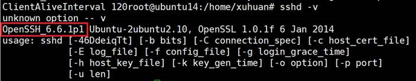
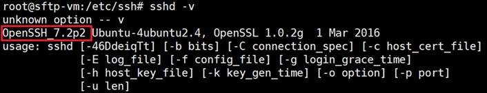
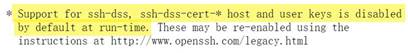

# 高版本 Ubuntu 系统无法使用 SSH DSA 密钥登录

## 问题描述

在 Ubuntu 16.04 LTS 和 18.04 LTS 中存在无法使用 SSH DSA 密钥登录的现象，但在 Ubuntu 14.04 LTS 中可以成功登录。

## 问题分析

Ubuntu16.0 以上版本的系统中，OpenSSH 协议升级到了 7.0 以上，如下图：

- Ubuntu 14.04LTS 中的 OpenSSH 协议版本

    

- Ubuntu 16.04LTS 中的 OpenSSH 协议版本

    

根据 [openssh 7.0 版本日志](http://www.openssh.com/txt/release-7.0)，该协议不再默认支持 SSH DSA 密钥。经测试，使用 SSH RSA key 后，即可使用 sftp 账号登录系统。

## 解决方法

在 Ubuntu 16.04 LTS 及以上系统内部创建密钥时，建议使用 `<ssh-keygen -t rsa>`。