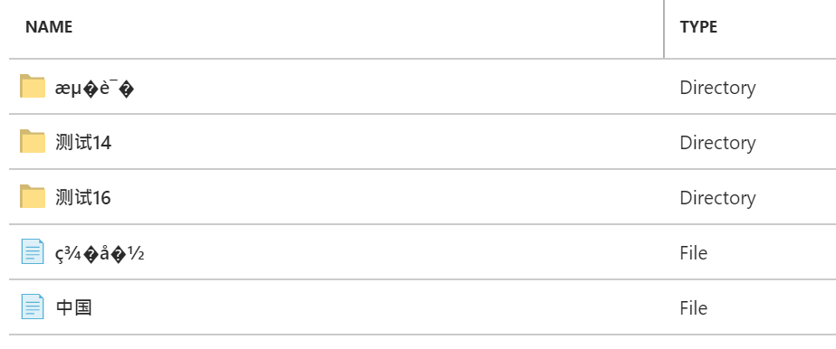
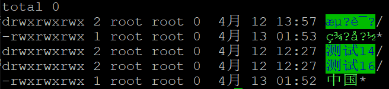
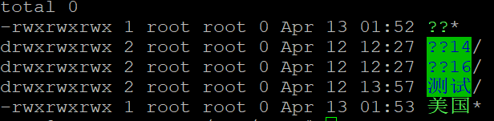
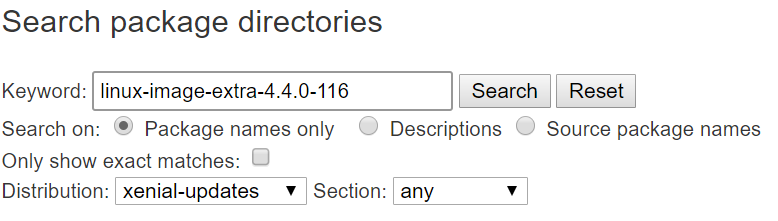

# 如何处理 Ubuntu 14.04 虚拟机使用 Azure 文件存储时出现中文乱码的问题

## 问题描述

当用户使用 Ubuntu 14.04 和 Ubuntu 16.04 版本的虚拟机挂载 Azure 文件存储时，可能会发现在 Ubuntu 14.04 中创建的中文文件和文件夹在 Ubuntu 16.04 和 Azure 门户中显示为乱码的问题。

Azure 门户中：



Ubuntu 16.04 中显示：



同时，在 Ubuntu 14.04 虚拟机中，通过 Ubuntu 16.04 创建的中文文件也无法正常显示：



## 问题分析

查看不同版本虚拟机的 locale 语言设置，发现即使通过 `sudo locale-gen zh_CN.UTF-8` 将系统语言设置为中文也无法解决问题。

```
# locale
LANG=zh_CN.UTF-8
LANGUAGE=zh_CN:zh
LC_CTYPE="zh_CN.UTF-8"
LC_NUMERIC="zh_CN.UTF-8"
LC_TIME="zh_CN.UTF-8"
LC_COLLATE="zh_CN.UTF-8"
LC_MONETARY="zh_CN.UTF-8"
LC_MESSAGES="zh_CN.UTF-8"
LC_PAPER="zh_CN.UTF-8"
LC_NAME="zh_CN.UTF-8"
LC_ADDRESS="zh_CN.UTF-8"
LC_TELEPHONE="zh_CN.UTF-8"
LC_MEASUREMENT="zh_CN.UTF-8"
LC_IDENTIFICATION="zh_CN.UTF-8"
LC_ALL=zh_CN.UTF-8
```

这时我们怀疑可能是 `mount` 时使用的编码有问题，尝试在 `mount cifs` 时使用 `iocharset=utf8` 参数指定使用 `UTF-8` 编码，得到以下报错：

```
# sudo mount -t cifs //storageaccount.file.core.chinacloudapi.cn/share /mnt/temp -o vers=3.0,username=storageaccount,password=xxxxxxx,dir_mode=0777,file_mode=0777,sec=ntlmssp,iocharset=utf8
mount error(79): Can not access a needed shared library
Refer to the mount.cifs(8) manual page (e.g. man mount.cifs)
```

查看 dmesg 日志，发现以下报错，说明 kernel 不包含 utf8 字符集。

```
# dmesg | tail
……
[  110.331917] FS-Cache: Loaded
[  110.402986] FS-Cache: Netfs 'cifs' registered for caching
[  110.403624] Key type cifs.spnego registered
[  110.403632] Key type cifs.idmap registered
[  110.403812] CIFS VFS: CIFS mount error: iocharset utf8 not found
```

查看 Ubuntu 社区文档，发现 Ubuntu 14.04 最小安装默认不包含 UTF-8 字符集，而 Ubuntu 16.04 则没有这个问题。

```
# sudo ls /lib/modules/$(uname -r)/kernel/fs/nls/nls_utf8.ko
ls: cannot access /lib/modules/4.4.0-116-generic/kernel/fs/nls/nls_utf8.ko: No such file or directory
```

## 解决方法

通过安装 linux-generic 包，或通过官网 [Ubuntu Packages](https://packages.ubuntu.com/) 搜索当前 kernel 版本对应的补充包，安装完毕后重启虚拟机，即可修复此问题。



```
# sudo apt-get install linux-generic
```

或

```
# sudo apt-get install linux-image-extra-4.4.0-116-generic
```

> [!IMPORTANT]
> 在更新当前 Ubuntu 14.04 之前，先将中文文件内容做备份，以免在更新后文件内容显示为乱码。从 Azure 门户和 Ubuntu 16.04 系统中看到的乱码文件和文件夹无法自动转码，需要手动修正文件名。