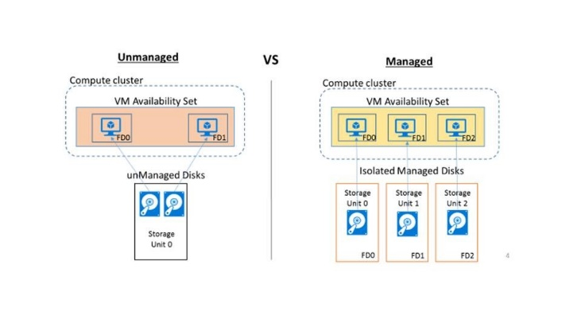
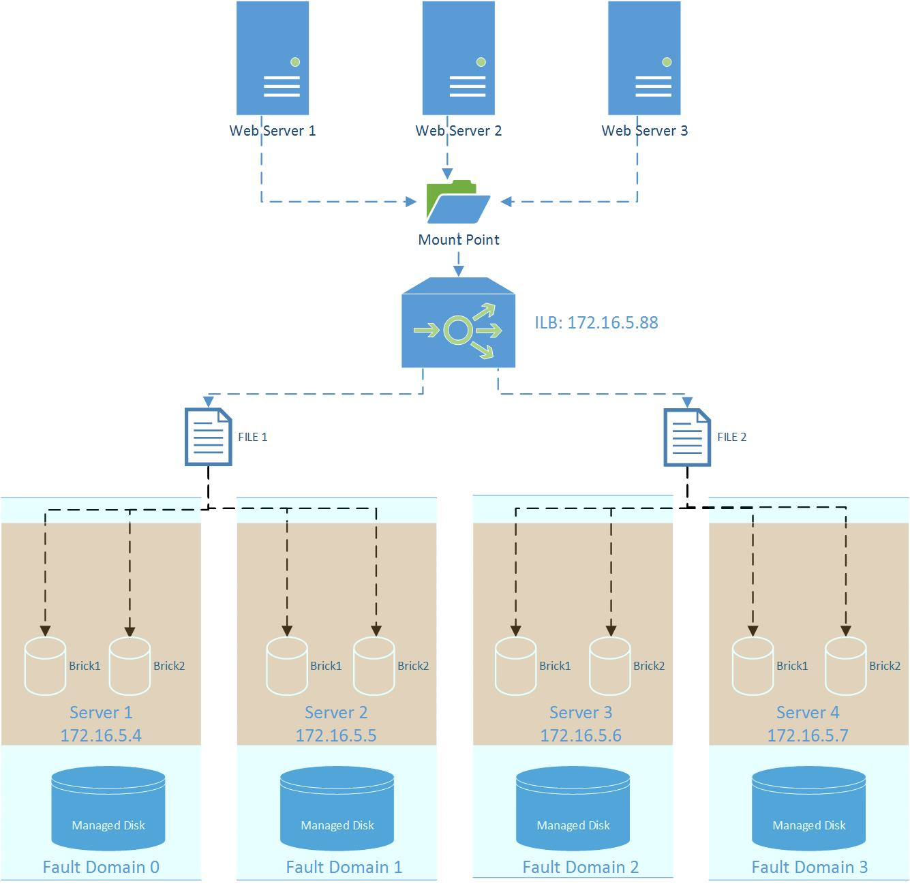

# 基于 Azure 托管磁盘配置高可用共享文件系统

## 背景介绍

在当下，共享这个概念融入到了人们的生活中，共享单车，共享宝马，共享床铺等等。其实在 IT 界，共享这个概念很早就出现了，通过 SMB 协议的 Windows 共享目录，NFS 协议的网络文件系统等等。在 Azure 平台，也提供了 Azure 共享文件服务供客户访问。但是不管是 CIFS,NFS，还是 Azure File Share 都有其不足之处。比如 CIFS,NFS 无法实现高可用，一旦 CIFS server 或者 NFS server 不可用，整个共享目录就变得不可用。那么如何实现共享文件系统的高可用呢？
今天就给大家介绍一下：

基于 Azure 托管磁盘 + Gluster 分布式文件系统来构建高可用的共享文件系统。

## 名词解释

### Azure 托管磁盘

在托管磁盘发布之前，Azure 的磁盘分为普通存储和高端存储，在创建存储账号之后，来存储虚拟机的磁盘（VHD 页文件）。而且对于磁盘的 IOPS 都有所限制，比如不能超过 20,000 IOPS/账户。而且存储单元是没有高可用的功能。一旦存储单元出现故障，那么该存储单元下的磁盘都会受到影响。在这种架构下，基于这些磁盘部署的虚拟机即使部署在同一个高可用集合内，依然会变得不可用。同理 Azure File Share 也会受到上述的限制。

最近 Azure 发布了托管磁盘（中国区还没正式上线），就完美的解决了上述的问题。其优点参考如下：

- **简单且可缩放的虚拟机部署**

    在使用托管磁盘时，磁盘的 IOPS 不再受到存储账号的 IOPS 上线限制。在进行扩展时，无需额外创建存储账号等。

- **可用性集更加可靠**

    托管磁盘彼此之间完全隔离以避免单点故障，通过高可用集，自动将磁盘防止在不同的存储单元。如果该存储单元不可用，那么只能影响到使用该磁盘的虚拟机实例。
 
    

其他优点及详情，参考链接如下：[Azure 托管磁盘概览](https://docs.microsoft.com/zh-cn/azure/storage/storage-managed-disks-overview)

### GlusterFS

**GlusterFS** 是一个开源的可扩展分布式文件系统，适用于云计算，流媒体等互联网应用。与 **Lustre**、**MooseFS**、**CEPH** 并列成为四大开源分布式文件系统。由于 GlusterFS 新颖的 KISS（KeepIt as Stupid and Simple）的系统架构，使其在扩展性、可靠性、性能、维护性等方面具有独特的优势，目前开源社区风头有压倒之势，国内外有大量用户在研究、测试和部署应用。有优势，也势必有其短板之处，比如处理元数据和海量小文件的效率和性能表现一般，所以在选择时，一定要评估自己的应用场景是否适用。

## 架构简介

基于上述对托管磁盘的分析，我们可以看到，从磁盘层面，我们已经做了高可用，保证同一可用集合内，不会所有的磁盘（虚拟机）同时不可用。之后，通过 Gluster 分布式文件系统的备份卷，即使有磁盘因为计划内的维护升级变得不可用，从文件系统层面，依然可以提供数据访问的可用性。

再加上 Azure 平台面向内部负载均衡器（ILB）,从前端访问不用担心节点故障时，需要手动切换挂载点。



## 实施方案

### 部署基于托管磁盘的虚拟机

1. 登录 [Azure 门户管理网站](https://portal.azure.cn) 。

2. 根据向导，部署 4 台基于 ARM 的 CentOS 7.3 虚拟机服务器。

    ```
    gfs-node1 ( 172.16.5.4 ）
    gfs-node2 ( 172.16.5.5 ）
    gfs-node3 ( 172.16.5.6 ）
    gfs-node4 ( 172.16.5.7 ）
    ```

3. 在创建时，一定要把虚拟机放在同一高可用集内。

4. 虚拟机创建完毕之后，给每一台虚拟机附加一块 1TB 的托管磁盘。

    

5.	登录虚拟机，通过 `fdisk -l` 检查托管磁盘是否附加上。

6.	当托管磁盘附加上之后，执行命令进行初始化：

7.	`# mkfs.xfs /dev/sdc`

8.	`# mkdir /sdc`

9.	`# mount /dev/sdc /sdc`

10.	在之后，`/sdc` 就作为 Gluster 文件系统里的 Brick 来使用。

### 安装配置 Gluster

1.	登录每台虚拟机，执行下列操作，安装配置 Gluster 服务

2.	`# yum install centos-release-gluster37`

3.	`# yum install glusterfs gluster-cli glusterfs-libs glusterfs-server`

4.	启动 Gluster 服务：`# service  glusterd start`

5.	创建存储池：`# gluster peer probe <hostname>`

6.	查看存储池状态：`# gluster peer status`

### 配置 ILB 实现负载均衡
	
1.	登录 [Azure 门户管理网站](https://portal.azure.cn)

2.	根据向导创建负载均衡 `gfs-ilb`

3.	指定前端 IP 地址为：`172.16.5.88`

4.	指定后端 IP 池：`172.16.5.4, 172.16.5.5, 172.16.5.6, 172.16.5.7`

5.	指定健康探测端口：`22`

6.	指定负载均衡规则：

7.	`Tcp/udp-24007/24008`

8.	上述端口为 Gluster 服务端口

9.	`Tcp 49152` 为数据端口，一个卷对应一个端口，其实为 49152，依次加 1。


### 客户端挂载 Gluster 卷

执行命令挂载 Gluster 卷：

`# mount.glusterfs 172.16.5.88:/dsr_vol /dsr_data`

至此，你就拥有了几乎不会 offline 的共享目录！ 