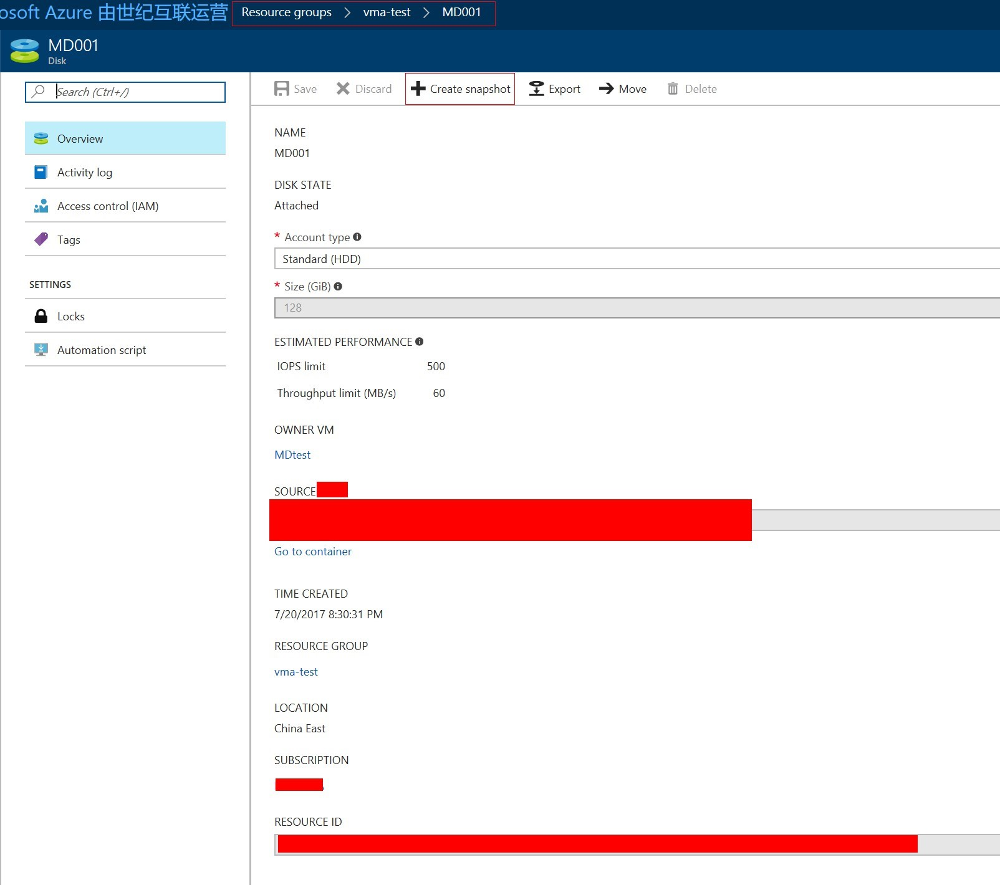
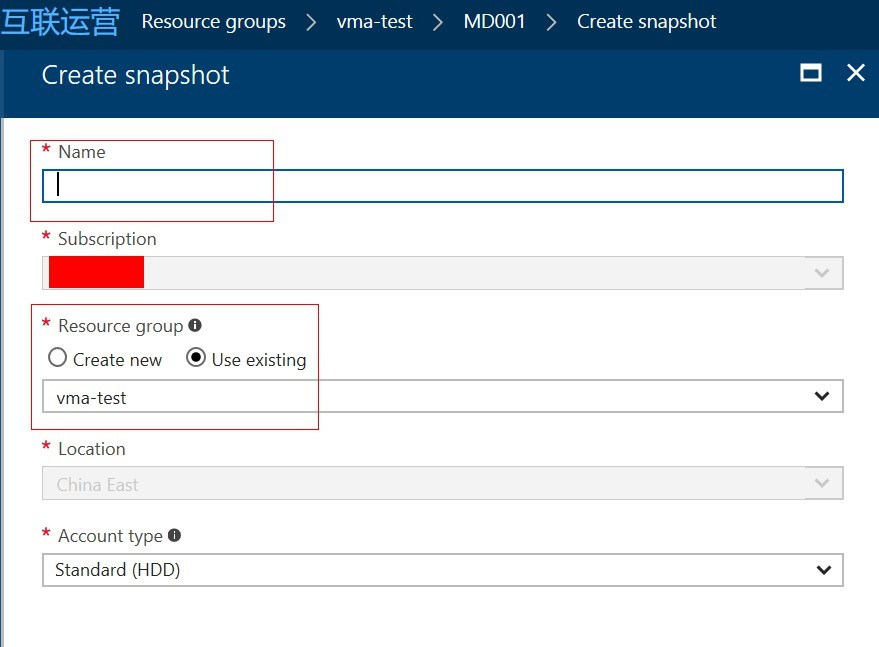

# 如何将使用托管磁盘虚拟机的 OS 盘挂载到其他虚拟机上

## 适用场景

当出现虚拟机无法启动等情况时，需要将虚拟机的 OS 磁盘挂载到其他虚拟机上进行问题诊断或者数据恢复。使用托管磁盘的虚拟机无法通过存储浏览器等工具进行管理，只能通过 PowerShell 来操作。

> [!NOTE]
> 本文仅适用于使用托管磁盘的虚拟机。

## 解决方案

1. 首先，为了避免影响现有的虚拟机，我们需要对虚拟机的托管磁盘执行一个快照，然后通过该快照来生成一个托管磁盘挂载到其他虚拟机上。

    登陆 [Azure 门户](https:\\portal.azure.cn), 浏览托盘磁盘所在的资源组，在资源组里点击托管磁盘，截图如下：

    

    点击上方图中的 "**Create Snapshot**"，然后填入名字并选择对应的资源组，如下图所示：

    

2. 快照创建完成后，我们通过该快照来生成一块托管磁盘。

```PowerShell
#准备基本信息
PS C:\windows\system32> $resourceGroupName= "<资源组名称>"
PS C:\windows\system32> $snapshotName ="<快照名称>"
PS C:\windows\system32> $diskName ="<磁盘名称>"
PS C:\windows\system32> $diskSize = '<磁盘大小，单位为 GB>'
PS C:\windows\system32> $storageType ="<存储类型，可选 StandardLRS 或 PremiumLRS>"
PS C:\windows\system32> $snapshot = Get-AzureRmSnapshot -ResourceGroupName $resourceGroupName -SnapshotName $snapshotName

#生成托管磁盘并将其赋予到变量 datadisk 中以备后用
PS C:\windows\system32> $diskConfig = New-AzureRmDiskConfig -AccountType $storageType -Location $location -CreateOption Copy -SourceResourceId $snapshot.Id
PS C:\windows\system32> $datadisk = New-AzureRmDisk -Disk $diskConfig -ResourceGroupName $resourceGroupName -DiskName $diskName
```

3. 将创建好的托管磁盘挂载到虚拟机上。请注意托管磁盘只能挂载到使用托管磁盘的虚拟机上。

    ```PowerShell
    #选择需要挂载到的虚拟机上
    PS C:\windows\system32> $vm=Get-AzureRmVM -Name “<挂载该磁盘的 VM 名字>” -ResourceGroupName "<资源组名称>"

    #配置虚拟机挂载托管磁盘，注意 -Lun 部分的数字不能与现有虚拟机上挂载的数据磁盘重复，查看该值的方法见下方截图
    PS C:\windows\system32> $vm=Add-AzureRmVMDataDisk -VM $vm -Name $diskName -CreateOption Attach -ManagedDiskId $datadisk.Id -Lun 1

    #更新虚拟机配置，执行挂载操作
    PS C:\windows\system32> Update-AzureRmVM -VM $vm -ResourceGroupName $resourceGroupName
    RequestId IsSuccessStatusCode StatusCode ReasonPhrase
    --------- ------------------- ---------- ------------
                    True         OK           OK
    ```

    

4. 最后在虚拟机操作系统上挂载该磁盘即可。