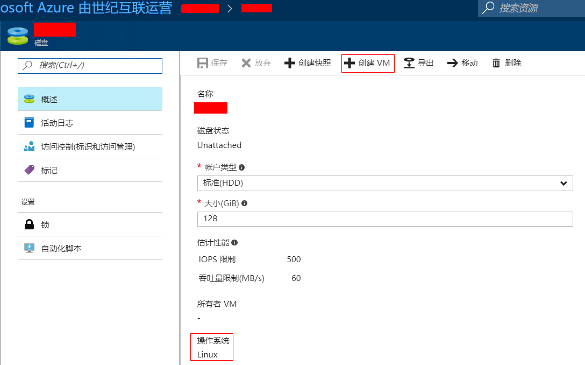

# 如何处理托管磁盘 OS 盘无法创建虚拟机的问题

## 适用场景

当客户删除使用托盘磁盘的虚拟机，尝试使用该 OS 磁盘再次创建虚拟机的时候，发现没有“ **创建 VM** ”的按钮。

> [!NOTE]
> 本文仅适用于使用托管磁盘的虚拟机

## 解决方案

1. 首先，我们需要通过 PowShell 来查看该托盘磁盘的信息。

    ```PowerShell
    #查询托盘磁盘信息
    PS C:\windows\system32> Get-AzureRmDisk -ResourceGroupName "<资源组名称>" -DiskName "<托盘磁盘名称>"

    ResourceGroupName  : 资源组名称
    AccountType        : StandardLRS
    TimeCreated        : 7/20/2017 12:30:31 PM
    OsType             :        <-这里空白代表缺失了 OsType
    CreationData       : Microsoft.Azure.Management.Compute.Models.CreationData
    DiskSizeGB         : 磁盘大小
    EncryptionSettings :
    OwnerId            :
    ProvisioningState  : Succeeded
    Id                 : /subscriptions/订阅 ID/resourceGroups/资源组名称/providers/Microsoft.Compute/disks/托盘磁盘名称
    Name               : 托盘磁盘名称
    Type               : Microsoft.Compute/disks
    Location           : chinaeast
    Tags               : {}
    ```

    缺失 OsType 的托管磁盘会被视作是数据磁盘，所以在该磁盘页面下，没有 “**创建 VM**“ 的按钮。

2. 手动更新该托管磁盘的 OsType 来赋予正确的键值。

    ```PowerShell
    #将托盘磁盘信息赋予给变量
    PS C:\windows\system32> $Disk = Get-AzureRmDisk -ResourceGroupName "<资源组名称>" -DiskName "<托盘磁盘名称>"
    #查询托盘磁盘信息确认无误
    PS C:\windows\system32> $Disk

    ResourceGroupName  : 资源组名称
    AccountType        : StandardLRS
    TimeCreated        : 7/20/2017 12:30:31 PM
    OsType             :        <-这里空白代表缺失了 OsType
    CreationData       : Microsoft.Azure.Management.Compute.Models.CreationData
    DiskSizeGB         : 磁盘大小
    EncryptionSettings :
    OwnerId            :
    ProvisioningState  : Succeeded
    Id                 : /subscriptions/订阅 ID/resourceGroups/资源组名称/providers/Microsoft.Compute/disks/托盘磁盘名称
    Name               : 托盘磁盘名称
    Type               : Microsoft.Compute/disks
    Location           : chinaeast
    Tags               : {}

    #输入托盘磁盘的 OsType
    PS C:\windows\system32> $Disk.OsType = "Linux" <-根据虚拟机 OS 类型选择 Windows 或者 Linux
    #手动更新托盘磁盘的信息
    PS C:\windows\system32> Update-AzureRmDisk -ResourceGroupName "<资源组名称>" -DiskName "<托盘磁盘名称>" -Disk $Disk

    AccountType        : StandardLRS
    TimeCreated        : 7/20/2017 8:30:31 PM
    OsType             : Linux
    CreationData       : Microsoft.Azure.Management.Compute.Models.CreationData
    DiskSizeGB         : 磁盘大小
    EncryptionSettings :
    OwnerId            :
    ProvisioningState  : Succeeded
    Id                 : /subscriptions/订阅 ID/resourceGroups/资源组名称/providers/Microsoft.Compute/disks/托盘磁盘名称
    Name               : 托盘磁盘名称
    Type               : Microsoft.Compute/disks
    Location           : chinaeast
    Tags               :
    ```

3.	在 [Azure 门户](https://portal.azure.cn) 上重新查看该托盘磁盘的信息，可以看到 “**创建 VM**” 的按钮了
 
    