# 以复制重建的方式修复托管磁盘虚拟机

## 应用背景

1. 托管磁盘机器 A 由于系统误配置导致无法正常连接使用，需要将 A 机器的 OS 磁盘挂载到正常机器 B 进行修复后，重新创建机器 C 连接使用。
2. 该文使用的方式为复制问题机器 A 的操作系统磁盘，挂载 OS 磁盘到正常机器 B 修复后重新创建的示例。

## 环境说明

问题托管磁盘机器 A：hlmcen69n2m0，附加了两块磁盘并且已创建 raid0 及 lvm<br>
正常托管磁盘机器 B：hlmcen69n2mt<br>
重建托管磁盘机器 C：hlmcen69n2m1，重组 raid0 及 lvm<br>
上述机器操作系统都为：CentOS6.9

## 示例演示

1. 机器 A 由于误配置导致虚拟机无法 SSH，为了保留问题现场及数据的安全性，以重命名的方式复制问题机器 A 的 OS 磁盘及数据磁盘到同一订阅的同一资源组下。

    1. 安装 [Windows Azure Powershell](https://www.azure.cn/zh-cn/downloads/#cmd-line-tools)。

        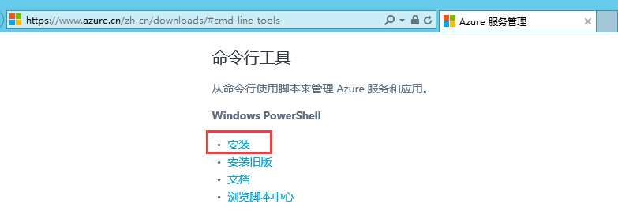

    2. 使用如下脚本复制问题机器 A 的 OS 磁盘及数据磁盘到同一订阅的同一资源组下，并且重命名。

        ```
        #登陆 Azure 账号：
        Add-AzureRmAccount -EnvironmentName AzureChinaCloud

        #获取订阅 ID：
        Get-AzureRmSubscription   

        #定义订阅 ID 的变量
        $sourceSubscriptionId='6c87a588-88df-48ee-9e52-d04b06a8601f'

        #选择指定订阅
        Select-AzureRmSubscription -SubscriptionId $sourceSubscriptionId

        #设置源资源组
        $sourceResourceGroupName='hlmrgn'

        #设置目标资源组
        $targetResourceGroupName='hlmrgn'

        #设置源托管磁盘名称
        $sourcemanagedDiskName='hlmcen69n2m0-disk02'

        #设置目标托管磁盘名称
        $targetmanagedDiskName='hlmcen69n2m0-disk02-copy'

        #获取源托管磁盘信息
        $managedDisk= Get-AzureRMDisk -ResourceGroupName $sourceResourceGroupName -DiskName $sourcemanagedDiskName

        #创建一个磁盘对象
        $diskConfig = New-AzureRmDiskConfig -SourceResourceId $managedDisk.Id -Location $managedDisk.Location -CreateOption Copy 

        #在目标资源组下创建一个新的托管磁盘
        New-AzureRmDisk -Disk $diskConfig -DiskName $targetmanagedDiskName -ResourceGroupName $targetResourceGroupName
        ```

        操作的截图说明：

        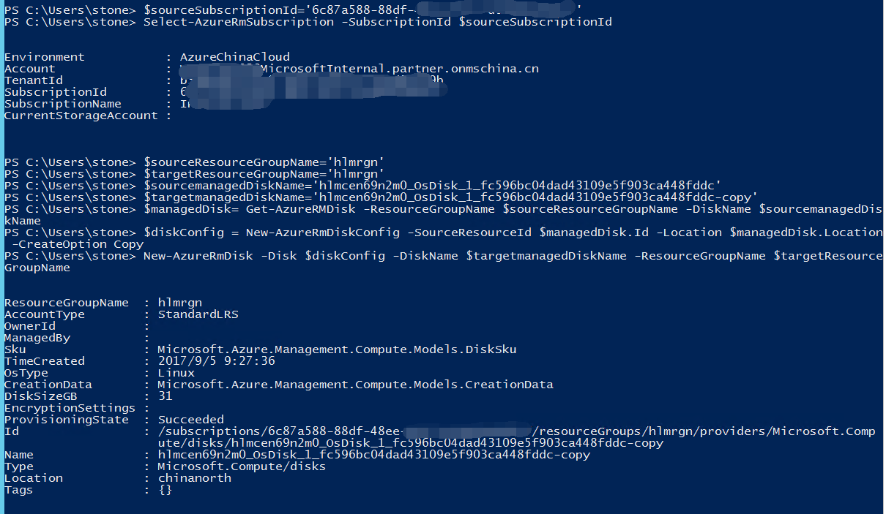

    3. 可以在 “**磁盘**” 项中查看到复制成功后的磁盘文件。

        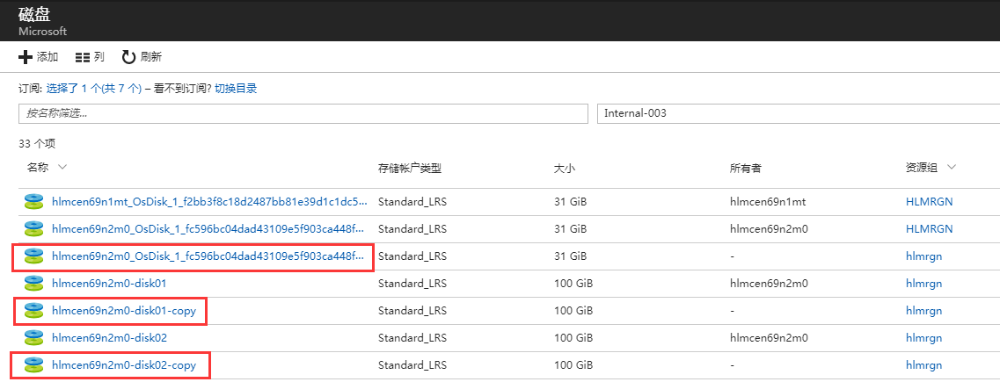

2. 在正常机器 B 的 “**磁盘**” 项中，附加问题机器 A 的操作系统磁盘。

    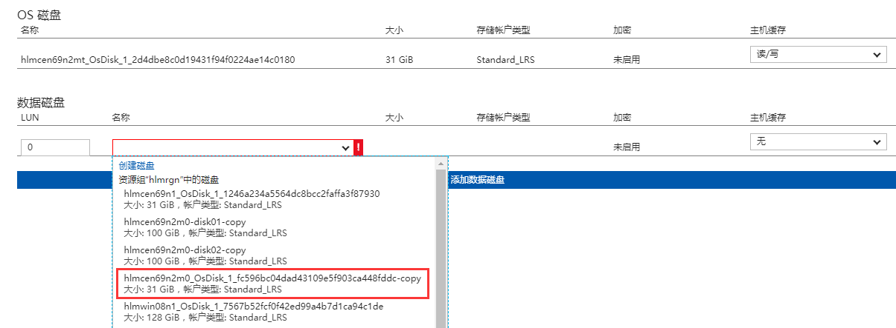

    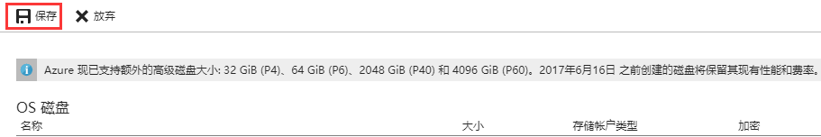

3. 接下来在正常机器 B 上挂载修复问题 OS 磁盘，修复完成后卸载，并分离磁盘。

    使用 `fdisk –l` 查看到磁盘已经附加成功。

    创建挂载点进行挂载 :

    ```
    [root@hlmcen69n2mt ~]# mkdir /mnt/sdc1
    [root@hlmcen69n2mt ~]# mount /dev/sdc1 /mnt/sdc1/
    ```

    修复完成后系统内部卸载磁盘 :

    ```
    [root@hlmcen69n2mt ~]# umount /mnt/sdc1/
    ```

    通过 Azure 门户分离磁盘

    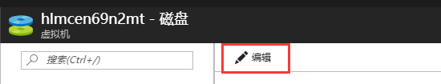

    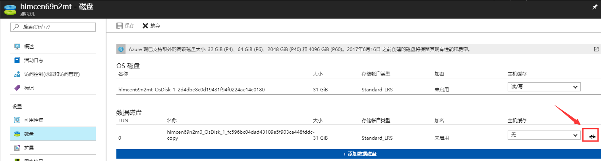

    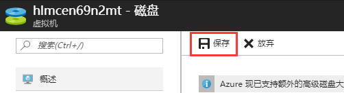

5. 在 “**磁盘**” 项中找到刚修复好的 OS 磁盘，创建虚拟机 C。

    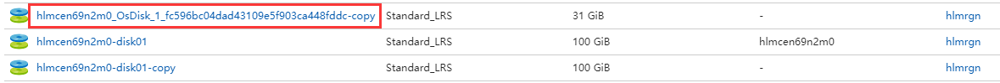

    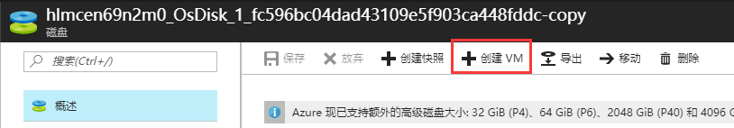

6. 将原来的两块数据磁盘附加上去，发现 raid 已经重组但 lvm 并没有自动重组，不要着急，我们重启下机器就会发现 lvm 已经自动重组了。


    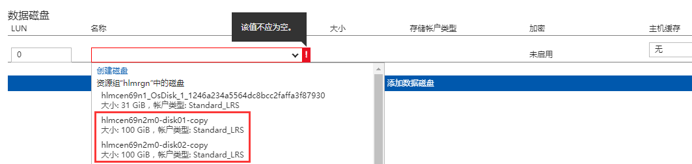

    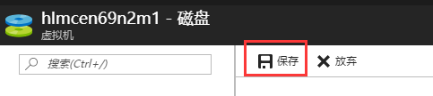

    ```
    [root@hlmcen69n2m0 ~]# ll /dev/vg*
    crw-rw----. 1 root root 10, 63 Sep  6 03:02 /dev/vga_arbiter
    [root@hlmcen69n2m0 ~]# blkid 
    /dev/sda1: UUID="db4773f9-7496-4b81-8fc6-895fd4ba32e2" TYPE="ext4" 
    /dev/sdb1: UUID="75c8ef6c-a136-43e7-b006-6433b1d6c232" TYPE="ext4" 
    /dev/sdc1: UUID="46634fd7-7984-40d2-a40e-4e7e1107ae87" TYPE="ext4" 
    /dev/sdd1: UUID="b89477a0-6969-4783-bea6-5de09c0ea2e6" TYPE="ext4" 
    /dev/md127: UUID="O1FEOo-bM6d-3VIe-rD9V-KCuu-ADiS-fohVuO" TYPE="LVM2_member"
    ```

    重启机器后，可以看到 lvm 已经自动重组，并且自动挂载到了/mnt/lv01 :

    ```
    [root@hlmcen69n2m0 ~]# ll /dev/vg*
    crw-rw----. 1 root root 10, 63 Sep  6 03:16 /dev/vga_arbiter

    /dev/vg0:
    total 0
    lrwxrwxrwx. 1 root root 7 Sep  6 03:16 lv01 -> ../dm-0

    [root@hlmcen69n2m0 ~]# blkid
    /dev/sda1: UUID="db4773f9-7496-4b81-8fc6-895fd4ba32e2" TYPE="ext4" 
    /dev/sdb1: UUID="75c8ef6c-a136-43e7-b006-6433b1d6c232" TYPE="ext4" 
    /dev/sdc1: UUID="b89477a0-6969-4783-bea6-5de09c0ea2e6" TYPE="ext4" 
    /dev/sdd1: UUID="46634fd7-7984-40d2-a40e-4e7e1107ae87" TYPE="ext4" 
    /dev/md127: UUID="O1FEOo-bM6d-3VIe-rD9V-KCuu-ADiS-fohVuO" TYPE="LVM2_member" 
    /dev/mapper/vg0-lv01: UUID="c20a74a9-611f-4fb1-9d27-404ae01b9c1d" TYPE="ext4" 

    [root@hlmcen69n2m0 ~]# cat /etc/fstab 
    # /etc/fstab
    # Created by anaconda on Fri Jul  7 18:13:48 2017
    #
    # Accessible filesystems, by reference, are maintained under '/dev/disk'
    # See man pages fstab(5), findfs(8), mount(8) and/or blkid(8) for more info
    #
    UUID=db4773f9-7496-4b81-8fc6-895fd4ba32e2 /                       ext4    defaults        1 1
    tmpfs                   /dev/shm                tmpfs   defaults        0 0
    devpts                  /dev/pts                devpts  gid=5,mode=620  0 0
    sysfs                   /sys                    sysfs   defaults        0 0
    proc                    /proc                   proc    defaults        0 0
    UUID=c20a74a9-611f-4fb1-9d27-404ae01b9c1d /mnt/lv01                       ext4    defaults        0 0

    [root@hlmcen69n2m0 ~]# mount
    /dev/sda1 on / type ext4 (rw)
    proc on /proc type proc (rw)
    sysfs on /sys type sysfs (rw)
    devpts on /dev/pts type devpts (rw,gid=5,mode=620)
    tmpfs on /dev/shm type tmpfs (rw,rootcontext="system_u:object_r:tmpfs_t:s0")
    /dev/mapper/vg0-lv01 on /mnt/lv01 type ext4 (rw)
    none on /proc/sys/fs/binfmt_misc type binfmt_misc (rw)
    /dev/sdb1 on /mnt/resource type ext4 (rw)
    ```

    可以成功查看到之前创建的已有数据文件 :

    ```
    [root@hlmcen69n2m0 ~]# cd /mnt/lv01/
    [root@hlmcen69n2m0 lv01]# ll
    total 20
    drwx------. 2 root root 16384 Aug 31 08:25 lost+found
    -rw-r--r--. 1 root root    17 Aug 31 08:28 test01.txt
    [root@hlmcen69n2m0 lv01]# cat test01.txt 
    heliming
    abcdefg
    ```

总结说明：通过上面的测试说明，托管磁盘挂载修复的步骤还是比较方便的，并且虚拟机中即使有 raid 或 lvm 也不用担心，重新创建后会自动重组，该文仅供参考，具体案例还需根据具体情况灵活应用。

## 相关文档

[以删除重建的方式修复托管磁盘虚拟机](aog-virtual-machines-managed-disks-repair-via-remove-and-rebuild.md)