# 关于 Azure 虚拟机的临时磁盘的说明

## 临时磁盘概述

1. 在虚拟机创建后，Azure 默认为每台虚拟机分配了一个临时磁盘，为应用程序和进程提供短期存储空间。
2. 临时磁盘的大小因虚拟机的大小而异，某些系列（例如 D，DS，Dv2 等）的虚拟机为临时磁盘提供更快的处理器，更高的内存 vCPU 比和固态硬盘。
3. 临时磁盘大小和类型与虚拟机型号的对应关系可以参考官网链接：[Azure 中 Windows 虚拟机的大小](https://docs.azure.cn/zh-cn/virtual-machines/windows/sizes)。
4. Windows 虚拟机默认临时磁盘标记是 D 盘。Linux 虚拟机临时磁盘通常为 /dev/sdb，挂载目录因不同 Linux 发行版而异，以 CentOS 为例，Azure Linux Agent 会自动将临时磁盘格式化并挂载到 /mnt/resource 目录下。

## 临时磁盘原理

临时磁盘是由承载虚拟机的物理主机所提供的。您的虚拟机可以迁移到不同的物理主机上。当您的虚拟机在新的物理主机上启动时，会使用您存储账号中的OS磁盘，然后会分配一个新的临时磁盘给到您的虚拟机，虚拟机之前临时磁盘上的数据无法随之迁移过来，数据会随之丢失。您可以参考如下示意图：

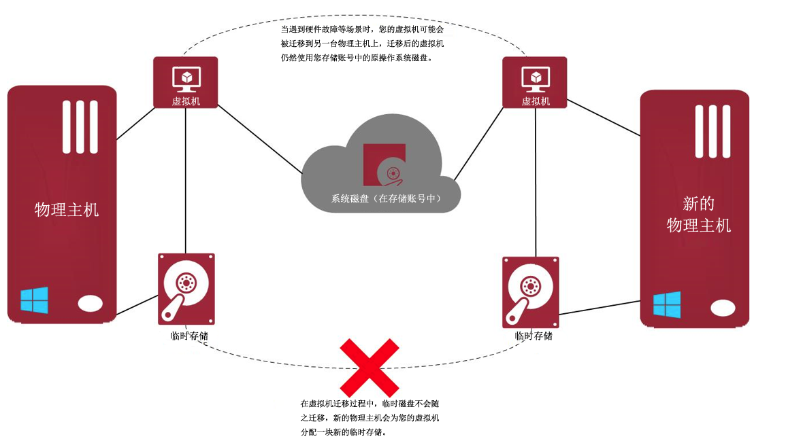

## 临时磁盘和持久性磁盘的区别

Azure 虚拟机支持持久性磁盘。持久性是指写入这些持久性磁盘的数据在发生虚拟机重启，取消分配后再次启动等事件时磁盘数据仍然可用。相比于持久性磁盘，临时磁盘上的数据在发生这类事件时数据可能丢失。这是因为临时磁盘数据存储在运行虚拟化管理程序的主机操作系统中，而持久性磁盘数据存储在 Microsoft Azure Storage 中。

## 临时磁盘数据丢失风险

> [!IMPORTANT]
> 请勿使用临时磁盘存储需要持久化的数据，它只是临时存储空间，临时磁盘的数据一旦丢失，无法恢复。

将虚拟机迁移到另一节点时，可能会发生数据丢失的情况。 调整虚拟机大小，主机更新，主机硬件故障等等都是触发虚拟机迁移的原因。

## 临时磁盘的用途

1. Windows 虚拟机中，临时磁盘用于配置虚拟内存，存放 pagefile.sys 文件：

    

2. Linux 虚拟机中，临时磁盘可用于配置 swap 分区（默认未配置）：

    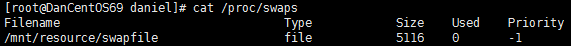

    以CentOS为例，配置 swap 分区的方法如下：

    1. 修改 /etc/waagent.conf 文件，按照下面两行修改参数：

        - 设置 `ResourceDisk.EnableSwap=y`
        - 设置 `ResourceDisk.SwapSizeMB=5120`（swap 分区的大小）

    2. 重启虚拟机 VMAgent 服务。

3. 此外，由于临时磁盘的性能要优于附加的数据磁盘，因此可以使用临时磁盘存放一些安装程序，临时的缓存文件，或者用于虚拟机之间临时拷贝文件等。

## 更改 Windows 虚拟机临时磁盘的盘符

默认情况下 Windows 虚拟机临时磁盘盘符是 D 盘，特殊情况下，如需变更临时磁盘的盘符，可以参考下面的步骤：

1. 在系统高级设置中找到虚拟内存的设置：

    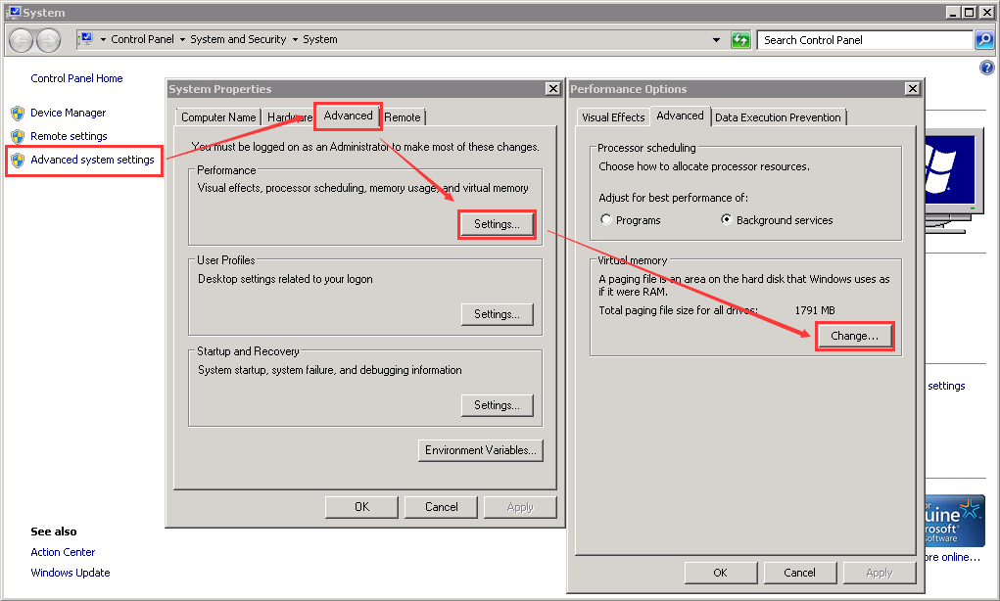

2. 将虚拟内存配置到其他磁盘（例如 C 盘）：

    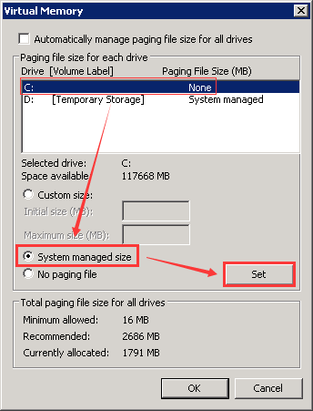
    

3. 设置完成后，需要重启虚拟机。虚拟机重启后，直接在磁盘管理中修改盘符：

    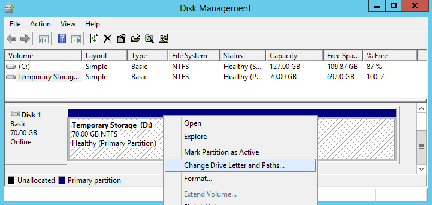

4. 将临时磁盘盘符从 D 修改为 E（弹出提示忽略即可）：

    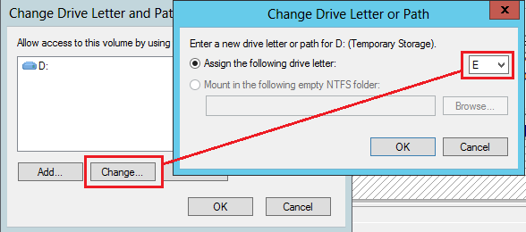

5. 查看盘符修改结果：

    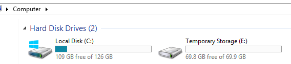

## 如何禁用临时磁盘

尽管在临时磁盘中已经放置了关于数据丢失的提醒文件，但是保险起见，对于真的不需要使用临时磁盘的用户来说，可以通过下面几种方式来禁用临时磁盘。

> [!NOTE]
> 通过下面演示的方法将虚拟内存或者 SWAP 空间配置到系统磁盘后，由于虚拟内存本身是利用磁盘空间进行内存映射，所以会消耗额外的磁盘空间，增加系统磁盘的存储费用。此外，在系统磁盘中进行虚拟内存交换的时候会产生 IO 请求，影响操作系统本身运行的性能，甚至可能由于 IO 过高出现存储访问超时造成虚拟机意外重启等问题。
> 因此，如果不是有特殊需求，建议保留临时磁盘以及虚拟内存的配置。

- Linux 虚拟机：

    Linux 虚拟机不同发行版的配置方法可能稍有不同，举例如下：

    - 在 CentOS 6.9 上禁用临时磁盘：

        1. 登录虚拟机，切换到 root 用户；
        2. 打开文件 /etc/waagent.conf；
        3. 找到 `ResourceDisk.Format=y` 将该行修改为 `ResourceDisk.Format=n`；
        4. 保存并退出。

        重启虚拟机之后, 临时盘就不会被自动挂载起来：

        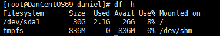

    - 在 Ubuntu 16.04 虚拟机上禁用临时磁盘：

        1. 打开文件 /usr/lib/python3/dist-packages/cloudinit/config/cc_mounts.py；
        2. 找到 `defmnts` 这行：

            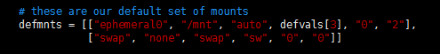

        3. 将其修改为：

            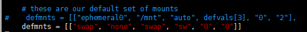

        4. 注释掉 /etc/fstab 中的下面这行，然后重启虚拟机：

            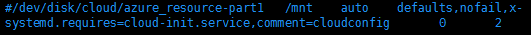

- Windows 虚拟机：

    Windows 虚拟机可以通过如下方法禁用临时磁盘：

    1. 在系统高级设置中找到虚拟内存的设置：

        

    2. 将虚拟内存配置到其他磁盘（例如 C 盘）：

        
        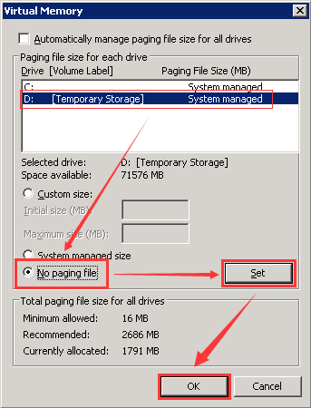

    3. 设置完成后，重启虚拟机，然后打开磁盘管理器下线临时磁盘：

        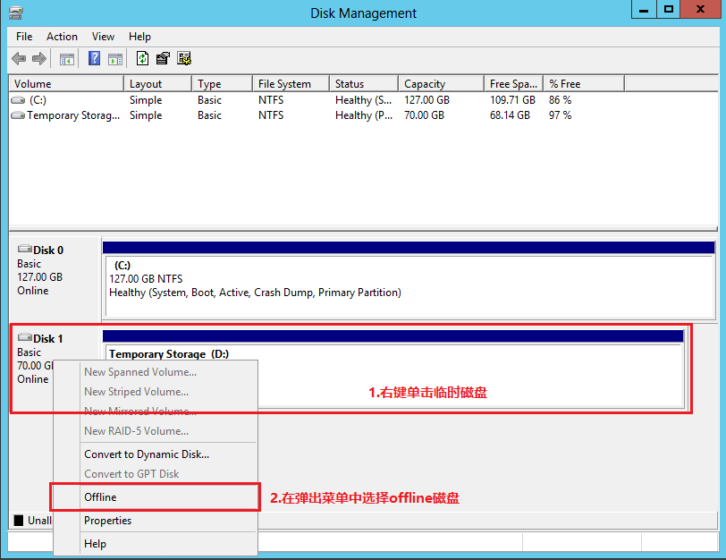

    4. 再次查看系统内已经没有临时磁盘了：

        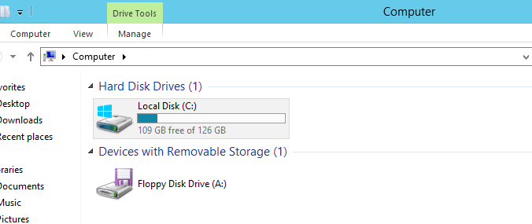