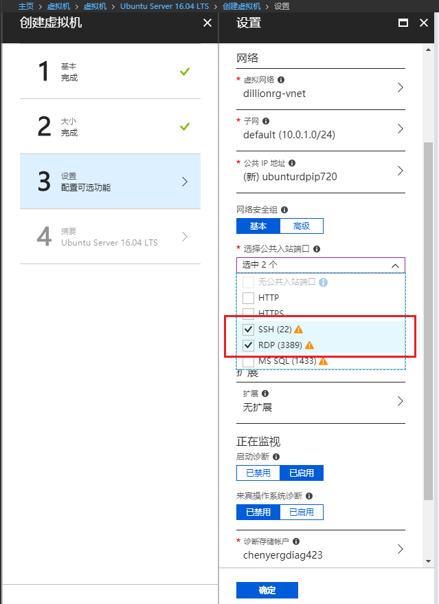

# 远程桌面到 Ubuntu 虚拟机 #

1. 创建 Ubuntu 虚拟机，选择 SSH(22) 和 RDP(3389) 公共入站端口.

    

2. 检查虚拟机入站端口规则

    

3. 安装 Gnome 桌面

    ```
    sudo apt-get update
    sudo apt-get install ubuntu-desktop
    ```

4. 安装 xrdp 和 xubuntu-desktop

    ```
    sudo apt-get install xrdp
    sudo apt-get install xubuntu-desktop
    ```

5. 修改配置文件 /etc/xrdp/startwm.sh，添加 xfce4-session 行

    

6. 添加 xfce4-session
        echo “xfce4-session” >~/.xsession

7. RDP 连接到 ubuntu

    