# 在 Azure 虚拟机上配置一般用途文件服务器故障转移群集

## 概述

本文介绍如何在 Resource Manager 模型中的 Azure 虚拟机上创建双节点的一般用途文件服务器(File Server)故障转移群集。此解决方案使用 Windows Server 2016 Datacenter 存储空间直通 (S2D) 作为基于软件的虚拟 SAN，在 Windows 群集中的节点 (Azure VM) 之间同步存储（数据磁盘）。S2D 是 Windows Server 2016 中的新增功能。

关于更多存储空间直通的介绍，请参考：[Windows Server 2016 中的存储空间直通](https://docs.microsoft.com/zh-cn/windows-server/storage/storage-spaces/storage-spaces-direct-overview)

S2D 支持两种类型的体系结构 - 聚合与超聚合。 本文档中所述的体系结构为超聚合。 超聚合基础结构将存储放置在托管群集应用程序的相同服务器上。 在此体系结构中，存储位于每个 File Server 节点上。

本例将我们创建 2 个节点的故障转移群集，开启存储空间直通，并配置一般用途的文件服务器角色。

### 环境：

* ADPDC：域控制器
* S2DNODE1 和 S2DNODE2 作为群集的 2 个节点，每个虚拟机挂载 2 块数据磁盘
* 见证磁盘：云见证
* 2 台虚拟机在同一个 Availability Set
* File Server 群集 IP 地址做 Azure 负载均衡

## 搭建 Active Directory 森林

### 创建虚拟网络

在本例中，我们在资源组中创建了一个虚拟网络 ADVNET, 并在里面添加一个子网。基本配置如下：

* 名称：ADVNET
* 虚拟网络地址：10.0.0.0/16
* 子网名称：adSubnet
* 子网地址：10.0.0.0/24<br>
    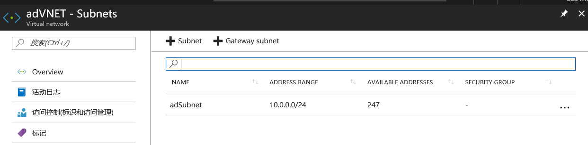

### 部署域控制器 

部署 AD 域控制器的步骤我们不在这里赘述，您可以参考该文档：[在 Azure 虚拟网络中安装新的 Active Directory 林](https://docs.azure.cn/zh-cn/active-directory/active-directory-deploying-ws-ad-guidelines)

您也可以使用 Github 上的已有[模板](https://github.com/Azure/azure-quickstart-templates/tree/master/active-directory-new-domain-ha-2-dc)创建一个有 2 台域控的森林。

> [!NOTE]
> 将 GitHub 的模板部署到中国区 Azure 上需要对模板文件做一些配置，具体步骤请参考[附录](#appendix)。

## 使用 S2D 配置 Windows 故障转移群集

### 创建虚拟机

部署 2 台虚拟机作为群集的 2 个节点。保证这 2 台虚拟机在同一个可用性群集中。并将它们加入我们创建好的 AD 域中。

注意点：

* 2 个节点具有相同的配置
* 在同一可用性群集
* 2 台虚拟机配置静态 IP


在同一资源组中，使用 Windows Server 2016 镜像创建新的虚拟机 S2DNode1 和 S2DNode2，并使用如下配置：

* 名称： S2DNode1/ S2DNode2
* 操作系统： Windows Server 2016 Datacenter
* 可用性集 — 创建新的可用性集。 (单击 **High Availability** > **Create new**, 然后输入名称(本例中使用 **clusterAS**)。使用 **Update domains** 和 **Fault domains** 的默认值)
* 配置 Virtual Network - **ADVnet**, Subnet – **ADsubnet**.
* 虚拟机的尺寸和存储大小按实际需求选取。对于 Azure S2D, 对虚拟机和存储有一定的要求，[这里](https://blogs.msdn.microsoft.com/clustering/2017/02/14/deploying-an-iaas-vm-guest-clusters-in-microsoft-azure/)的文章有详细的介绍。<br>
    截图供参考：<br>
    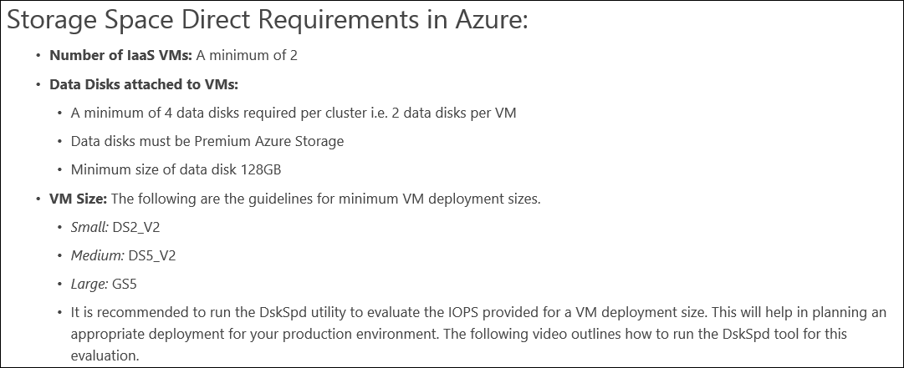

### 配置节点网络

* 将所有群集节点 VM 的 **IP addresses** 设置为 **Static**。

    选择其中一台 VM >  **Network interfaces**，选择列表中的 **Network Interface**，点击 **IP Configurations**。选择列表中的 **IP configuration**，点击 **Static** 并保存.

    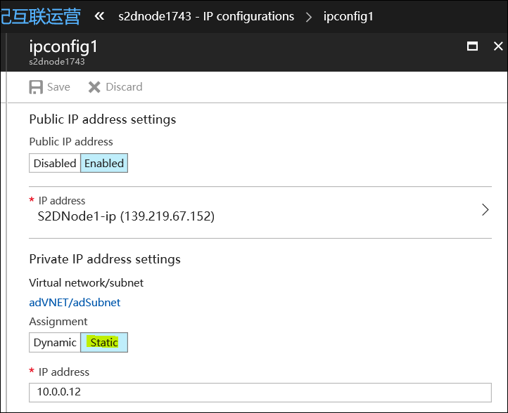

* 将群集节点 VM 的 NIC 上的 **primary DNS server address** 设置为域控制器(**adDC**) 的私有 IP 地址 (本例中为 10.0.0.4)。

* 选择节点 **VM** > **Network Interfaces** > **DNS servers** > **Custom DNS**。输入上面提到的私有 IP 地址，然后单击**保存**。

    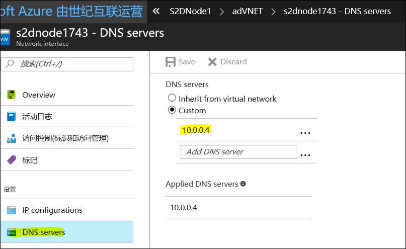


### 为节点 VM 添加数据磁盘

请参考文档 : [附加数据磁盘](https://docs.azure.cn/virtual-machines/windows/attach-managed-disk-portal)。

为每个节点添加 2 块数据磁盘如下图。将 **host caching** 设置为 **None**。

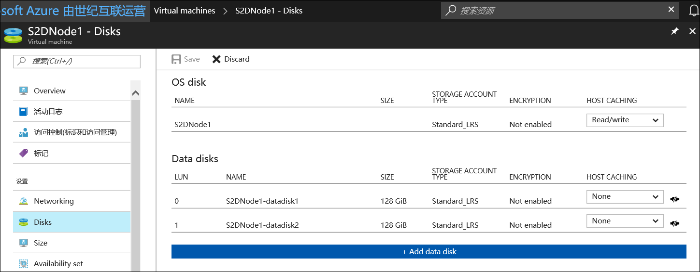

### 将 2 个节点加入域

* 登陆每台节点虚拟机
* 在虚拟机操作系统中右键开始按钮选择 **System**
* 在计算机名称，域和工作组这组中将 2 个节点加入之前创建的域<br>
    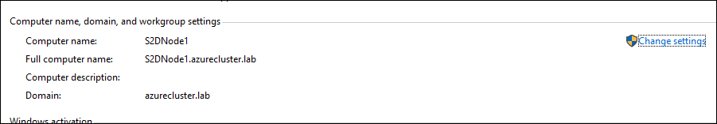

### 创建云见证

按照文档 : [创建一个 Azure 存储账户成为您的云见证](https://docs.microsoft.com/zh-cn/windows-server/failover-clustering/deploy-cloud-witness#CloudWitnessSetUp)(**Cloudwit**)，如果按上文操作，请在 “使用故障转移群集管理器 GUI 配置 Cloud Witness” 时停止 ，我们将在创建群集时再执行后面的步骤。

云见证的配置如下：

* 部署模型：Resource Manager
* 账户类型：常规用途
* 性能：标准
* 复制：本地冗余存储(LRS)<br>
    

## 配置故障转移群集

接下来我们会将启用故障转移群集功能，启用 S2D 并配置文件服务器角色。

### 安装故障转移群集功能和文件服务器功能。

使用 PowerShell 脚本在两个节点上安装 Cluster 和 File Server 功能。

```PowerShell
$nodes = ("s2dnode1", "s2dnode2")
icm $nodes {Install-WindowsFeature Failover-Clustering -IncludeAllSubFeature -IncludeManagementTools} 
icm $nodes {Install-WindowsFeature FS-FileServer}
```

### 运行群集验证以及创建一个双节点群集

登陆其中一台虚拟机，在此步骤中，将使用以下 PowerShell 命令创建一个故障转移群集(例如 **s2d-cluster**)。
将 `–NoStorage` 参数添加到 PowerShell cmdlet 中非常重要，否则可能会将磁盘自动添加到群集，这样在启用存储空间直通之前需要将其删除，否则它们不会包含在存储空间直通存储池中。

```PowerShell
Test-Cluster -node $nodes
New-Cluster -Name TestFSCluster -Node $nodes –NoStorage –StaticAddress 10.0.0.20
```

> [!NOTE]
> 以上命令创建一个名为 TestFSCluster 的双节点的故障转移群集，并配置固定 IP 地址 10.0.0.20. 请按照您的实际需求创建 Cluster 的名称并定义 IP。请查看您的 DNS 记录，保证该记录没有被占用。

创建完成后再其中一台节点上打开 Failover Cluster Manager 可以看到详细的信息

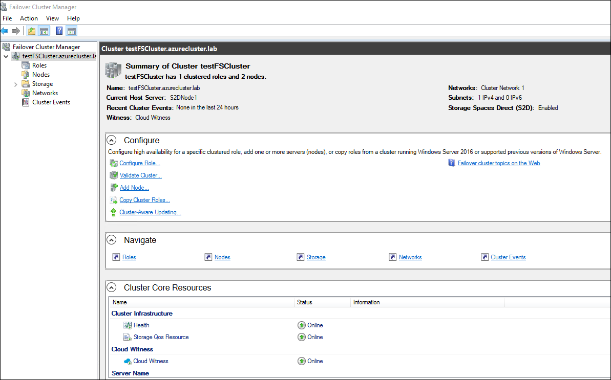

### 为故障转移群集配置云见证

云见证是 Windows Server 2016 引入的新的故障转移群集仲裁见证。继续使用[文档](https://docs.microsoft.com/zh-cn/windows-server/failover-clustering/deploy-cloud-witness#configure-cloud-witness-as-a-quorum-witness-for-your-cluster)中的方法来配置云见证。

在 **Failover Cluster Manager** 中右键群集名称, 选择 **More Actions** -> **Configure Cluster Quorum Settings**.

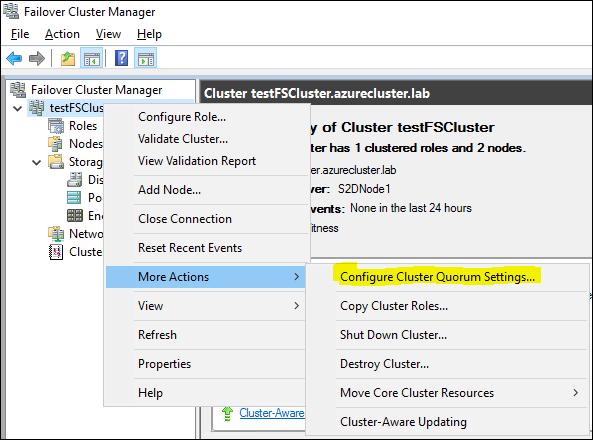

在对话框中选择 Cloud Witness, 并且提供 Azure Store Account 名称以及 Primary Key。

### 启用存储空间直通

在其中一台虚拟机上运行 PowerShell 脚本 `Enable-ClusterS2D` 命令时，将会启用存储空间直通并且自动创建一个存储池。


您可以在 **Failover Cluster Manager** 或者 **Server Manager** 中看见创建的存储池。

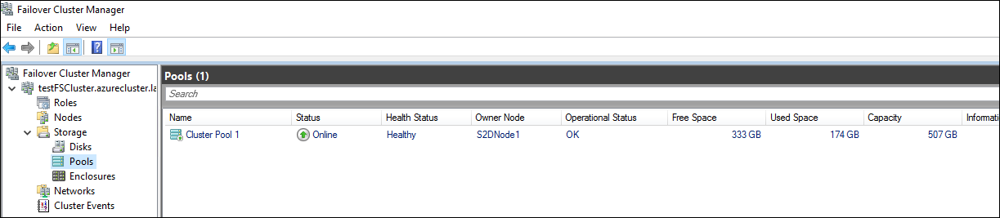
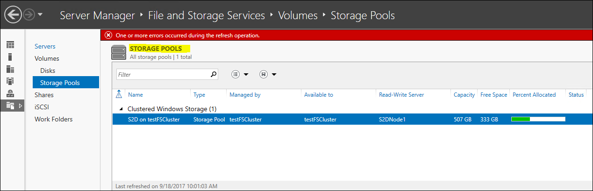

### 创建卷

* 现在可以通过 `New-Volume` 命令创建一个虚拟磁盘卷(例如 **VDisk01**)。

    ```PowerShell
    New-Volume -StoragePoolFriendlyName S2D* -FriendlyName VDisk01 -FileSystem NTFS -Size 120GB
    ```
    
    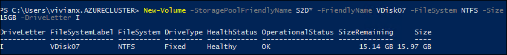

    > [!NOTE]
    > 在上面这条命令中创建一个 120GB 的 NTFS 卷。

    您可以指定 `-FileSystem` 类型为 `NTFS`, `ReFS`, `CSVFS_NTFS` 或 `CSVFS_ReFS`。 **CSVFS** 格式支持 Cluster Shared Volume。如果您要创建共享存储的 Scale Out File Server 群集，请使用 CSVFS 格式。如果您创建一般用途文件服务器群集，并且需要使用 FSRM (File Server Resource Manager) 功能, 那么请创建 **NTFS** 格式的卷。

* 您可以在 **Failover Cluster Manager** 中查看创建好的虚拟磁盘卷。

    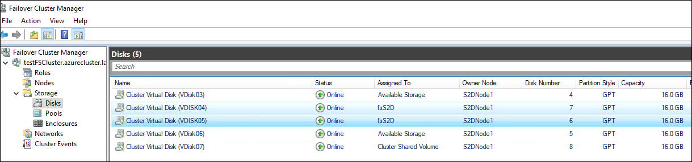

### 配置文件服务器群集角色

1. 在 **Failover Cluster Manager** 中右键 **Roles** -> **Configure Role**, 选择 **File Server** -> **File Server for general use**。

    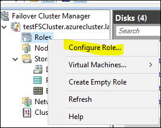
    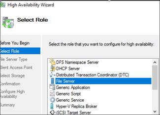
    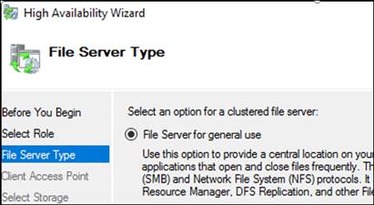

2. Storage 选择我们刚刚创建的磁盘。

    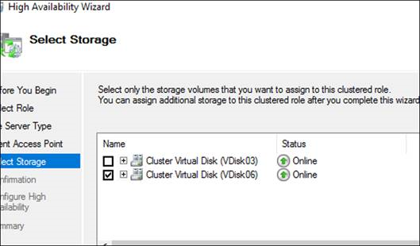

3. 从 UI 界面创建的 Cluster 角色会把该节点的 IP 资源分配给 Cluster 角色，导致 IP 地址冲突，会有如下的 Failed 的报错，请在 Roles 页面最下端选择 Resources 查看是否有 IP 冲突。如果是，右键 IP 选择 Properties. 设置一个固定 IP 给这个资源.

    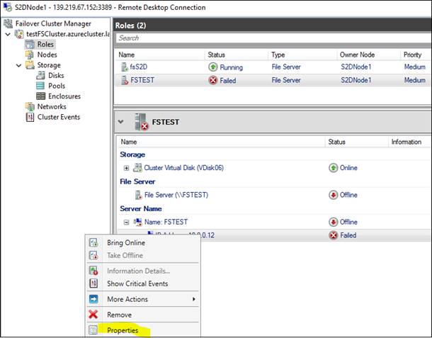

您也可以用 PowerShell 创建 Cluster，指定固定 IP。

```PowerShell
Add-ClusterFileServerRole -Name FSCluster -Storage "Cluster virtual disk (vdisk06)" -StaticAddress 10.0.0.40
```


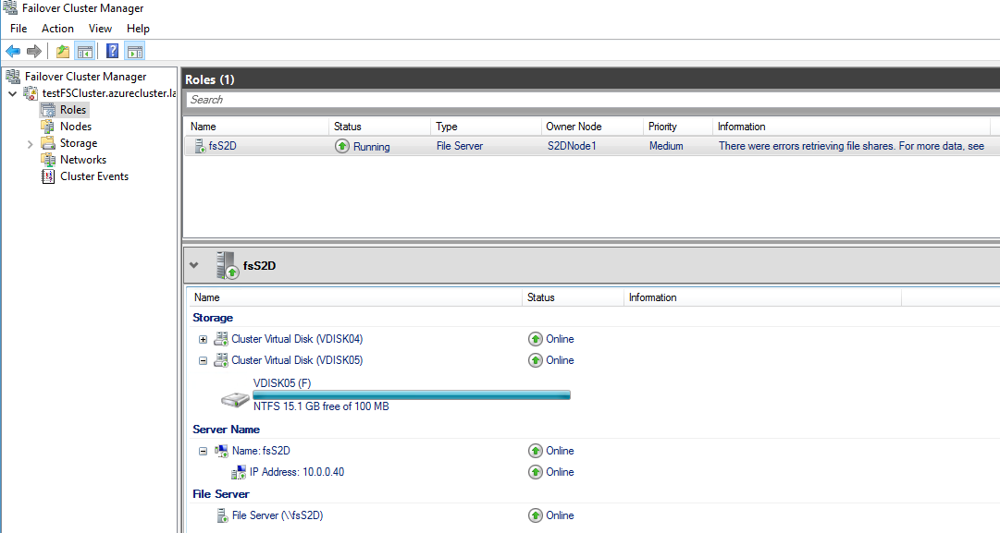

## 创建 Azure 负载均衡

在 Azure 虚拟机上，群集使用负载均衡器来保存每次都需要位于一个群集节点上的 IP 地址。 在此解决方案中，负载均衡器保存 File Server Cluster 的 IP 地址。我们需要设置 Azure Load Balancer 来实现 IP 的负载均衡。

### 创建负载均衡器

若要创建负载均衡器，请执行以下操作：

1. 在 [Azure 门户](https://portal.azure.cn)中，转到虚拟机所在的资源组。
2. 单击“**+ 添加**”。 在应用商店中搜索**负载均衡器**。 单击“**负载均衡器**”。
3. 为负载均衡器配置以下属性：
    * 类型：Internal
    * 虚拟网络：ADVnet
    * 子网：ADsubnet
    * 专用 IP 地址：分配给 File Server Cluster 网络资源的同一 IP 地址。本例中是 10.0.0.40.
    * 资源组：使用虚拟机所在的同一资源组。<br>
        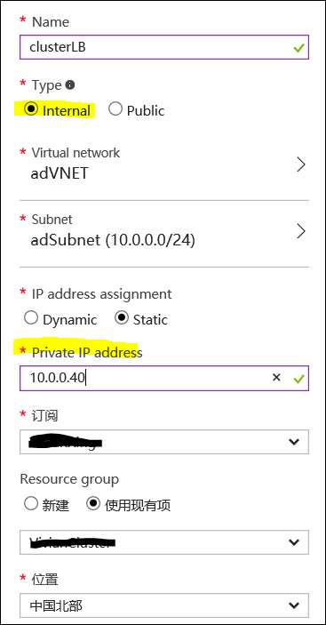

### 配置负载均衡器后端池

1. 返回到虚拟机所在的 Azure 资源组，找到新的负载均衡器。
2. 在负载均衡器边栏选项卡中，单击 “**后端池**”。
3. 单击 “**+ 添加**” 添加后端池。
4. 单击 “**添加虚拟机**”。
5. 在 “**选择虚拟机**” 边栏选项卡中，单击 “**选择可用性集**”。
6. 选择虚拟机所在的可用性集。
7. 在 “**选择虚拟机**” 边栏选项卡中，单击 “**选择虚拟机**”。<br>
    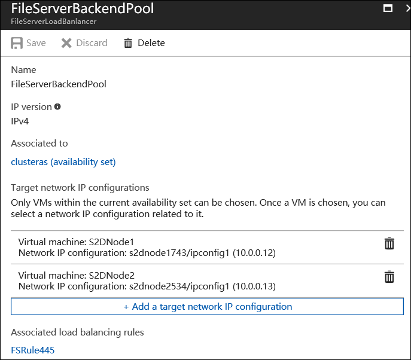

配置负载均衡器运行状况探测

1. 在负载均衡器边栏选项卡中，单击 Health Probs。
2. 添加一个新的 Health Probs：
    * 协议：TCP
    * 端口：59999<br>
        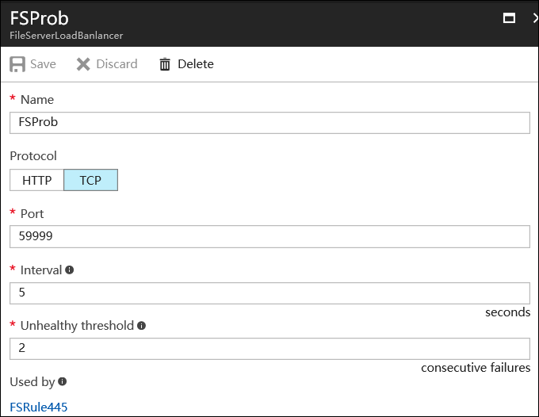

### 设置负载均衡规则

在负载均衡器边栏选项卡中，单击 “**Load Balancing Rules**” :

* 前端 IP 地址：使用 File Server 群集网络资源的 IP 地址。
* 端口：设置为 SMB 端口 445。
* 后端端口：此值使用的端口与启用 “浮动 IP (直接服务器返回)” 时使用的 “端口” 值相同。
* 后端池：使用前面配置的后端池名称。
* 运行状况探测：使用前面配置的运行状况探测。
* 浮动 IP (直接服务器返回)：已启用<br>
    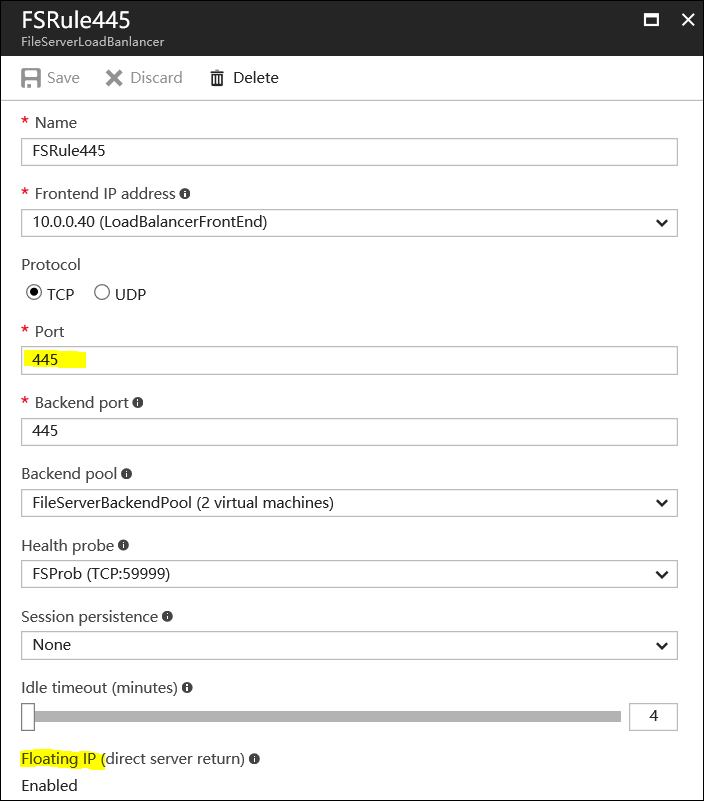

### 为探测配置群集

然后在 Cluster 上运用这些设置，按实际情况运行 PowerShell。

```PowerShell
$ClusterNetworkName = "<Cluster Network Name>" # the cluster network name (Get-ClusterNetwork 可以得到该信息).

$IPResourceName = "IP Address Resource Name" # Cluster 资源的 IP 地址名称
$ILBIP = "<10.0.0.x>" #负载均衡的 IP 地址
[int]$ProbePort = <59999>

Import-Module FailoverClusters

Get-ClusterResource $IPResourceName | Set-ClusterParameter -Multiple @{"Address"="$ILBIP";"ProbePort"=$ProbePort;"SubnetMask"="255.255.255.255";"Network"="$ClusterNetworkName";"EnableDhcp"=0}
```

以下为示例：

```PowerShell
$ClusterNetworkName = "cluster network 1" 
$IPResourceName = "IP Address 10.0.0.0"
$ILBIP = "10.0.0.40"

Import-Module FailoverClusters

Get-ClusterResource $IPResourceName | Set-ClusterParameter -Multiple @{Address=$ILBIP;ProbePort=59999;SubnetMask="255.255.255.255";Network=$ClusterNetworkName;EnableDhcp=0}
```

之后您可以在磁盘所在的节点虚拟机的虚拟卷中创建共享文件夹:

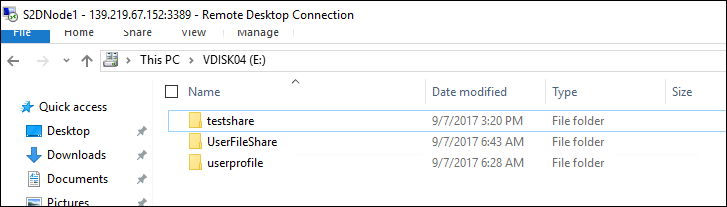

完成后的共享可以在内网机器中访问：

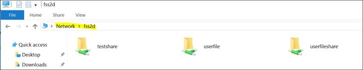

## <a id="appendix"></a>附录

将 GitHub 的模板部署到中国区 Azure 上需要对模板文件做一些配置，步骤如下：

1. 首先注册并登录您的 GitHub 账号。

2. 点击需要部署的模板链接, 比如第一个链接，在页面右上方点击 Fork, 将其添加到自己的模板列表中。

    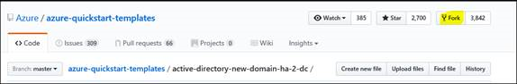
    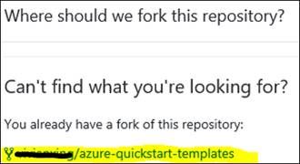

3. 点击上图中的链接，然后按名称搜索要部署的模板，并选中。

    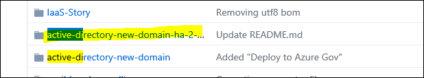

4. 点击文件列表中的 README.MD 文件。

    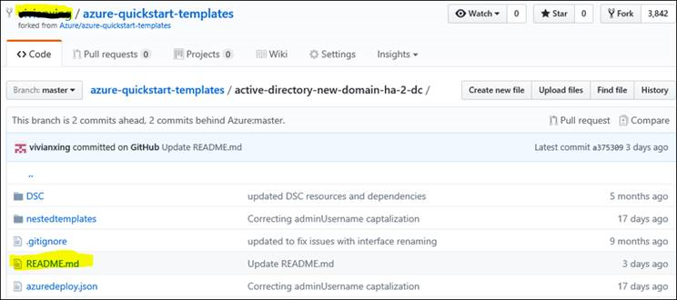

5. 点击右上角笔形按钮进行编辑。

    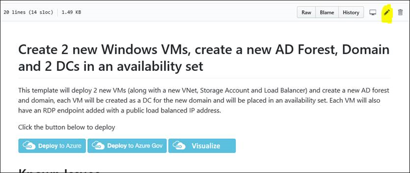

6. 将文本中的地址改为中国区 Azure 的地址 `https://portal.auzre.cn`。

    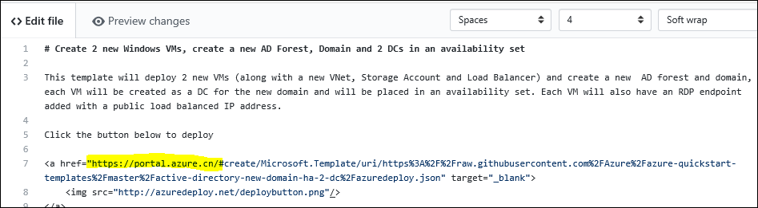

7. 下拉到底部点击 “**Commit Changes**”。

    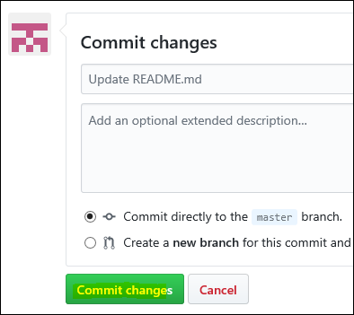

8. 然后在模板页面选择 “**Deploy to Azure**”。

    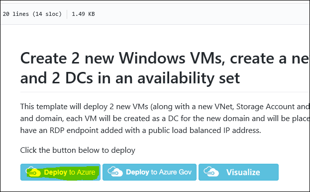