# 如何使用 Windows Server 2016 与 Azure 搭建 S2S VPN 并支持 BGP 协议

通过系统自带的路由和远程访问服务（ Routing and Remote Access ， 简称 RRAS ），Windows Server 也能与 Azure 进行 S2S VPN 连接。从 Windows Server 2016 开始，RRAS 不需要搭建 Multitenant Gateway 也能支持 BGP 协议，我们可以使用 Windows Server 2016 的 RRAS 功能很方便的跟 Azure 搭建支持 BGP 的 VPN。

本文主要介绍如何通过 Windows Server 2016 搭建到 Azure 的 S2S VPN 连接并支持 BGP 协议。

在测试环境中本地 VPN 所设置的 AS 号为 65023，BGP Peer 地址为 `10.41.0.5`，本地网段为 `10.41.0.0/24`。
Azure VPN gateway BGP AS 号需要自定义， 如果在创建Azure VPN gateway时不指定BGP AS号，默认使用65515。
本文本使用 Azure 默认 AS 号`65515`，Peer 地址为 `10.0.0.4`，网络空间为 `10.0.0.0/22`。

## S2S VPN 搭建并支持 BGP 协议

### Azure 端配置站点到站点 (S2S) VPN 连接并启用 BGP

由于我们已经有现有的文章来讲述如何在 Azure 端进行配置，所以本文不再赘述。<br>
具体的配置细节请参考文档：[如何使用 Azure 资源管理器 和 PowerShell 在 Azure VPN 网关上配置 BGP](/vpn-gateway/vpn-gateway-bgp-resource-manager-ps)。

### Windows Server 2016 端配置步骤

Windows Server 2016 搭建 S2S VPN 并支持 BGP 协议的步骤大致分为以下几步：

1. [安装 RRAS 角色和功能](#section1)
2. [配置并启用路由和远程访问](#section2)
3. [S2S VPN 拨号接口设置和连接](#section3)
4. [通过 PowerShell 指令配置本地 BGP](#section4)

#### <a id="section1"></a>安装 RRAS 角色和功能

打开**服务器管理器**。选择 “**管理**” -> “**添加角色和功能**”。

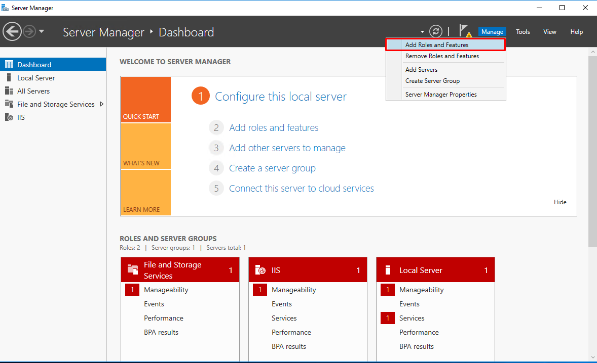

在 “**添加角色和功能向导**” 执行以下操作：

1. **开始之前**：单击 “**下一步**”
2. **安装类型**：“**基于角色**” -> 单击 “**下一步**”
3. **服务器选择**：从服务器池中选择一台服务器 -> **RRAS-Server** - >单击 “**下一步**”
4. **服务器角色**：选择 “**远程访问**” -> 单击 “**下一步**”

    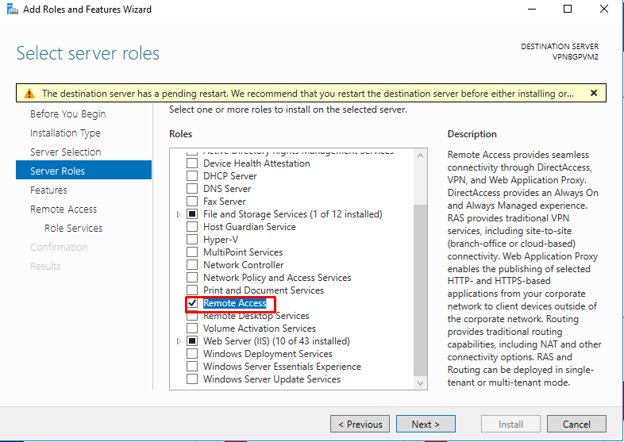

5. **功能**：点击 “**下一步**”
6. **远程访问**：单击 “**下一步**”
    - **角色服务**：
        - 勾选 “**直接访问和 VPN（RAS）**”，在弹出窗口中单击 “**添加功能**”<br>
        - 勾选 “**路由**”<br>
    - 点击 “**下一步**”

    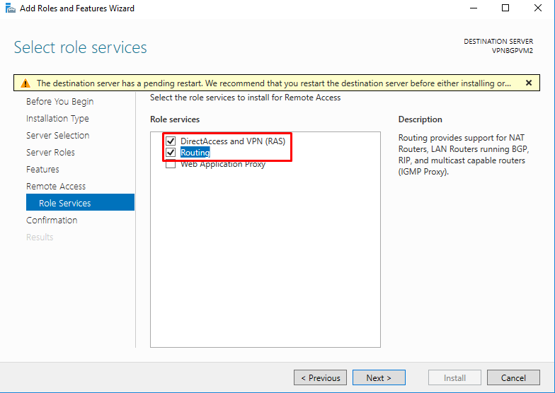

7. **Web 服务器角色（IIS）**：单击 “**下一步**”
    - **角色服务**：
        - 接受**默认值**：单击 “**下一步**”
8. **确认**：单击 “**安装**”

    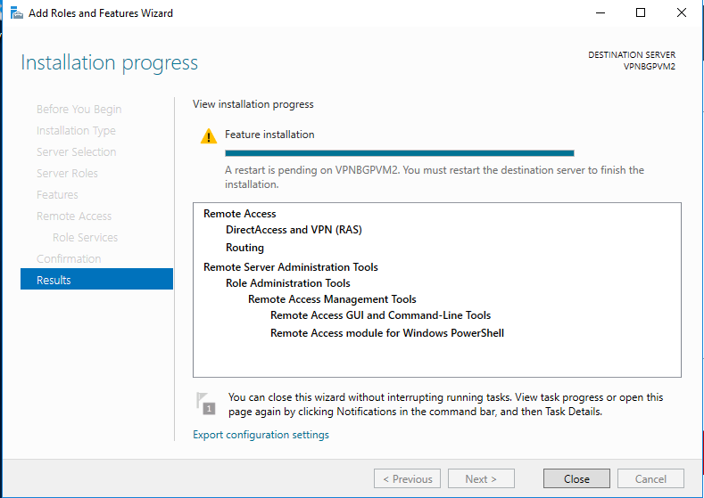

#### <a id="section2"></a>配置并启用路由和远程访问

远程访问角色安装完成后，打开 “**路由和远程访问**”，配置并启用路由和远程访问。

右键单击 RRAS 服务器，然后单击 “**配置并启用路由和远程访问**”。

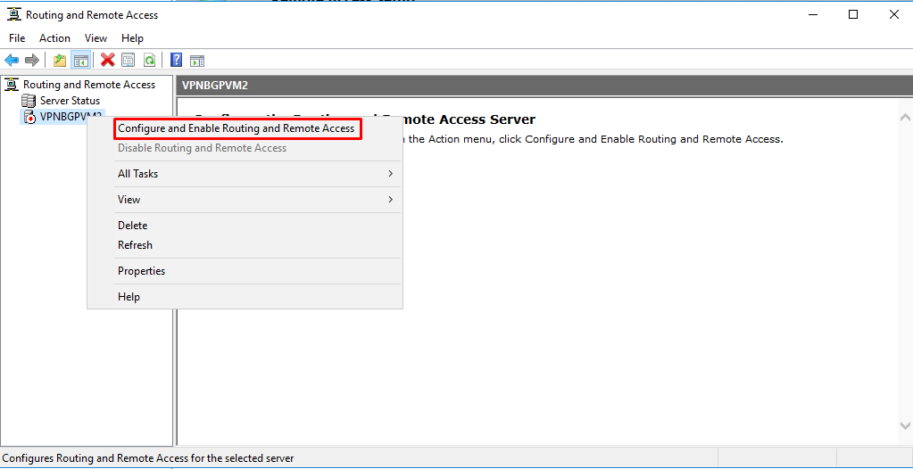

**路由和远程访问服务器安装向导**将出现：

1. **欢迎使用路由和远程访问服务器安装向导**：单击“**下一步**”
2. **配置**：选择 “**自定义配置**”，单击 “**下一步**”

    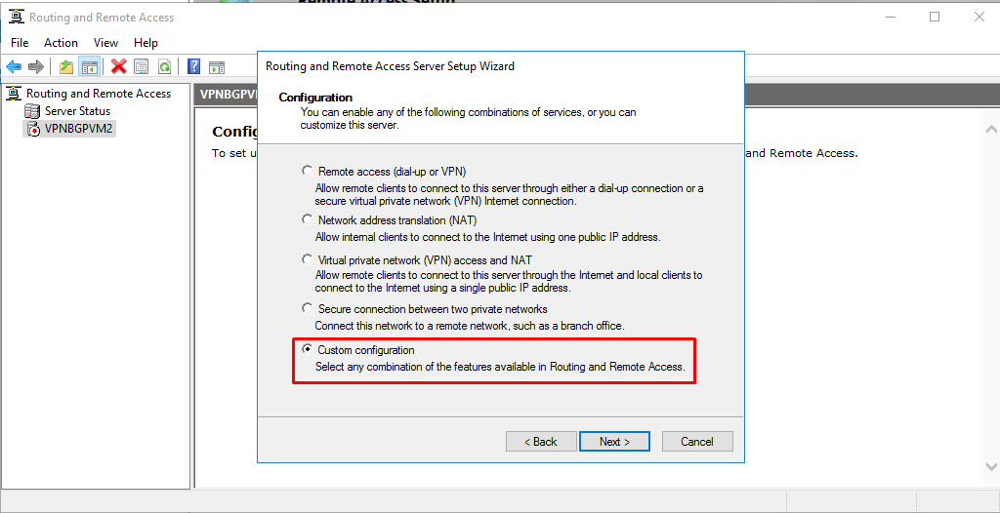

3. 选择服务：**VPN 接入**和**LAN 路由**，单击 “**下一步**”

    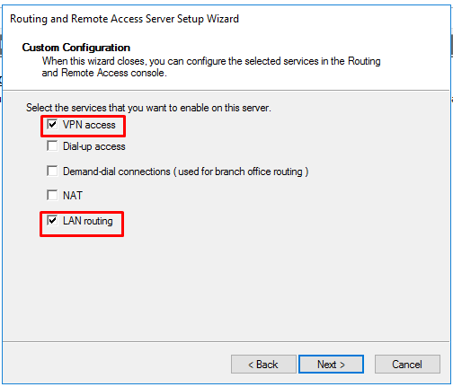

4. 完成路由和远程访问服务器安装向导：单击 “**完成**”

    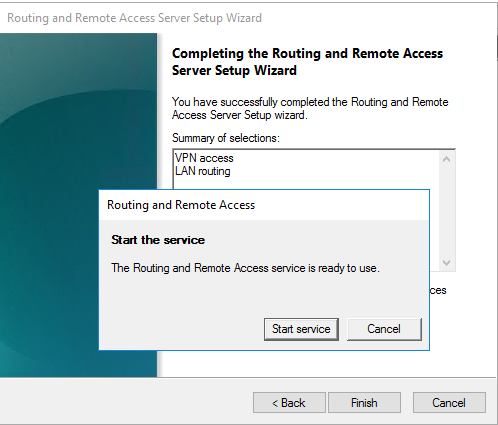

#### <a id="section3"></a>S2S VPN 拨号接口设置和连接

服务器需配置有双网卡，一个用于配置公网 IP，一个用于配置内网 IP。

1. 右键单击 “**网络接口**”，然后单击 “**新拨号接口**”。

    

2. **接口名称**：输入 “**Azure S2S BGP**”，点击 “**下一步**”

    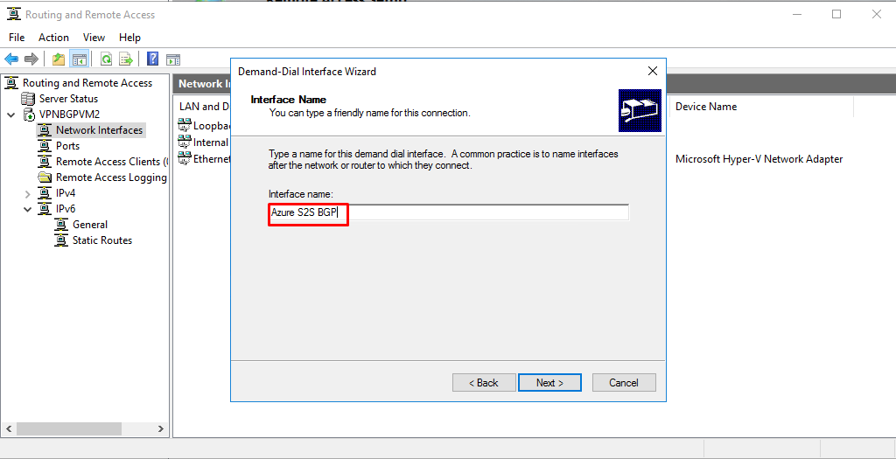

3. **连接类型**：选择 “**使用虚拟专用网络（VPN）连接**”，单击 “**下一步**”

    

4. **VPN 类型**：选择 **IKEv2**，单击 “**下一步**”

    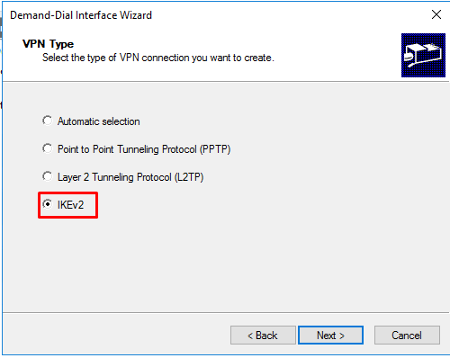

5. **目标地址**：输入 Azure 虚拟网络网关的公共 IP 地址，单击 “**下一步**”

    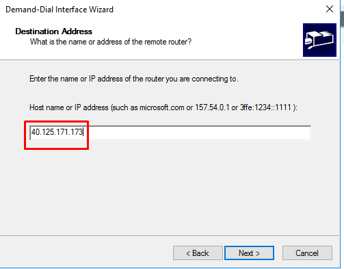

6. **协议和安全**：“**路由此接口上的 IP 数据包路由**”，单击 “**下一步**”

    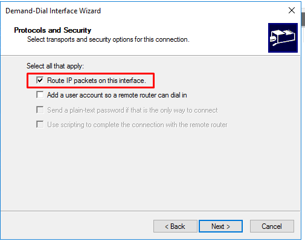

7. **远程网络的静态路由**：单击 “**添加**”
    - **静态路由**：选择使用 IPv4 的远程网络支持：
        - 目的地：**10.0.0.4**（Azure VPN 网关 BGP peer 地址）
        - 网络掩码：**255.255.255.255**
        - 公制：**25**
        - 点击 “**确定**”
    - 点击 “**下一步**”

    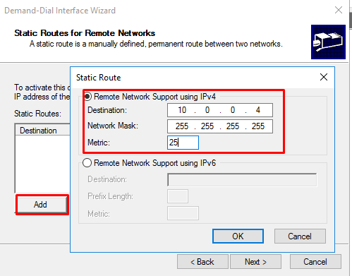

8. **拨出凭据**：键入 Azure 作为用户名，单击 “**下一步**”
9. 完成向导：单击 “**完成**”
10. 在新建网络接口 “**Azure S2S BGP**” 右键单击并选择 “**属性**”

    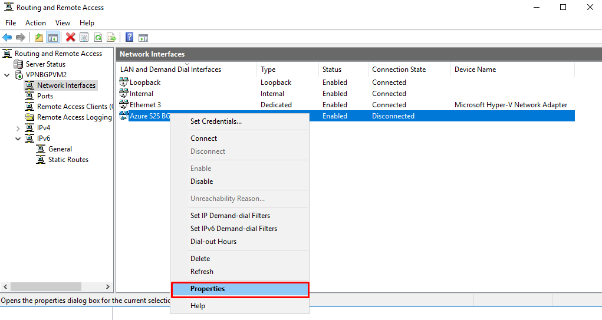

11. 选择**安全**选项卡，然后在身份验证下选择使用预共享密钥进行身份验证。输入在 Azure VPN 网关站点到站点上设置的预共享密钥，点击 “**确定**”。

    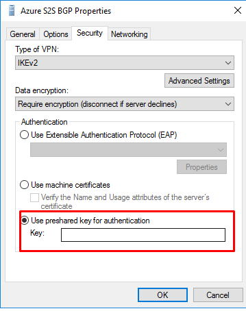

12.	右键单击“**Azure S2S 网络接口**”，然后单击“**连接**”。连接成功后连接状态变为**已连接状态**。

    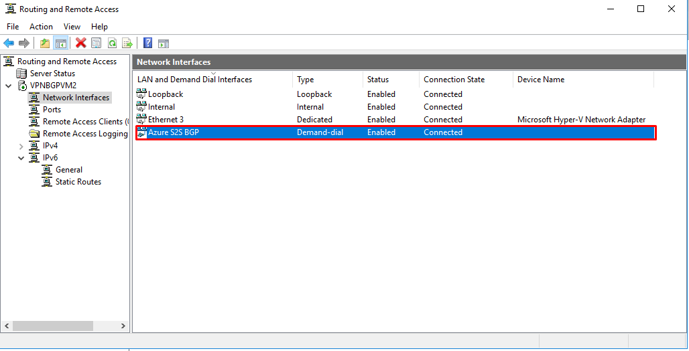

#### <a id="section4"></a>通过 PowerShell 指令配置本地 BGP

```powershell
#建立 BGP Peer，10.41.0.5 是 Windows Server2016 网卡地址
Add-BgpRouter -BgpIdentifier "10.41.0.5" -LocalASN 65032

#指定 Azure 端的 BGP 参数，PeerName 可以自行定义，PeerIPAddress 为 Azure VPN gateway peer 地址，PeerASN 为 Azure VPN gateway AS 号，LocalIPAddress 为本地 VPN peer 地址
Add-bgppeer -PeerName "AzureS2S" -PeerIPAddress "10.0.0.4" -PeerASN 65515 -LocalIPAddress 10.41.0.5

#将内网网卡的路由进行 BGP 发布
Add-BgpCustomRoute -Network "10.41.0.0/24" -PassThru
```

## 验证 BGP 连接

1. 查看 BGP Peer 连接状态。

    从下面的结果可以看到 BGP 是连接状态（connected）。

    ```
    PS C:\Users\Administrator> Get-BGPPeer

    PeerName LocalIPAddress PeerIPAddress PeerASN OperationMode ConnectivityStatus
    -------- -------------- ------------- ------- ------------- ------------------
    AzureS2S 10.41.0.5       10.0.0.4      65515   Mixed         Connected         
    ```

2. 查看本地获取的路由信息。

    `10.0.0.0/22` 是 Azure VNET 的网络地址空间；

    ```
    PS C:\Users\Administrator> Get-BgpRouteInformation
    DestinationNetwork NextHop    LearnedFromPeer State LocalPref MED
    ------------------ -------    --------------- ----- --------- ---
    10.0.0.0/22        10.0.0.4    AzureS2S        Best               
    ```

3. 测试连通性。

    `10.0.0.7` 是 VNET 内的一台 Azure 虚拟机的内网 IP；
    从本地的测试机发起的 PING 测试可以看到互通没有问题。

    ```
    C:\Windows\system32>ping 10.0.0.7

    Pinging 10.0.0.7 with 32 bytes of data:
    Reply from 10.0.0.7: bytes=32 time=4ms TTL=126
    Reply from 10.0.0.7: bytes=32 time=4ms TTL=126
    Reply from 10.0.0.7: bytes=32 time=4ms TTL=126
    Reply from 10.0.0.7: bytes=32 time=6ms TTL=126

    Ping statistics for 10.0.0.7:
        Packets: Sent = 4, Received = 4, Lost = 0 (0% loss),
    Approximate round trip times in milli-seconds:
    Minimum = 4ms, Maximum = 6ms, Average = 4ms
    ```
