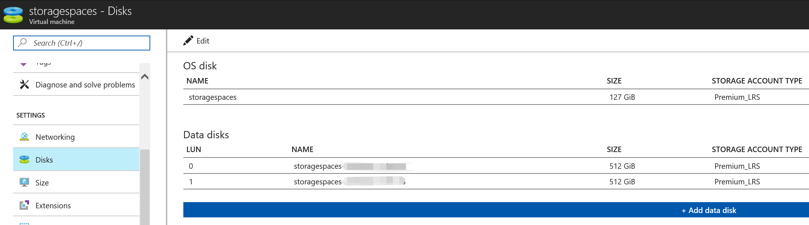
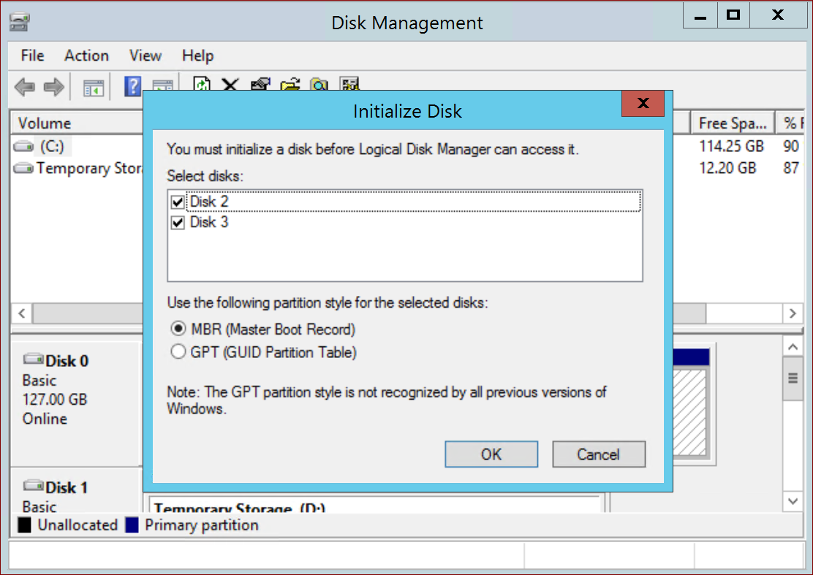
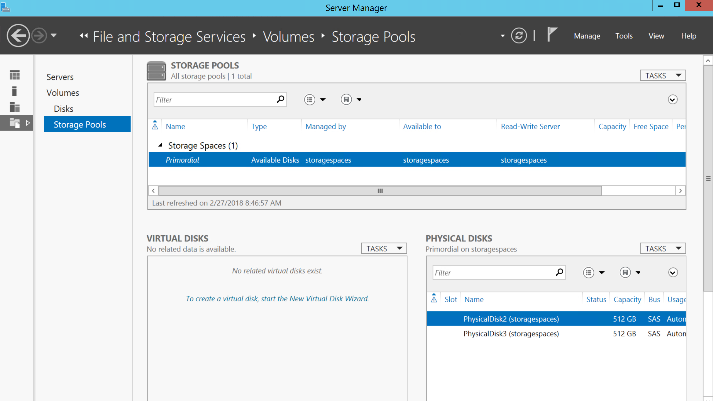
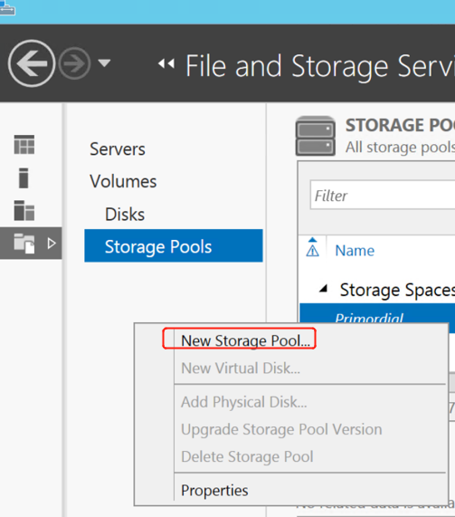
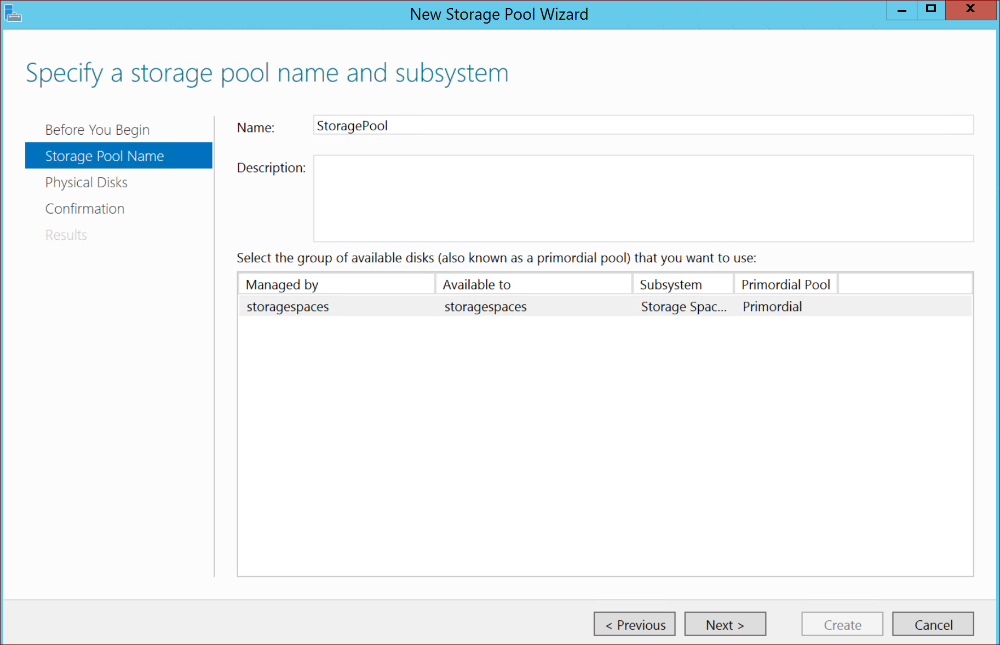
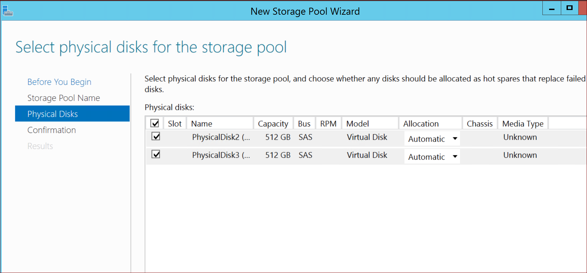
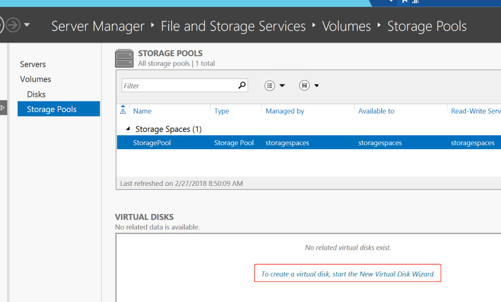
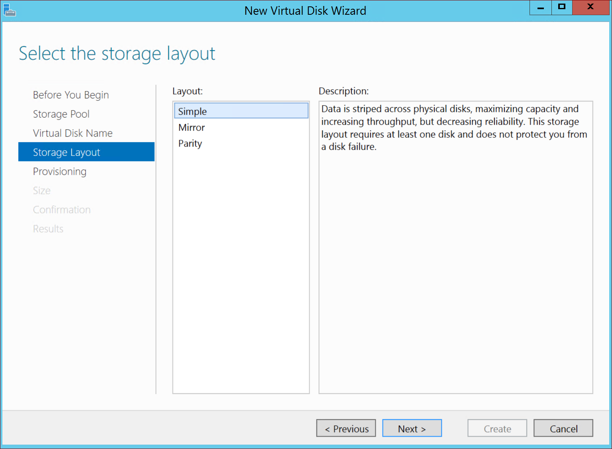
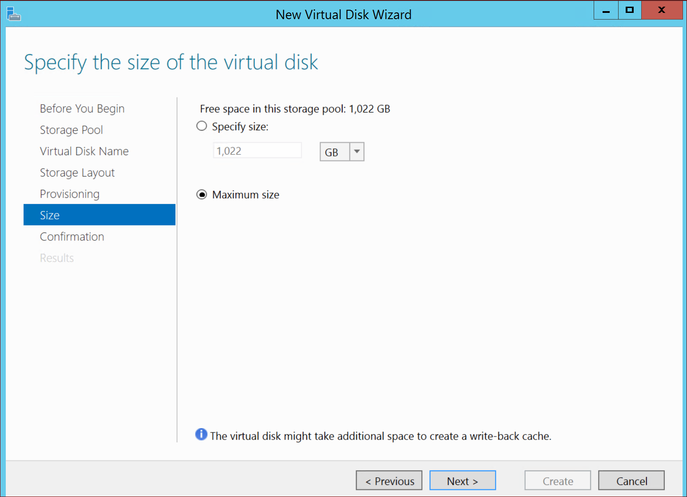
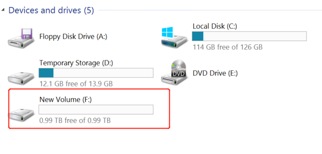

# 如何使用 Storage Spaces 条带化虚拟机数据磁盘

## 概述

本文介绍如何利用 Windows Server 2012 R2 中的存储空间（Storage Spaces）功能，将 Azure 虚拟机的多块数据磁盘进行条带化，以便聚合其 IOPS，带宽和存储容量。

存储空间能够提供经济高效、高度可用、可伸缩以及灵活的存储解决方案。它包括以下功能：

- **存储池** : 存储池是存储空间的基本构建块。

    例如，给定一组物理磁盘，管理员可以创建一个池（使用所有可用的物理磁盘）或多个池（根据需要划分物理磁盘）。

- **弹性存储** : 存储空间提供三种存储布局（又称为复原类型）：

    - 简单
    - 镜像
    - 奇偶校验

关于存储空间的详细信息请参考：[存储空间概述](https://msdn.microsoft.com/zh-cn/library/hh831739(v=ws.11).aspx)。

以高级存储为例，当您要获取比单个高级存储磁盘的最大值还要高的 IOPS 和带宽，可将多个高级磁盘一起条带化。 例如，将两个 P30 磁盘条带化得到的组合 IOPS 为 10,000 IOPS。 关于高级存储的磁盘大小及说明您可以参考：[性能和可伸缩性](https://docs.azure.cn/zh-cn/virtual-machines/windows/premium-storage#scalability-and-performance-targets)。

> [!NOTE]
> Azure 虚拟机的 IOPS/吞吐量受到虚拟机磁盘大小以及虚拟机尺寸大小的限制。当您使用多块磁盘条带时请确保虚拟的大小可以支持该磁盘 IOPS 和吞吐量组合。

具体您可以参考以下文档：[Azure 虚拟机的大小](https://docs.azure.cn/zh-cn/virtual-machines/windows/sizes-general)。

## 具体步骤

以下举例将 2 块 512GB 的高级磁盘做条带化的具体步骤：

1. 创建一台 Windows Server 2012R2 虚拟机。
2. 从 [Azure 门户](https://portal.azure.cn/)上为虚拟机添加 2 块数据磁盘。

    

3. 登录虚拟机，键入 `diskmgmt.msc` 来运行磁盘管理器。
4. 在跳出的对话框中点击 OK 来初始化磁盘。

    

5. 打开 服务器管理器-> 文件和存储服务 -> 卷 -> 存储池

    

6. 在存储池框中点击右键选择新建存储池。

    

7. 在接下来的对话框中填入所需要的内容，选择刚刚添加的 2 块磁盘。

    
    

8. 在虚拟磁盘框中点击链接创建新的虚拟磁盘。

    

9. 在存储布局提供三种选择。由于 Windows Azure 虚拟机的磁盘是 vhd 格式，Azure 已经提供了弹性机制，所以在 Windows Azure 云环境中建议选择 Simple。

    

10. 选择最大尺寸，注：只创建一个磁盘。

    

11. 当虚拟机创建完成后，在跳出的新建卷对话框中填入相应新建卷。
12. 您可以在资源管理器中看到条带化之后的卷。

    

## 注意事项

- 使用服务器管理器 UI 最多可以条带化 8 个磁盘，当连接 8 个以上的磁盘时，请使用 PowerShell 来创建卷。
- 使用 PowerShell，请将列数设置为与磁盘数相等。 否则将得不到理想的磁盘性能。例如，如果一个条带集中有 16 个磁盘，请在 [New-VirtualDisk](http://technet.microsoft.com/library/hh848643.aspx) PowerShell 中使用 NumberOfColumns 参数设置 16 个列数。
- 请根据应用程序正在运行的工作负荷的类型，选择合适的条带大小。 对于随机的较小的 IO 请求，请使用较小的条带大小。 而对于大型的顺序性的 IO 请求，则请使用较大的条带大小。 对于要在高级存储上运行的应用程序，请找出相应的条带大小建议。

    关于列和条带的概念请参考：[什么是列，以及存储空间如何决定使用多少？](https://social.technet.microsoft.com/wiki/zh-cn/contents/articles/25513.faq.aspx#What_are_columns_and_how_does_Storage_Spaces_decide_how_many_to_use)

- 每个存储池创建一个虚拟机磁盘。并选择 Simple 布局。
- 可以在 DS 系列的 VM 上将最多 32 个高级存储磁盘条带化，在 GS 系列的 VM 上将最多 64 个高级存储磁盘条带化。

## 参考链接

- [Azure 高级存储：高性能设计](https://docs.azure.cn/zh-cn/virtual-machines/windows/premium-storage-performance#disk-striping)
- [Interoperability with Azure VM](https://docs.microsoft.com/en-us/previous-versions/windows/it-pro/windows-server-2012-R2-and-2012/hh831739(v=ws.11)#interoperability-with-azure-virtual-machines)
- [Azure 高性能高级存储和托管磁盘](https://docs.azure.cn/zh-cn/virtual-machines/windows/premium-storage)