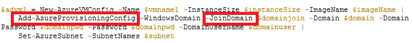
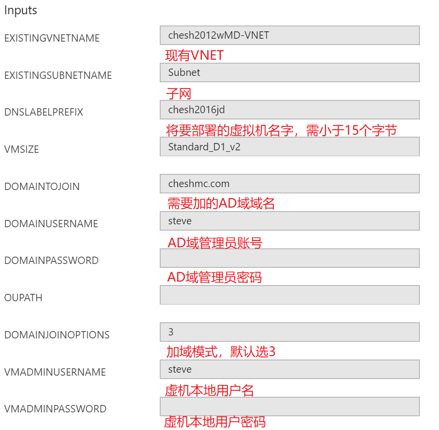
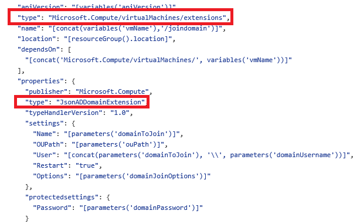
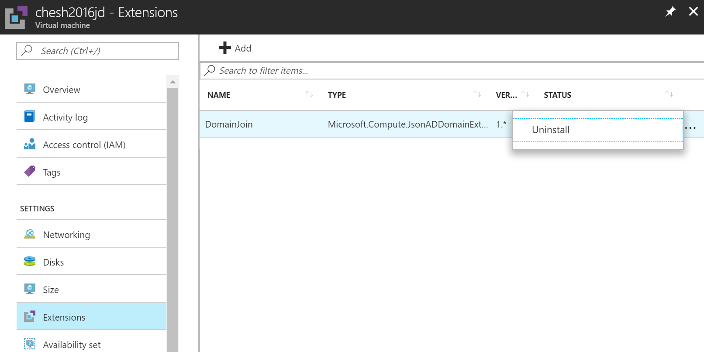

# Azure Windows 虚拟机自动加域的配置方法和排查思路

在 Azure 中配置虚拟机并将其加入现有的 Active Directory（AD）域是非常常见的情况。客户可以通过混合连接从本地域扩展至云端环境，也可以在云端环境中部署安装域控制器（DC）到 Azure 虚拟机。

## 前提条件

目标虚拟机所在的虚拟网络子网应能 DNS 解析并访问到本地或云端的域控制器。

如需配置混合连接，请参考 [Azure VPN 网关](https://docs.azure.cn/zh-cn/vpn-gateway/vpn-gateway-about-vpngateways)。

如需配置子网 DNS，请参考 [使用自己的 DNS 服务器的名称解析](https://docs.azure.cn/zh-cn/virtual-network/virtual-networks-name-resolution-for-vms-and-role-instances#a-namename-resolution-using-your-own-dns-server-idname-resolution-using-your-own-dns-servera-使用你自己的-dns-服务器的名称解析)。

## 配置方法

### ASM 模式 – 使用已有的 Azure PowerShell 命令

使用传统 Azure 服务管理（ASM）API，可以使用名为 [Add-AzureProvisioningConfig](https://docs.microsoft.com/en-us/powershell/module/Azure/Add-AzureProvisioningConfig?view=azuresmps-4.0.0) 的 PowerShell cmdlet，并使用 `-JoinDomain` 开关将 VM 自动加入 AD 域，如下例所示：



在最新的 Azure 资源管理器（ARM）API 中可以通过名为 `JsonADDomainExtension` 的新型 ARM 扩展来获得同样的功能：

* [使用 Azure ARM 模板](#section1)
* [使用 Azure ARM PowerShell Cmdlet](#section2)

### <a id=section1></a>使用 Azure ARM 模板

使用 Azure ARM 模板很简单，只需访问 [Azure Portal - 自定义部署](https://portal.azure.cn/#create/Microsoft.Template/uri/https%3A%2F%2Fraw.githubusercontent.com%2FAzure%2Fazure-quickstart-templates%2Fmaster%2F201-vm-domain-join%2Fazuredeploy.json)，将模板部署到 Azure 中国即可。
用户需要提供的参数如下：



> [!NOTE]
> 新建的虚拟机需要能够 DNS 解析到现有的 AD 域，建议通过虚拟网络的子网配置 DNS 地址。详细内容请参考文档：[使用自己的 DNS 服务器的名称解析](https://docs.azure.cn/zh-cn/virtual-network/virtual-networks-name-resolution-for-vms-and-role-instances#a-namename-resolution-using-your-own-dns-server-idname-resolution-using-your-own-dns-servera-使用你自己的-dns-服务器的名称解析)。



正如上文所述，这个新的虚拟机扩展可以使用所有必要的参数将虚拟机添加到一个已经存在的 AD 域，然后在完成加入操作后重启虚拟机。现在，如果您不熟悉或不想使用 ARM 模板，而是想要使用 Azure PowerShell，需要怎么做呢？

### <a id=section2></a>使用 Azure PowerShell 命令行

使用以下 PowerShell 命令行可以将现有的虚拟机加入已有的 AD 域，具体参数请按实际情况更改。

```PowerShell
$ResourceGroupName = "RGname"
$VMName = "VMname"

$Settings = @{
    Name = "contoso.com" #AD域名
    User = "contoso.com\admin" #AD域管理员
    Restart = "true“ #设置加域后虚拟机是否需要自动重启
    Options = "3" #加域模式，不建议改动
    }

$ProtectedSettings = @{
    Password = "password" #AD域管理员密码
    }

$vm = Get-AzureRmVM -ResourceGroupName $ResourceGroupName -Name $VMName 
Set-AzureRmVMExtension -Name 'DomainJoin' -ResourceGroupName $vm.ResourceGroupName -VMName $vm.Name -Location $vm.Location -Publisher 'Microsoft.Compute' -ExtensionType 'JsonADDomainExtension' -TypeHandlerVersion 1.3 -Settings $Settings -ProtectedSettings $ProtectedSettings
```

如果脚本完成后收到 `Succeeded` 的结果，说明虚拟机已经成功加域并重启；如果收到 `Long running operation failed with status 'Failed'` 结果，则说明加域操作失败，请结合下列步骤进行排查。

## 排查 JsonADDomainExtension 加域问题

JsonADDomainExtension 扩展调用了 Windows 的 NetJoinDomain 功能，所以产生的报错代码也与 NetJoinDomain 相同。以下列举了排查的基本思路：

1. 排查扩展是否成功安装在目标虚拟机中

    Azure 虚拟机扩展默认安装在 C:\Packages\Plugins 文件夹中，请查看该文件夹下是否存在 Microsoft.Compute.JsonADDomainExtension\1.3 文件夹。如果不存在扩展文件夹的话，说明安装命令不正确。

2. 排查扩展是否执行了加域动作

    Azure 虚拟机扩展的日志默认存放在 C:\WindowsAzure\Logs\Plugins 文件夹中，请确认 C:\WindowsAzure\Logs\Plugins\Microsoft.Compute.JsonADDomainExtension\1.3 文件夹中是否存在  ADDomainExtension 和 CommandExecution 等日志。

    日志文件夹中的 CommandExecution 文件是每次通过平台对 extension 推送配置的日志。ADDomainExtension 文件是执行推送配置的日志。如果推送不成功，则有可能在日志中看到以下报错：

    ```
    2017-11-02T15:03:25.4982465Z     [Error]:     Try join: domain='contoso.com', ou='', user='admin', option='NetSetupJoinDomain, NetSetupAcctCreate' (#3:User Specified), errCode='1355'.
    2017-11-02T15:03:30.1617203Z     [Error]:     Try join: domain='contoso.com', ou='', user='admin', option='NetSetupJoinDomain' (#1:User Specified without NetSetupAcctCreate), errCode='1355'.
    2017-11-02T15:03:30.1657206Z     [Error]:     Computer failed to join domain 'contoso.com' from workgroup 'WORKGROUP'.
    ```

3. 排查扩展的具体报错

    这里的 errCode 就是扩展在调用 Windows 的 NetJoinDomain 功能时的错误码，可以通过查看 [AD 认证错误信息库](https://technet.microsoft.com/en-us/library/cc961817.aspx)，来得知其报错内容是 `ERROR NO SUCH DOMAIN`。

    常见的错误码如下：

    | Description | Actual Error | Error Code | Hex Error Code |
    | ----------- | ------------ | ---------- | -------------- |
    | 未能找到或连接到域控制器 | ERROR NO SUCH DOMAIN | 1355 | 0x548 |
    | 用户名或密码错误 | ERROR_LOGON_FAILURE | 1326 | 0x52E |
    | 客户端与服务器存在时间偏差，导致 Kerberos 身份验证失败 | ERROR_TIME_SKEW | 1398 | 0x576 |
    | 未能连接到域控制器，访问被拒绝 | ERROR_ACESS_DENIED | 5 | 0x5 |
    | 找不到可用的域控制器 | ERROR_NO_LOGON_SERVERS | 1311 | 0x51F |

4. 如何重新配置扩展

    请从 [Azure 门户](https://portal.azure.cn/) 中找到目标虚拟机，点击左侧的扩展栏，找到对应扩展右侧的 “**…**” 按钮，选择卸载，再通过 Azure PowerShell 推送扩展的新配置。

    

## 扩展内容

* [适用于 Windows 的虚拟机扩展和功能](https://docs.azure.cn/zh-cn/virtual-machines/windows/extensions-features)
* [对 Azure Windows VM 扩展故障进行故障排除](https://docs.azure.cn/zh-cn/virtual-machines/windows/extensions-troubleshoot)