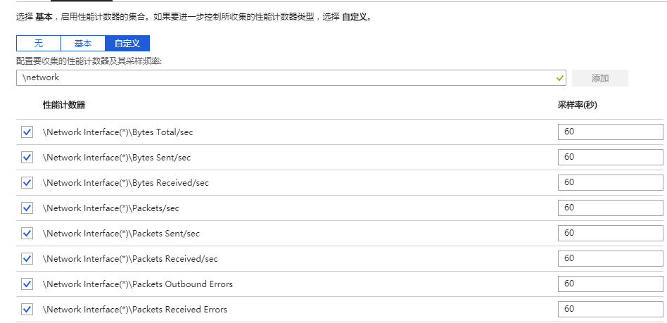
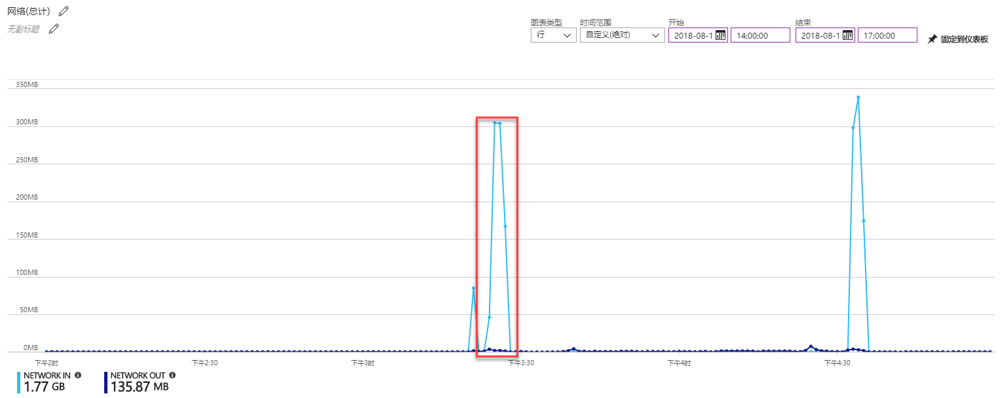
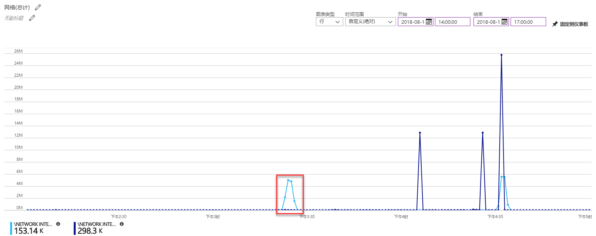
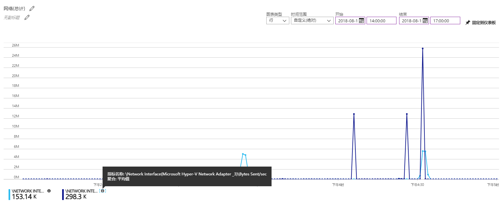
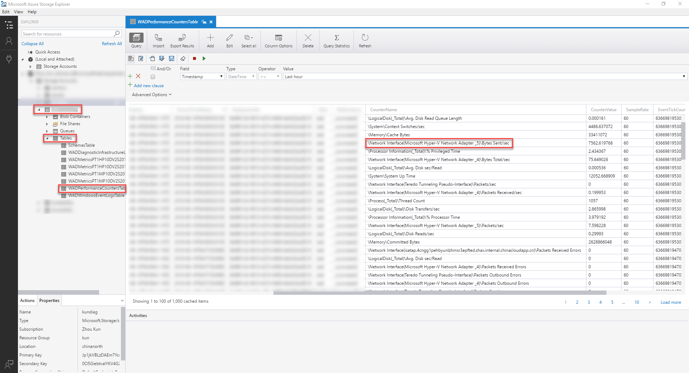
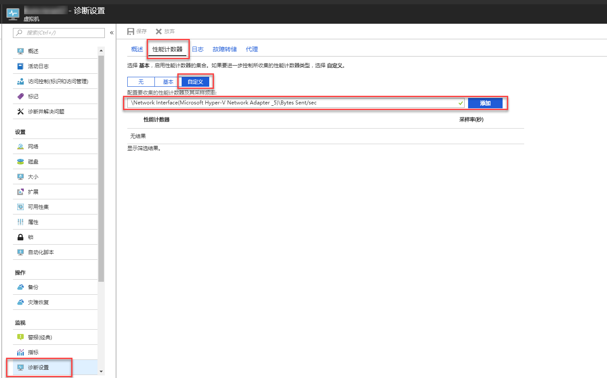
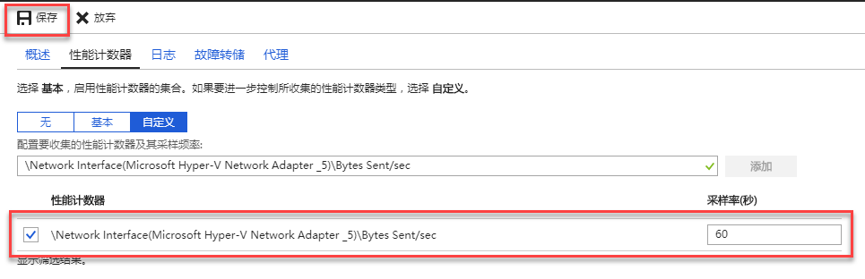
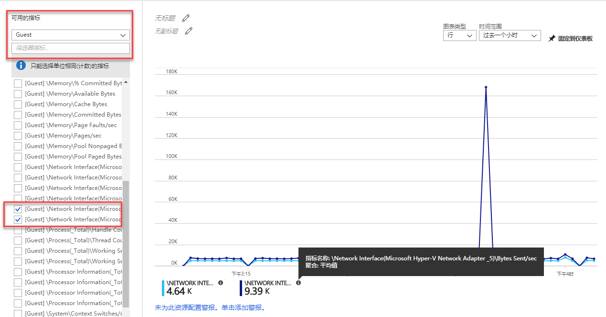
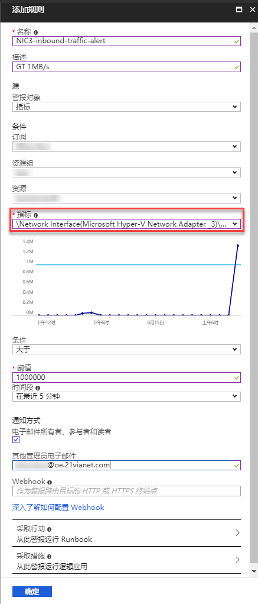
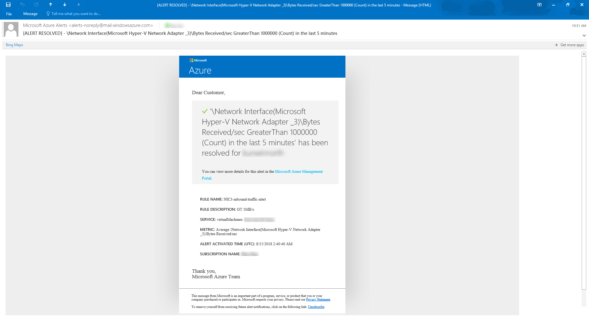

# 如何理解 Windows 虚拟机的网络指标

Azure 虚拟机具有两种类型的指标，主机级指标，及来宾 OS 级指标。 
默认情况下，基于 Resource Manager 的虚拟机发出基本（主机级）指标。此外，[为虚拟机安装诊断扩展并启用来宾级别监视](https://docs.azure.cn/zh-cn/virtual-machines/windows/tutorial-monitoring)时，Azure 诊断扩展也会发出来宾 OS 性能计数器（通常称为“来宾 OS 指标”）。 
通俗说来，主机级指标来自物理主机，而来宾 OS 级指标是 VM 中的代理收集的。可以在为 Windows 虚拟机配置的诊断存储账户中找到名为 WADPerformanceCountersTable 的表，并在表中查看到代理收集的全部诊断信息。

在主机级指标中，有 Network In 及 Network Out 两项网络指标；同时，在来宾 OS 级指标中，同样有多个关于网络的指标可用，例如：`\Network Interface(*)\Bytes Sent/sec`，`\Network Interface(*)\Bytes Received/sec`，但未指定网卡名称，需手动添加后才可查看或应用。具体的指标名称，请以 WADPerformanceCountersTable 表中显示为准（网卡名称与虚拟机内查看到的相对应）。本文将着重于`\Network Interface(*)\Bytes Sent/sec` 和 `\Network Interface(*)\Bytes Received/sec`。

通过这些指标所绘制的图表，可能会存在很大差异。这不仅仅体现在指标所采用的度量单位不同以及采样频率不同而导致的数值差异。 
以下两图来自同一台虚拟机在相同时间段内的两组指标。图一基于主机级指标 `Network In` 及 `Network Out` 绘制，单位为 Bytes，其值代表在每个统计周期（目前为一分钟）内的入向/出向总流量；而图二基于来宾 OS 级指标 `\Network Interface(Microsoft Hyper-V Network Adapter _3)\Bytes Sent/sec` 及 `\Network Interface(Microsoft Hyper-V Network Adapter _3)\Bytes Received/sec` 绘制，单位为 Bytes/sec，代表每个采样周期（默认为最小值 60 秒）内的平均发送/接收传输速率。

> [!NOTE]
> 理论上，如果网络速率（Byte/s）为 x，那么一分钟（60s）的总流量 y（Bytes）=60x
> 红框标出的部分，主要来自同一次下载任务，由于其度量方式的不同，`Network In`（Bytes）可见峰值为 300 多 MB，而 `\Network Interface(Microsoft Hyper-V Network Adapter _3)\Bytes Received/sec` 峰值在 5MB/s 左右。大致符合上述关系
> （但由于统计方式及具体取样时间等差异，并不能精确满足上述公式）。

图一 主机级指标

图二 来宾 OS 级指标

（上图示意查看指标的完整名称）

图二可见在 16：00-17：00 之间有过三次的出向流量高峰，而图一中却没发现这些流量。

事实上，这些流量是通过专用 IP 地址，向同一个虚拟网络中的 FTP 服务器上传了大文件产生的。由于指标背后的算法不同，通过专用 IP 通信产生的流量，没有被计入主机级 `Network In/Out`。 
但来宾 OS 级指标的数据收集自虚拟机的网卡。因此，无论流量来自或去向哪里，即使是多网卡虚拟机自身的两块网卡之间通过专用 IP 地址进行通信，也会被计入这一指标。

参考以下几种场景：

|                                                                         | 主机级指标 | 来宾 OS 级 |
| :---------------------------------------------------------------------- | :--------: | :--------: |
| 从本地，通过公网，使用公共 IP 地址访问 Azure 虚拟机                     |    计入    |    计入    |
| 从本地，通过 VPN 接入 Azure 虚拟网络，通过专用 IP 地址访问 Azure 虚拟机 |    不计    |    计入    |
| 从 Azure，通过公共 IP 地址访问虚拟机                                    |    计入    |    计入    |
| 从 Azure，通过专用 IP 地址访问虚拟机                                    |    不计    |    计入    |
| 多网卡虚拟机，通过公共 IP 地址在网卡间传输数据                          |    计入    |    计入    |
| 多网卡虚拟机，通过专用 IP 地址在网卡间传输数据                          |    不计    |    计入    |

同时值得注意的是，主机级别指标，会统计当前虚拟机所有网卡产生的符合条件的流量总和，不区分网卡；而来宾 OS 级别指标，会按照每个网卡分别进行统计。

考虑到统计方式及结果的不同，要了解虚拟机的实际运行及流量状况，建议以来宾 OS 级指标为准；因此，也建议为虚拟机启用来宾级别监视。启用后，需要为每个网卡添加需要的网络指标。且如果之后对虚拟机网卡进行操作而导致网卡名称改变的，需要重新添加新的指标，删除不再有效的指标。

## 后续步骤

### 为 Windows 虚拟机添加网络指标并创建警报规则

为了更好的监控 Windows 虚拟机流量情况，建议手动添加网络指标并配置[警报规则](https://docs.azure.cn/zh-cn/monitoring-and-diagnostics/monitoring-overview-alerts)：

1. 添加来宾 OS 级指标

    启用来宾 OS 级指标后，默认已经添加多个指标，但关于网络的指标 `\Network Interface(_)\Bytes Total/sec`，`\Network Interface(_)\Bytes Total/sec` 等，均未指明网卡，因此也无法获取到流量数据。

    1. 确认网卡名称及指标名称。

        可以通过 Visual Studio、Azure 存储资源管理器、Azure Management Studio 等方式来查看存储账户中的监控数据，并确定需要添加的指标名称。

        例如，使用 Azure 存储资源管理器，登录账户后，找到 **存储账户** — **Tables** — **WADPerformanceCountersTable** — **CounterName** — `\Network Interface(Microsoft Hyper-V Network Adapter \_5)\Bytes Sent/sec`：

        

    2. 在 “**诊断设置**” 中添加需要的指标。

        在 Azure 门户虚拟机的 “**诊断设置**” 中，选择 “**性能计数器**” — “**自定义**”，添加在上一步获取到的指标名称：

        

        添加后，可以配置 “**采样率（秒）**”（默认为 **60** 秒），并保存：

        

    3. 在 “**指标中**”，查看新添加的指标。

        保存并更新完成后，新添加的指标将会在 “**Guest**” 下的可用指标中列出：

    

2. 添加警报规则

    可以通过 Azure 门户配置经典指标警报，选择 “**警报（经典）**” — “**添加指标警报（经典）**”

    根据实际需求，选择添加的网络指标并设定阈值，配置界面中也会根据设置的阈值，为缩略图标注出该基准线。

    

    当该警报规则被触发时，会根据规则配置执行预设的操作，例如选择接收邮件通知，将会在触发规则时收到 Microsoft Azure Alerts alerts-noreply@mail.windowsazure.com 的如下邮件：

    

    这些警报规则，能在一定程度上辅助避免因异常流量而导致的经济及业务上的损失。

## 参考文档

- [教程：监视和更新 Azure 中的 Windows 虚拟机](https://docs.azure.cn/zh-cn/virtual-machines/windows/tutorial-monitoring)