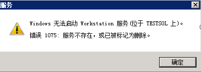
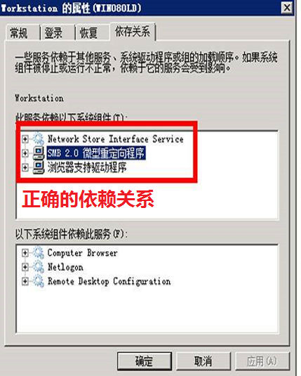
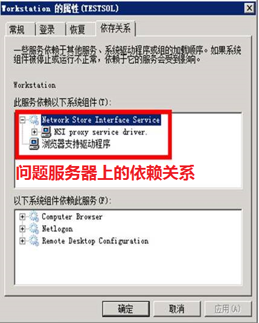
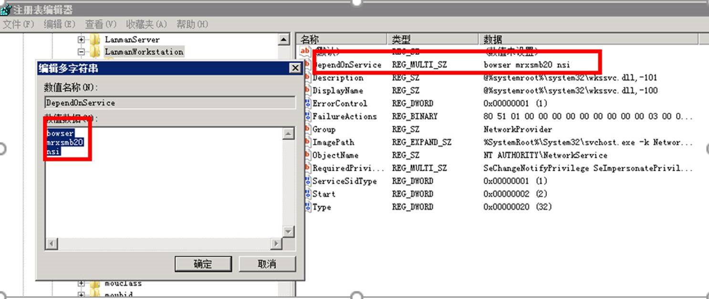
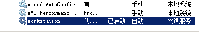

# 如何解决 Azure Windows 2008 R2 虚拟机无法启动 Workstation 服务

## 问题描述

用户在使用 Windows 2008 R2 虚拟机（版本：2.127.20171216）时，如果启动依赖于 Worksation 服务的应用会出现错误：**Windows 无法启动 Workstation 服务。错误 1075：服务不存在，或已被标记为删除**。



## 问题分析

Workstation 服务的依赖关系定义错误，导致在启动该服务时，系统找不到对应的依赖服务，无法确认其状态。（在开始菜单-运行栏中输入services.msc可以查询Workstation 服务的状态）

相关依赖关系对比如下：




## 解决方法

通过修改注册表，将服务依赖关系改成正确的值。

1. 直接修改注册表

    在运行窗口输入 `regedit` 打开注册表，定位到 `HKEY_LOCAL_MACHINE\SYSTEM\CurrentControlSet\services\LanmanWorkstation`，修改 `DependOnService` 的值为：

    ```
    bowser
    mrxsmb20
    nsi
    ```

    

2. 命令行改注册表

    在命令提示符(CMD)中，输入下面命令修改配置：

    `sc.exe config lanmanworkstation depend= bowser/mrxsmb20/nsi`

最后重启服务器，尝试启动该服务。<br>
在运行窗口输入 `services.msc` 打开 Widnows 服务界面，查看 Workstation 服务是否启动成功。


